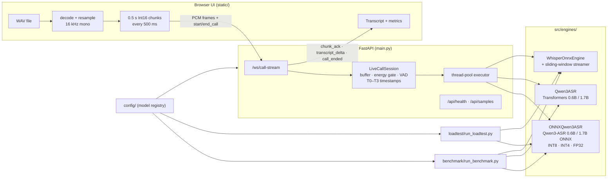
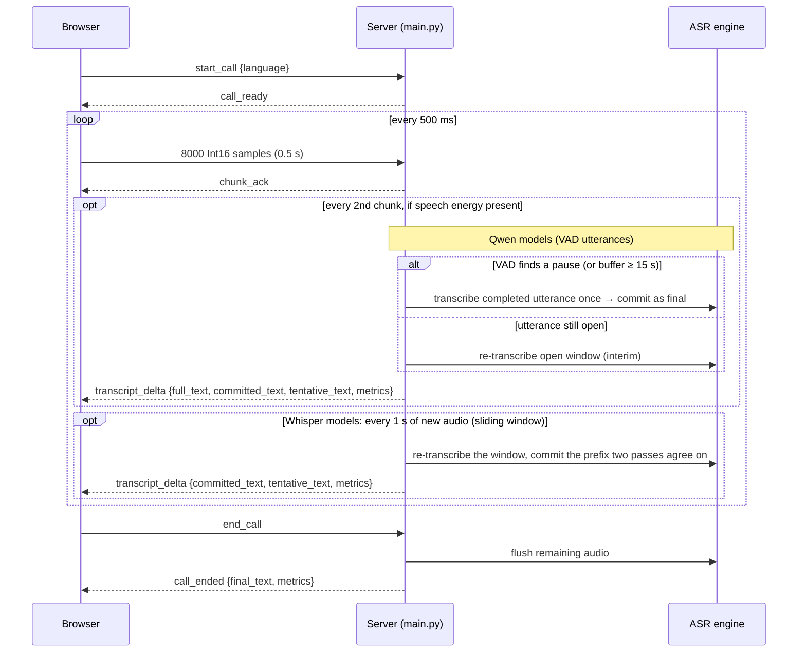

# RT-MASR-CPU

Real-time multilingual speech recognition on **CPU only**: a proof of concept
that simulates a live voice-call leg and streams it through **Qwen3-ASR or
Whisper** (selectable), plus a benchmark harness that compares both families.

- **Languages:** English, Mandarin Chinese, Bahasa Indonesia (auto-detect or forced).
- **Live demo:** a browser UI loads a WAV file, streams 16 kHz PCM over a WebSocket
  in 0.5 s chunks at real-time pace, and shows the evolving transcript with
  latency, RTF, stage-timing and process telemetry. Playback sound is **muted by
  default**; use the *Sound* toggle to listen along (transcription is unaffected).
- **Streaming modes:** Qwen3-ASR streams per speech utterance (energy gate + VAD);
  Whisper, which is an offline model, streams with a **sliding window** and
  LocalAgreement-2 (confirmed text vs. dimmed tentative text).
- **Engines:** Qwen3-ASR-0.6B on ONNX Runtime (INT8 decoder, no PyTorch),
  Qwen3-ASR-0.6B / 1.7B on Transformers (BF16), and Whisper tiny→medium on ONNX
  Runtime (INT8 / FP16 / FP32).
- **Benchmark:** cold-start load, latency/RTF percentiles, WER/CER, and
  concurrency scaling, written to JSON + Markdown reports.
- **Load test & capacity sizing:** simulates many real-time call legs on pinned
  worker processes, finds the saturation point and builds a CPU sizing guide
  for 50-1,000 legs (`loadtest/`, see `docs/loadtest/`).

---

## Architecture



### Call-leg flow



New to this? Start with [`docs/how-streaming-works.md`](docs/how-streaming-works.md), a
plain-language explanation of how each engine streams.

Details (WebSocket protocol, chunking/VAD parameters, metric definitions and
where each timestamp is captured, engine contract, known limitations) are in
[`docs/arch/architecture.md`](docs/arch/architecture.md).

---

## Repository layout

```
main.py                     FastAPI app: UI, /api/*, /ws/call-stream
static/                     Web UI (index.html, app.js, style.css)
src/
  core/config.py            Config + model-registry resolution
  engines/
    live_call_session.py    Per-call buffer, energy gate, VAD, telemetry
    qwen3_onnx_engine.py    Qwen3-ASR ONNX Runtime engine
    qwen3_engine.py         Qwen3-ASR Transformers engine
    whisper_engine.py       Whisper ONNX Runtime engine
    whisper_streaming.py    Sliding-window + LocalAgreement streamer for Whisper
  utils/
    audio_utils.py          Audio loading, mel spectrogram, silence splitting
    download_utils.py       Model downloader (CLI)
    check_models.py         Self-test: which models run on this PC
  whisper/                  Vendored Whisper tokenizer/decoding (whisper-onnx-cpu)
config/
  config.yaml               Server settings + default_model
  models/models.yaml        Model registry
  models/*.yaml             Per-model settings (download, engine, inference)
benchmark/                  Offline benchmark pipeline (runners, metrics, reporters, tests)
loadtest/                   Load test (call-leg simulator, saturation search) + sizing model
tests/                      Server / session / streaming tests
models/                     Downloaded weights (git-ignored)
test_audio/{en,cn,id}/      Test WAV files (git-ignored)
docs/                       Architecture, changelog, benchmark and load-test docs
```

---

## Requirements

- Linux x86_64 (developed on Ubuntu, kernel 6.8). macOS should work but is untested.
- Python **3.12** (pinned in `.python-version`).
- [`uv`](https://docs.astral.sh/uv/) (recommended) or `pip`.
- `curl` and `tar` (used to fetch the Whisper tarballs).
- RAM: ~4 GB for the ONNX engine alone; the Transformers 1.7B engine peaked at
  ~10 GB RSS during benchmarking. 16 GB is comfortable.
- Disk: ~2.5 GB for the ONNX model; ~14 GB for all Qwen3 models plus Whisper
  INT8 (see the table below); plus several GB for PyTorch.

No GPU is used. `torch` is only needed for the Transformers backend but is
installed as a dependency of `qwen-asr`.

---

## Installation

```bash
git clone <repo-url> RT-MASR-CPU
cd RT-MASR-CPU

# Install uv if needed
curl -LsSf https://astral.sh/uv/install.sh | sh

# Create .venv and install the locked dependencies (also installs src/ in editable mode)
uv sync
```

Without uv:

```bash
python3.12 -m venv .venv
source .venv/bin/activate
pip install -e .
```

All commands below are run **from the project root** (configs, `models/` and
`test_audio/` are resolved relative to it). With a plain venv, replace
`uv run python` with `python` after activating `.venv`.

---

## Model download

Weights are downloaded into `models/` by `src/utils/download_utils.py`, driven by
the `download:` section of each per-model YAML. All sources are public; no
Hugging Face token is needed.

| Registry name | Backend | Source | Local directory | Size on disk |
|---|---|---|---|---|
| `qwen3_onnx_0.6b_int8` | `onnx` | HF [`Daumee/Qwen3-ASR-0.6B-ONNX-CPU`](https://huggingface.co/Daumee/Qwen3-ASR-0.6B-ONNX-CPU) | `models/qwen3-asr-onnx-0.6b-int8` | 2.5 GB |
| `qwen3_onnx_0.6b_fp32` | `onnx` | HF [`andrewleech/qwen3-asr-0.6b-onnx`](https://huggingface.co/andrewleech/qwen3-asr-0.6b-onnx) (FP32 files) | `models/qwen3-asr-onnx-0.6b-fp32` | 4.1 GB |
| `qwen3_onnx_0.6b_int4` | `onnx` | HF [`andrewleech/qwen3-asr-0.6b-onnx`](https://huggingface.co/andrewleech/qwen3-asr-0.6b-onnx) (INT4 files) | `models/qwen3-asr-onnx-0.6b-int4` | 2.0 GB |
| `qwen3_onnx_1.7b_fp32` | `onnx` | HF [`andrewleech/qwen3-asr-1.7b-onnx`](https://huggingface.co/andrewleech/qwen3-asr-1.7b-onnx) (FP32 files) | `models/qwen3-asr-onnx-1.7b-fp32` | 10.0 GB |
| `qwen3_onnx_1.7b_int4` | `onnx` | HF [`andrewleech/qwen3-asr-1.7b-onnx`](https://huggingface.co/andrewleech/qwen3-asr-1.7b-onnx) (INT4 files) | `models/qwen3-asr-onnx-1.7b-int4` | 4.1 GB |
| `qwen3_0.6b` | `transformers` | HF [`Qwen/Qwen3-ASR-0.6B`](https://huggingface.co/Qwen/Qwen3-ASR-0.6B) | `models/qwen3-asr-0.6b` | 1.8 GB |
| `qwen3_1.7b` | `transformers` | HF [`Qwen/Qwen3-ASR-1.7B`](https://huggingface.co/Qwen/Qwen3-ASR-1.7B) | `models/qwen3-asr-1.7b` | 4.4 GB |
| `whisper_int8_{tiny,base,small,medium}` | `whisper` | PINTO model zoo, INT8 tarball | `models/whisper_int8` (shared) | 5.5 GB |
| `whisper_fp16` | `whisper` | PINTO model zoo, FP16 tarball | `models/whisper_fp16` | not measured |
| `whisper_fp32` | `whisper` | PINTO model zoo, FP32 tarball | `models/whisper_fp32` | not measured |

```bash
# Recommended minimum for the live demo
uv run python src/utils/download_utils.py --model qwen3_onnx_0.6b_int8

# Fused-encoder ONNX exports: 0.6B / 1.7B, FP32 or INT4 (add --dry-run to list files first)
uv run python src/utils/download_utils.py --model qwen3_onnx_0.6b_int4
uv run python src/utils/download_utils.py --model qwen3_onnx_0.6b_fp32
uv run python src/utils/download_utils.py --model qwen3_onnx_1.7b_int4
uv run python src/utils/download_utils.py --model qwen3_onnx_1.7b_fp32

# Transformers variants (for comparison)
uv run python src/utils/download_utils.py --model qwen3_0.6b
uv run python src/utils/download_utils.py --model qwen3_1.7b

# Whisper INT8: one tarball containing tiny/base/small/medium (and *.en, large-v1/v2)
uv run python src/utils/download_utils.py --model whisper_int8

# Everything in the registry (includes the FP16/FP32 Whisper tarballs)
uv run python src/utils/download_utils.py

# Re-download even if files exist
uv run python src/utils/download_utils.py --model qwen3_onnx_0.6b_int8 --force
```

A download is skipped when its target already looks complete (the required ONNX
files for `qwen3_onnx_0.6b_int8`, a non-empty directory for the others). Expected files:

```
models/qwen3-asr-onnx-0.6b-int8/   decoder_init.int8.onnx  decoder_step.int8.onnx  embed_tokens.bin
                                   encoder_conv.onnx(.data)  encoder_transformer.onnx(.data)  tokenizer.json
models/qwen3-asr-onnx-<size>-<prec>/   encoder[.int4].onnx  decoder_init[.int4].onnx  decoder_step[.int4].onnx
                                       decoder_weights[.int4].data  embed_tokens.bin (FP16)  config.json  tokenizer.json  ...
models/whisper_int8/               {tiny,base,small,medium}_{encoder,decoder}_11_int8.onnx  ...
```

---

## Which model can my PC run?

After downloading, let the machine pick for you. `check_models.py` loads each
downloaded model in its own subprocess, transcribes a ~10 s clip and reports load
time, latency, real-time factor (RTF) and peak RAM. A model that runs out of memory
or hangs is killed and reported; it cannot crash the script.

```bash
# Check every model in the registry (a few minutes; the large ones take longest)
uv run python src/utils/check_models.py

# Only some models / only static checks (files, deps, estimated RAM; takes seconds)
uv run python src/utils/check_models.py --models whisper_int8_tiny,qwen3_onnx_0.6b_int8
uv run python src/utils/check_models.py --no-run

# Also try models predicted to need more RAM than is free; save a JSON report
uv run python src/utils/check_models.py --force --json report.json
```

| Verdict | Meaning |
|---|---|
| `REAL-TIME` | RTF ≤ 0.5: comfortable for live streaming |
| `BORDERLINE` | RTF ≤ 1.0: keeps up on one stream with little headroom |
| `OFFLINE ONLY` | RTF > 1.0: fine for files, too slow for live calls |
| `NOT DOWNLOADED` / `MISSING DEPS` | files or Python packages missing (the note shows the fix) |
| `TOO BIG` / `OUT OF MEMORY` / `TIMEOUT` | does not fit in the free RAM, or did not finish in `--timeout` |
| `NO OUTPUT` / `ERROR` | the model loaded or crashed but gave no usable transcript |

It ends with a recommendation (best accuracy that still runs in real time,
fastest, lightest on RAM) and the exact `default_model` line to put in
`config/config.yaml`. Close other heavy apps first, since the check uses the RAM
that is free at that moment.

---

## Test audio

WAV files are git-ignored, so add your own under `test_audio/`. The folder name
sets the language the UI shows for a sample: `en`, `cn` (or `zh`), `id`.

```
test_audio/
  en/  librispeech_0_1089_0.wav  librispeech_1_1089_1.wav  librispeech_2_1089_2.wav
  cn/  OSR_cn_000_0072_8k.wav  OSR_cn_000_0073_8k.wav
  id/  ind_001.wav  ind_002.wav
```

These are the files `benchmark/configs/bench_config.yaml` and
`benchmark/data/references.yaml` expect (English from LibriSpeech speaker 1089,
Mandarin from the Open Speech Repository Chinese set).

The baseline format everywhere — wire protocol, engines and benchmark numbers —
is **16 kHz mono Linear PCM (little-endian Int16)**. Any Linear PCM WAV still
works in the UI: the browser resamples to 16 kHz and averages the channels to
mono before streaming, and a non-browser client can declare a different rate or
channel count in `start_call` for the server to normalise instead. See
[§2.1 Audio format and normalisation](docs/arch/architecture.md#21-audio-format-and-normalisation)
for the full conversion table and its limitations.

---

## Configuration

Pick the model served by the live UI in `config/config.yaml`:

```yaml
default_model: "qwen3_onnx_0.6b_int8"    # or "qwen3_0.6b", "qwen3_1.7b", "whisper_int8_tiny", ...
```

or override it for one run without editing the file:

```bash
RT_MASR_MODEL=whisper_int8_tiny uv run uvicorn main:app --host 0.0.0.0 --port 8000
```

The name is resolved through `config/models/models.yaml` to a per-model YAML
(`config/models/<name>.yaml`) that holds engine settings such as `num_threads`
(0 = all cores), `quantize`, `dtype`, default `language` and ORT session options.

- The repo currently ships with `default_model: "whisper_int8_tiny"`. Qwen3-1.7B
  ran slower than real time on an 8-core CPU in our benchmark (RTF ≈ 1.0–1.5); use
  `qwen3_onnx_0.6b_int8` or `whisper_int8_tiny` for a smooth live demo.
- `whisper_*` entries are served with **sliding-window streaming**: the window
  is re-transcribed every `hop_s`, text confirmed by two consecutive passes
  (LocalAgreement-2) is shown as final and the rest as dimmed tentative text. Tune
  it in the `streaming:` block of `config/models/whisper_*.yaml`. Start with
  `whisper_int8_tiny`; `small`/`medium` are slower than real time on CPU.
- The `server:` block (host/port) is not read by `main.py`; pass host/port to
  uvicorn instead.

---

## Run the live demo

```bash
uv run uvicorn main:app --host 0.0.0.0 --port 8000
# or, with auto-reload:
uv run python main.py
```

Open <http://localhost:8000>, then:

1. Pick a sample from the list (served from `test_audio/`) or load a local WAV.
2. Choose a language or leave **Auto-Detect**.
3. Press **Start Call**. The audio is streamed to the server at real-time pace;
   the transcript and metric cards update as results arrive. Playback is muted
   by default; click **Sound** to hear it (the setting persists across calls
   until the page reloads and never affects what is sent to the ASR).
4. **Hang Up** ends the call early; **Reset** clears the UI.

The model loads at startup (a few seconds for ONNX). `GET /api/health` reports
`model_ready`, the active model and process CPU/RSS.

---

## Run the benchmark

```bash
# Full run: every config in bench_config.yaml, 3 runs, concurrency legs 1/2/4
# (one leg = one live audio stream played at real-time pace)
uv run python benchmark/run_benchmark.py

# Fast run: ONNX only, no accuracy, 1 run
uv run python benchmark/run_benchmark.py --models qwen3_onnx_int8_0.6b --runs 1 --legs 1,2 --skip-accuracy

# ONNX vs Transformers 0.6B
uv run python benchmark/run_benchmark.py --models qwen3_onnx_int8_0.6b,qwen3_transformers_bf16_0.6b --runs 3

# Qwen3 ONNX vs Whisper INT8 small
uv run python benchmark/run_benchmark.py --models qwen3_onnx_int8_0.6b,whisper_int8_small
```

Config ids: `qwen3_onnx_int8_0.6b`, `qwen3_onnx_fp32_0.6b`, `qwen3_onnx_int4_0.6b`, `qwen3_onnx_fp32_1.7b`
(disabled by default), `qwen3_onnx_int4_1.7b` (all but the first need their models downloaded first),
`qwen3_transformers_bf16_0.6b`, `qwen3_transformers_bf16_1.7b`,
`whisper_int8_tiny`, `whisper_int8_base`, `whisper_int8_small`,
`whisper_int8_medium`. Reports are written to
`benchmark/results/<UTC timestamp>_raw.json` and `_summary.md`. See
[`docs/benchmark/benchmarking.md`](docs/benchmark/benchmarking.md) for what each
stage measures and how to read the results.

**Disable / enable a config.** Add `enabled: false` to its entry in
`benchmark/configs/bench_config.yaml` to skip it in default runs (omit the key or
set `true` to enable). Example, as shipped for the 1.7B FP32 model (~10 GB, too
large for some machines):

```yaml
  - id: "qwen3_onnx_fp32_1.7b"
    enabled: false          # set true (or remove this line) to include it again
```

A disabled config can still be run once by naming it:
`uv run python benchmark/run_benchmark.py --models qwen3_onnx_fp32_1.7b --runs 1`.

**Concurrency.** One leg = one independently streamed audio source. The default
`concurrency_mode: stream` plays N audio sources into one shared engine at
real-time pace (the live server's stream logic) and reports whether all N keep
up (staleness, end lag, max legs kept up). `--concurrency-mode batch` runs the
older offline test where each "leg" is a worker making back-to-back
`transcribe()` requests.

Sample results from `benchmark/results/20261004T095157Z_summary.md` (8 physical
/ 16 logical cores, 14.9 GB RAM, `librispeech_0_1089_0.wav`, 10.4 s; the
throughput column is from the older batch-mode concurrency test):

| Config | Load | Latency P50 | RTF | WER | Throughput @ 4 legs |
|---|---|---|---|---|---|
| Qwen3-0.6B ONNX INT8 | 3.7 s | 2.27 s | 0.21 | 0.036 | 6.3 audio-h/h |
| Qwen3-0.6B Transformers BF16 | 5.8 s | 6.72 s | 0.64 | 0.036 | 1.8 audio-h/h |
| Qwen3-1.7B Transformers BF16 | 1.0 s* | 12.99 s | 1.25 | 0.000 | 1.0 audio-h/h |

\* Measured after the 0.6B run with weights in the page cache; not a true cold load.

---

## Run the load test and capacity sizing

The load test answers *how many simultaneous live calls can one edge CPU carry, and how many identical boxes
are needed for 50-1,000 legs?* It runs many independent real-time call legs (one leg = one audio source streamed at
real-time pace through the live server's stream logic) on pinned worker processes, ramps the number of legs until the
machine saturates, and writes the measured data. A separate step turns it into a sizing guide for more of the same
edge boxes. It does not size cloud instance fleets.

```bash
# Show the runs (model x load profile on this whole machine)
uv run python loadtest/run_loadtest.py --list

# Full run (keep the machine otherwise idle)
uv run python loadtest/run_loadtest.py

# Narrower runs
uv run python loadtest/run_loadtest.py --profiles conversational --models whisper_int8_tiny
uv run python loadtest/run_loadtest.py --levels 1,2 --duration 15        # smoke run

# Build the sizing guide from one or more raw results (every assumption is a flag)
uv run python loadtest/run_sizing.py --input loadtest/results/<dense>_loadtest_raw.json loadtest/results/<conv>_loadtest_raw.json
uv run python loadtest/run_sizing.py --headroom 0.6 --serving-overhead 1.25 --legs 50,100,1000
```

- **Models:** add an `id` under `models:` in `loadtest/configs/loadtest_config.yaml`. The id must already exist in
  `benchmark/configs/bench_config.yaml` (that file maps id → backend and model YAML). `--models` only selects from that
  roster.
- **Profiles:** `dense` (about 85% speech, stress) and `conversational` (about 47% speech, planning case).
- **Saturation point:** the highest leg count where every leg keeps p95 staleness and end-of-call lag within
  `slo.lag_threshold_s` (2 s by default), found by ramp, bisect and confirm.
- **Outputs:** `loadtest/results/<UTC>_loadtest_raw.json` and `_loadtest_summary.md` (measured), then
  `<UTC>_sizing_guide.md` and `_sizing.json` (derived and extrapolated, each number tagged
  MEASURED / DERIVED / ASSUMED / EXTRAPOLATED).
- **Memory safety:** workers start one at a time against free RAM, and levels that would not fit are skipped
  (reserve and floor in `loadtest/configs/loadtest_config.yaml`).

Result on the development laptop (8 cores / 16 threads, whole machine, one process): one box saturates at only
**1-3 legs** (Whisper tiny INT8: 3 conversational / 2 dense; Qwen3-0.6B INT8: 1 / 1). Extra legs need extra boxes.
Every 50+ leg row is extrapolated and labelled with its confidence. For example, 100 conversational legs is about
59 Whisper-tiny boxes (range 44-87, ~4 GB each) or 110 Qwen3 boxes (~7 GB each), including 10% spares. Repeat runs
differ by about one leg. See
[`docs/loadtest/sizing_guide.md`](docs/loadtest/sizing_guide.md) for the full tables (50/60/100/200/500/1,000 legs),
assumptions and limitations, and [`docs/loadtest/loadtest.md`](docs/loadtest/loadtest.md) for how the pipeline works.
Re-run it on the target edge CPU before buying hardware.

---

## Tests

```bash
uv run pytest tests/test_live_call_session.py   # session buffer / gate / VAD, no models needed
uv run pytest benchmark/tests                   # benchmark pipeline, uses fake engines
uv run pytest loadtest/tests                    # load-test core and sizing model, no models needed
uv run pytest                                   # all of tests/ (needs models + test_audio)
```

`tests/test_server.py`, `tests/test_full_stream.py` and
`tests/test_stream_realtime.py` load the configured model and read
`test_audio/`. `test_full_stream.py` still points at the old flat path
`test_audio/librispeech_0_1089_0.wav`.

---

## Known limitations

- Whisper live streaming re-encodes a 30 s-padded window every hop, so only tiny (and
  probably base) keep up with real time; larger models lag.
- `ttft_ms` is stamped when the first text-producing inference pass returns, so
  it measures that whole pass, not the first decoded token.
- The Transformers backend returns each pass's text in one piece (no token
  streaming); Whisper yields per segment.
- The energy gate is a fixed RMS threshold calibrated on the test audio, not a
  trained VAD; there is no queue limit or drop policy for frames that arrive
  during inference.
- Load-test sizing for 50+ legs is extrapolated from a single laptop CPU where a node saturates at 1-3
  legs, so it carries Low / Very low confidence; re-measure on the target hardware.
- Mandarin and Indonesian references are partly unverified drafts, so ZH/ID
  accuracy numbers are not yet meaningful.

---

## Documentation

| Document | Contents |
|---|---|
| [`docs/arch/architecture.md`](docs/arch/architecture.md) | Current POC architecture, streaming design, protocol, metrics, engine contract |
| [`docs/arch/changes.md`](docs/arch/changes.md) | Chronological changelog of architectural decisions and fixes |
| [`docs/benchmark/benchmarking.md`](docs/benchmark/benchmarking.md) | Benchmark pipeline design, CLI, metrics and outputs |
| [`docs/loadtest/loadtest.md`](docs/loadtest/loadtest.md) | Load-test pipeline: leg simulation, saturation search, sizing model |
| [`docs/loadtest/sizing_guide.md`](docs/loadtest/sizing_guide.md) | Edge-CPU sizing for 50-1,000 concurrent legs (identical boxes; measured vs extrapolated) |
| [`docs/deployment.md`](docs/deployment.md) | Production design: telephony ingestion, VAD / long speech / interruptions / jitter, headroom, failure mode, node counts |
