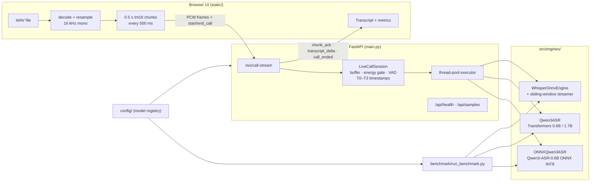
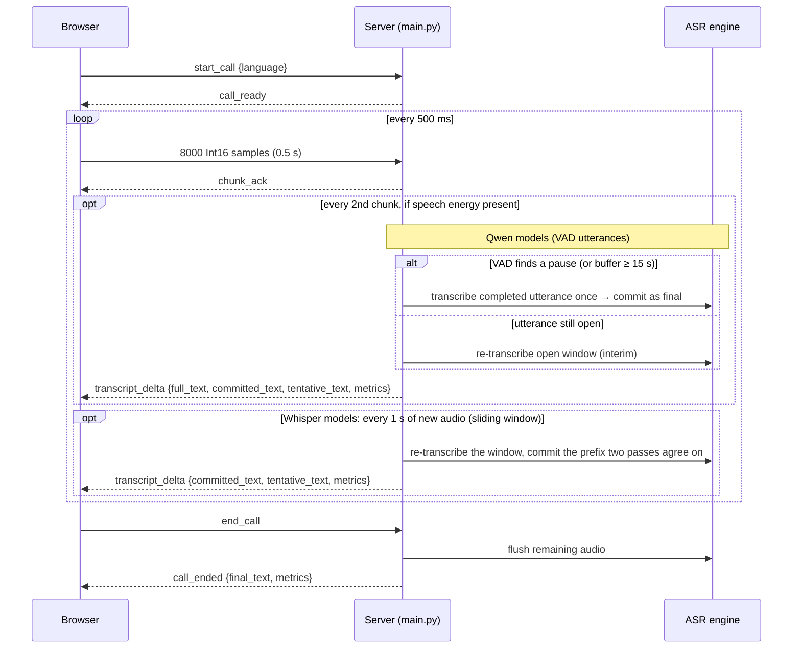

# RT-MASR-CPU

Real-time multilingual speech recognition on **CPU only**: a proof of concept
that simulates a live voice-call leg and streams it through **Qwen3-ASR or
Whisper** (selectable), plus a benchmark harness that compares both families.

- **Languages:** English, Mandarin Chinese, Bahasa Indonesia (auto-detect or forced).
- **Live demo:** a browser UI loads a WAV file, streams 16 kHz PCM over a WebSocket
  in 0.5 s chunks at real-time pace, and shows the evolving transcript with
  latency, RTF, stage-timing and process telemetry. Playback sound is **muted by
  default**; use the *Sound* toggle to listen along (transcription is unaffected).
- **Streaming modes:** Qwen3-ASR streams per speech utterance (energy gate + VAD);
  Whisper, which is an offline model, streams with a **sliding window** and
  LocalAgreement-2 (confirmed text vs. dimmed tentative text).
- **Engines:** Qwen3-ASR-0.6B on ONNX Runtime (INT8 decoder, no PyTorch),
  Qwen3-ASR-0.6B / 1.7B on Transformers (BF16), and Whisper tiny→medium on ONNX
  Runtime (INT8 / FP16 / FP32).
- **Benchmark:** cold-start load, latency/RTF percentiles, WER/CER, and
  concurrency scaling, written to JSON + Markdown reports.

---

## Architecture



### Call-leg flow



Details (WebSocket protocol, chunking/VAD parameters, metric definitions and
where each timestamp is captured, engine contract, known limitations) are in
[`docs/arch/architecture.md`](docs/arch/architecture.md).

---

## Repository layout

```
main.py                     FastAPI app: UI, /api/*, /ws/call-stream
static/                     Web UI (index.html, app.js, style.css)
src/
  core/config.py            Config + model-registry resolution
  engines/
    live_call_session.py    Per-call buffer, energy gate, VAD, telemetry
    qwen3_onnx_engine.py    Qwen3-ASR ONNX Runtime engine
    qwen3_engine.py         Qwen3-ASR Transformers engine
    whisper_engine.py       Whisper ONNX Runtime engine
    whisper_streaming.py    Sliding-window + LocalAgreement streamer for Whisper
  utils/
    audio_utils.py          Audio loading, mel spectrogram, silence splitting
    download_utils.py       Model downloader (CLI)
  whisper/                  Vendored Whisper tokenizer/decoding (whisper-onnx-cpu)
config/
  config.yaml               Server settings + default_model
  models/models.yaml        Model registry
  models/*.yaml             Per-model settings (download, engine, inference)
benchmark/                  Offline benchmark pipeline (runners, metrics, reporters, tests)
tests/                      Server / session / streaming tests
models/                     Downloaded weights (git-ignored)
test_audio/{en,cn,id}/      Test WAV files (git-ignored)
docs/                       Architecture, changelog, benchmark docs
```

---

## Requirements

- Linux x86_64 (developed on Ubuntu, kernel 6.8). macOS should work but is untested.
- Python **3.12** (pinned in `.python-version`).
- [`uv`](https://docs.astral.sh/uv/) (recommended) or `pip`.
- `curl` and `tar` (used to fetch the Whisper tarballs).
- RAM: ~4 GB for the ONNX engine alone; the Transformers 1.7B engine peaked at
  ~10 GB RSS during benchmarking. 16 GB is comfortable.
- Disk: ~2.5 GB for the ONNX model; ~14 GB for all Qwen3 models plus Whisper
  INT8 (see the table below); plus several GB for PyTorch.

No GPU is used. `torch` is only needed for the Transformers backend but is
installed as a dependency of `qwen-asr`.

---

## Installation

```bash
git clone <repo-url> RT-MASR-CPU
cd RT-MASR-CPU

# Install uv if needed
curl -LsSf https://astral.sh/uv/install.sh | sh

# Create .venv and install the locked dependencies (also installs src/ in editable mode)
uv sync
```

Without uv:

```bash
python3.12 -m venv .venv
source .venv/bin/activate
pip install -e .
```

All commands below are run **from the project root** (configs, `models/` and
`test_audio/` are resolved relative to it). With a plain venv, replace
`uv run python` with `python` after activating `.venv`.

---

## Model download

Weights are downloaded into `models/` by `src/utils/download_utils.py`, driven by
the `download:` section of each per-model YAML. All sources are public; no
Hugging Face token is needed.

| Registry name | Backend | Source | Local directory | Size on disk |
|---|---|---|---|---|
| `qwen3_onnx` | `onnx` | HF [`Daumee/Qwen3-ASR-0.6B-ONNX-CPU`](https://huggingface.co/Daumee/Qwen3-ASR-0.6B-ONNX-CPU) | `models/qwen3-asr-onnx` | 2.5 GB |
| `qwen3_0.6b` | `transformers` | HF [`Qwen/Qwen3-ASR-0.6B`](https://huggingface.co/Qwen/Qwen3-ASR-0.6B) | `models/qwen3-asr-0.6b` | 1.8 GB |
| `qwen3_1.7b` | `transformers` | HF [`Qwen/Qwen3-ASR-1.7B`](https://huggingface.co/Qwen/Qwen3-ASR-1.7B) | `models/qwen3-asr-1.7b` | 4.4 GB |
| `whisper_int8_{tiny,base,small,medium}` | `whisper` | PINTO model zoo, INT8 tarball | `models/whisper_int8` (shared) | 5.5 GB |
| `whisper_fp16` | `whisper` | PINTO model zoo, FP16 tarball | `models/whisper_fp16` | not measured |
| `whisper_fp32` | `whisper` | PINTO model zoo, FP32 tarball | `models/whisper_fp32` | not measured |

```bash
# Recommended minimum for the live demo
uv run python src/utils/download_utils.py --model qwen3_onnx

# Transformers variants (for comparison)
uv run python src/utils/download_utils.py --model qwen3_0.6b
uv run python src/utils/download_utils.py --model qwen3_1.7b

# Whisper INT8: one tarball containing tiny/base/small/medium (and *.en, large-v1/v2)
uv run python src/utils/download_utils.py --model whisper_int8

# Everything in the registry (includes the FP16/FP32 Whisper tarballs)
uv run python src/utils/download_utils.py

# Re-download even if files exist
uv run python src/utils/download_utils.py --model qwen3_onnx --force
```

A download is skipped when its target already looks complete (the required ONNX
files for `qwen3_onnx`, a non-empty directory for the others). Expected files:

```
models/qwen3-asr-onnx/   decoder_init.int8.onnx  decoder_step.int8.onnx  embed_tokens.bin
                         encoder_conv.onnx(.data)  encoder_transformer.onnx(.data)  tokenizer.json
models/whisper_int8/     {tiny,base,small,medium}_{encoder,decoder}_11_int8.onnx  ...
```

---

## Test audio

WAV files are git-ignored, so add your own under `test_audio/`. The folder name
sets the language the UI shows for a sample: `en`, `cn` (or `zh`), `id`.

```
test_audio/
  en/  librispeech_0_1089_0.wav  librispeech_1_1089_1.wav  librispeech_2_1089_2.wav
  cn/  OSR_cn_000_0072_8k.wav  OSR_cn_000_0073_8k.wav
  id/  ind_001.wav  ind_002.wav
```

These are the files `benchmark/configs/bench_config.yaml` and
`benchmark/data/references.yaml` expect (English from LibriSpeech speaker 1089,
Mandarin from the Open Speech Repository Chinese set). Any Linear PCM WAV works
in the UI; the browser resamples it to 16 kHz mono before streaming.

---

## Configuration

Pick the model served by the live UI in `config/config.yaml`:

```yaml
default_model: "qwen3_onnx"    # or "qwen3_0.6b", "qwen3_1.7b", "whisper_int8_tiny", ...
```

or override it for one run without editing the file:

```bash
RT_MASR_MODEL=whisper_int8_tiny uv run uvicorn main:app --host 0.0.0.0 --port 8000
```

The name is resolved through `config/models/models.yaml` to a per-model YAML
(`config/models/<name>.yaml`) that holds engine settings such as `num_threads`
(0 = all cores), `quantize`, `dtype`, default `language` and ORT session options.

- The repo currently ships with `default_model: "whisper_int8_tiny"`. Qwen3-1.7B
  ran slower than real time on an 8-core CPU in our benchmark (RTF ≈ 1.0–1.5); use
  `qwen3_onnx` or `whisper_int8_tiny` for a smooth live demo.
- `whisper_*` entries are served with **sliding-window streaming**: the window
  is re-transcribed every `hop_s`, text confirmed by two consecutive passes
  (LocalAgreement-2) is shown as final and the rest as dimmed tentative text. Tune
  it in the `streaming:` block of `config/models/whisper_*.yaml`. Start with
  `whisper_int8_tiny`; `small`/`medium` are slower than real time on CPU.
- The `server:` block (host/port) is not read by `main.py`; pass host/port to
  uvicorn instead.

---

## Run the live demo

```bash
uv run uvicorn main:app --host 0.0.0.0 --port 8000
# or, with auto-reload:
uv run python main.py
```

Open <http://localhost:8000>, then:

1. Pick a sample from the list (served from `test_audio/`) or load a local WAV.
2. Choose a language or leave **Auto-Detect**.
3. Press **Start Call**. The audio is streamed to the server at real-time pace;
   the transcript and metric cards update as results arrive. Playback is muted
   by default; click **Sound** to hear it (the setting persists across calls
   until the page reloads and never affects what is sent to the ASR).
4. **Hang Up** ends the call early; **Reset** clears the UI.

The model loads at startup (a few seconds for ONNX). `GET /api/health` reports
`model_ready`, the active model and process CPU/RSS.

---

## Run the benchmark

```bash
# Full run: every config in bench_config.yaml, 3 runs, concurrency legs 1/2/4
uv run python benchmark/run_benchmark.py

# Fast run: ONNX only, no accuracy, 1 run
uv run python benchmark/run_benchmark.py --models onnx_int8 --runs 1 --legs 1,2 --skip-accuracy

# ONNX vs Transformers 0.6B
uv run python benchmark/run_benchmark.py --models onnx_int8,transformers_bf16_0.6b --runs 3

# Qwen3 ONNX vs Whisper INT8 small
uv run python benchmark/run_benchmark.py --models onnx_int8,whisper_int8_small
```

Config ids: `onnx_int8`, `transformers_bf16_0.6b`, `transformers_bf16_1.7b`,
`whisper_int8_tiny`, `whisper_int8_base`, `whisper_int8_small`,
`whisper_int8_medium`. Reports are written to
`benchmark/results/<UTC timestamp>_raw.json` and `_summary.md`. See
[`docs/benchmark/benchmarking.md`](docs/benchmark/benchmarking.md) for what each
stage measures and how to read the results.

Sample results from `benchmark/results/20261004T095157Z_summary.md` (8 physical
/ 16 logical cores, 14.9 GB RAM, `librispeech_0_1089_0.wav`, 10.4 s):

| Config | Load | Latency P50 | RTF | WER | Throughput @ 4 legs |
|---|---|---|---|---|---|
| Qwen3-0.6B ONNX INT8 | 3.7 s | 2.27 s | 0.21 | 0.036 | 6.3 audio-h/h |
| Qwen3-0.6B Transformers BF16 | 5.8 s | 6.72 s | 0.64 | 0.036 | 1.8 audio-h/h |
| Qwen3-1.7B Transformers BF16 | 1.0 s* | 12.99 s | 1.25 | 0.000 | 1.0 audio-h/h |

\* Measured after the 0.6B run with weights in the page cache; not a true cold load.

---

## Tests

```bash
uv run pytest tests/test_live_call_session.py   # session buffer / gate / VAD, no models needed
uv run pytest benchmark/tests                   # benchmark pipeline, uses fake engines
uv run pytest                                   # all of tests/ (needs models + test_audio)
```

`tests/test_server.py`, `tests/test_full_stream.py` and
`tests/test_stream_realtime.py` load the configured model and read
`test_audio/`. `test_full_stream.py` still points at the old flat path
`test_audio/librispeech_0_1089_0.wav`.

---

## Known limitations

- Whisper live streaming re-encodes a 30 s-padded window every hop, so only tiny (and
  probably base) keep up with real time; larger models lag.
- `ttft_ms` is stamped when the first text-producing inference pass returns, so
  it measures that whole pass, not the first decoded token.
- The Transformers backend returns each pass's text in one piece (no token
  streaming); Whisper yields per segment.
- The energy gate is a fixed RMS threshold calibrated on the test audio, not a
  trained VAD; there is no queue limit or drop policy for frames that arrive
  during inference.
- Mandarin and Indonesian references are partly unverified drafts, so ZH/ID
  accuracy numbers are not yet meaningful.

---

## Documentation

| Document | Contents |
|---|---|
| [`docs/arch/architecture.md`](docs/arch/architecture.md) | Current POC architecture, streaming design, protocol, metrics, engine contract |
| [`docs/arch/changes.md`](docs/arch/changes.md) | Chronological changelog of architectural decisions and fixes |
| [`docs/benchmark/benchmarking.md`](docs/benchmark/benchmarking.md) | Benchmark pipeline design, CLI, metrics and outputs |
