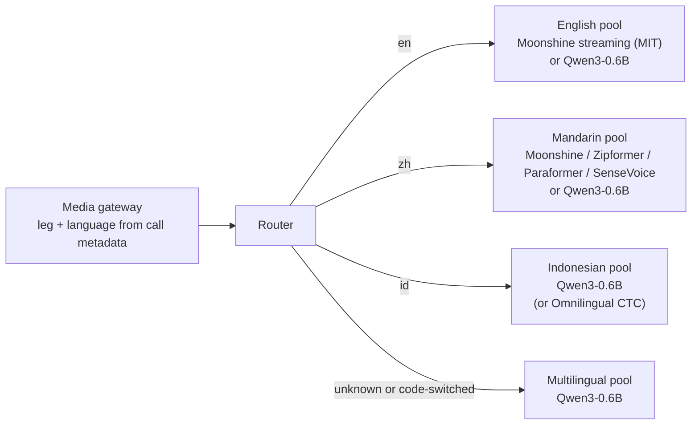
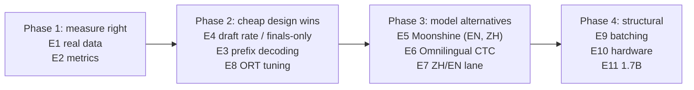

# Alternatives Analysis: Models, Runtimes and Designs

This document compares the models, runtimes and streaming designs that were considered for live EN / ZH / ID call
transcription on CPU, explains the trade-offs, and proposes the next experiments in priority order.

**Scope: CPU only.** Every option listed runs on a CPU with an ONNX Runtime or C++ CPU runtime. Options that need a GPU or a
GPU-serving stack such as vLLM are out of scope and not listed.

Current choice and its evidence: [`system_architecture.md`](system_architecture.md),
[`../report/technical_report.md`](../report/technical_report.md). Measured results:
[`../benchmark/final_result.md`](../benchmark/final_result.md), [`../loadtest/final_result.md`](../loadtest/final_result.md).

**Evidence labels**

| Label | Meaning |
|---|---|
| **MEASURED** | Run in this project (benchmark `20261005T173127Z`, load test `20261007T202154Z`, Ryzen 7 6800H, 16 threads, AVX2) |
| **PUBLISHED** | Stated by the model or runtime authors (model card, README, paper); not reproduced here |
| **EXPECTED** | Our reasoning from the measured bottleneck; needs an experiment |

External facts were checked in October 2026 (sources in section 10). Model licences and language lists change; re-check before adopting.

---

## 1. Summary

- **Current choice:** Qwen3-ASR-0.6B on ONNX Runtime, INT4 (INT8 as the conservative option), with re-transcription streaming.
  It is the only configuration tested that is accurate on all three languages and fast enough to stream. It carries
  **1 live leg per 16-thread box** (MEASURED).
- **The bottleneck is the streaming design rather than the model.** Re-transcribing open audio makes each audio second
  2.3-3.7x more expensive than one batch pass. Within each pass the sequential decode loop is 57-81% of the time, and at saturation
  only 38-68% of the CPU is busy (MEASURED). The most promising alternatives therefore cut **passes** or **decode steps**,
  or replace autoregressive decoding.
- **No single alternative model covers EN + ZH + ID with streaming and a commercial licence.** Strong streaming models
  exist for English and Mandarin (Moonshine, sherpa-onnx Zipformer / Paraformer) and fast offline ones for Chinese + English
  (SenseVoice), but none of them covers Indonesian. Meta's Omnilingual ASR covers all three but is a non-streaming CTC model. Replacing Qwen means either
  **per-language engines** or accepting a different streaming design.
- **Evaluation is the weakest link.** 7 clips, 54 verified English words, and Mandarin / Indonesian references drafted from
  Qwen output cannot rank models reliably. **More real, human-transcribed data and a broader metric set come first**
  (experiments E1 and E2), before any model swap.

**Top recommended experiments:**

1. **E1:** real call data with verified references.
2. **E2:** metrics beyond WER/CER (streaming latency and stability, hallucination, entities, confidence intervals).
3. **E3:** prefix-forced incremental decoding for Qwen in our CPU ONNX engine.
4. **E4:** draft-rate and finals-only sweep.
5. **E5:** Moonshine as a streaming lane for English (and Mandarin).
6. **E6:** Omnilingual ASR CTC as a cheap all-language candidate.

---

## 2. Decision criteria

| Criterion | Why it matters | How it is measured |
|---|---|---|
| Language coverage | EN, Mandarin (Simplified), Indonesian in one deployment | Model card; our accuracy suite per language |
| Accuracy | Transcript quality on real calls | WER (EN, ID), CER (ZH) on verified references, plus E2 metrics |
| Live capacity | Fleet cost scales with boxes per leg | Load test: max legs kept up per box at the 2 s SLO |
| Streaming behaviour | Partials, finalisation delay, stability | Staleness, time to first text, partial rewrites (E2) |
| CPU runtime maturity | Must run on edge CPUs without a GPU | ONNX / C++ runtime available; INT8 / INT4 quantisation |
| Memory | Box RAM | Peak RSS in the benchmark and load test |
| Licence | Commercial deployment | Model licence (code and weights can differ) |
| Integration effort | New engine in `src/engines/` + registry YAML + benchmark/load-test ids | Engineering days |

---

## 3. What the measured bottleneck says about alternatives

| Measured fact | Implication for alternatives |
|---|---|
| Re-transcription multiplies cost per audio second by 2.3-3.7x (Qwen) | Fewer or cheaper draft passes, or a streaming-native model, attack the largest cost |
| Decode loop is 57-81% of a Qwen pass; mel features ≤ 1% | Shorter decodes (prefix forcing, fewer tokens) or non-autoregressive models (CTC, transducer, Paraformer) avoid the dominant stage |
| CPU only 38-68% busy at saturation; 4, 8 and 16 threads all carried 1 Qwen leg | Legs are bound by per-pass latency, not total CPU: batching across legs or several smaller processes could use idle cores |
| One extra Qwen leg took P95 staleness from 0.98 s to 3.1 s | Any design must be load-tested; single-stream RTF does not predict live capacity |
| FP32 no more accurate than INT8 on this data; ONNX 3.8x faster than PyTorch BF16 | Stay on quantised ONNX-class runtimes; precision is not the lever |

---

## 4. Options already measured in this project

| Configuration | Overall RTF | EN WER | ZH CER\* | Live legs / box | Verdict |
|---|---|---|---|---|---|
| Qwen3-0.6B ONNX INT4 | 0.141† | 0.038† | 0.000 | **1** | **Chosen**: same capacity as INT8, ~1.2 GB less RAM, ~12% less compute. Set language per leg (empty output once with auto-detect) |
| Qwen3-0.6B ONNX INT8 | 0.151 | 0.037 | 0.013 | **1** | Conservative alternative; no INT4 caveat |
| Qwen3-0.6B ONNX FP32 | 0.278 | 0.037 | 0.000 | not tested | Rejected: 1.8x slower, ~2.5 GB more RAM, no accuracy gain |
| Qwen3-1.7B ONNX INT4 | 0.245 | 0.000 | 0.000 | not tested (expected ≤ 1) | Accuracy ceiling; ~1.6-1.9x the cost of 0.6B |
| Qwen3-0.6B / 1.7B Transformers BF16 | 0.571 / 1.070 | 0.037 / 0.000 | 0.000 / 0.000 | not tested | Rejected: 3.8-4.4x slower than ONNX |
| Whisper tiny INT8 (ONNX) | 0.245 | 0.130 | 0.470 | **3** conv / **2** dense | Density fallback where accuracy allows; weak Mandarin |
| Whisper base / small / medium INT8 | 0.548 / 1.716 / 6.387 | 0.093 / 0.019 / 0.019 | 0.282 / 0.060 / 0.040 | not tested | Small and medium cannot keep up live; base is weak on ZH |

\* ZH references are unreviewed drafts from Qwen output, so ZH scores favour Qwen. † Excludes the one clip INT4 returned empty.

---

## 5. Alternative models considered (not measured here)

| Model | Type | EN | ZH | ID | Streaming | Licence | CPU path | Trade-off | Verdict |
|---|---|---|---|---|---|---|---|---|---|
| **Moonshine streaming** (EN Tiny 34M / Small 123M / Medium 245M; ZH Tiny 34M) | Encoder-decoder with a sliding-window streaming encoder and caching | yes | yes (Tiny Streaming only) | **no** | **yes**, native | **Streaming models MIT in every language**; only the legacy non-streaming non-English models stay under the non-commercial Moonshine Community Licence (licence changed in 2026: confirm per checkpoint) | ONNX Runtime C++ core with Python bindings; ORT flatbuffer (`.ort`) models only since v0.1.2; also in sherpa-onnx | English WER 12.0 / 7.8 / 6.7% (Tiny / Small / Medium streaming, Open ASR leaderboard average) at 69 / 165 / 269 ms on Linux x86; Mandarin Tiny Streaming CER 16.1% on the vendor's 400-clip set (PUBLISHED, not comparable with our numbers). Mandarin only at Tiny size | **Strong candidate for an English lane, possible Mandarin lane** (E5). Not a single-model replacement |
| **Omnilingual ASR CTC** (300M / 1B, v2) | wav2vec2 encoder + CTC head, non-autoregressive | yes | yes (`cmn_Hans`) | yes | no (offline); usable with VAD segments | Apache-2.0 | sherpa-onnx INT8 / INT4 exports (~235 MB for 300M INT8) | No decode loop, so it avoids our dominant stage. Accuracy on high-resource languages vs Qwen unknown; output style (punctuation, casing, numerals) needs checking | **Candidate** for a cheap all-language engine (E6) |
| **sherpa-onnx streaming Zipformer / Paraformer** (bilingual zh-en) | Transducer / Paraformer, truly streaming | yes | yes | **no** | **yes**, native | Apache-2.0 (per model; check each) | sherpa-onnx C++ / Python, INT8 | Very low cost per leg; older (2023) models trained mainly on read Chinese / English data | **Candidate for a ZH / EN lane** (E7) |
| **SenseVoice-Small** (234M) | Non-autoregressive encoder | yes | yes | **no** | no (fast offline) | Check model licence | FunASR, sherpa-onnx INT8 | Very fast, strong Mandarin (PUBLISHED); languages limited to zh, en, yue, ja, ko | Candidate for a ZH / EN lane (E7) |
| **Whisper via faster-whisper (CTranslate2) / whisper.cpp** | Same Whisper models, faster runtimes | yes | weak at small sizes | yes | no (re-transcription) | MIT | Mature CPU runtimes with INT8 | Faster than our ONNX path is likely, but Whisper's 30 s window and small-model Mandarin weakness remain | Low priority: only if Whisper stays as fallback |
| **Whisper large-v3-turbo** | Larger Whisper | yes | good | yes | no | MIT | CTranslate2 / whisper.cpp | Much better multilingual accuracy; Whisper small is already RTF 1.7 here | Expected too slow for live CPU use; batch / post-call only |
| **NVIDIA Parakeet-TDT-0.6B-v3 / Canary-1B-v2** | Transducer / encoder-decoder | yes | **no** | **no** | Parakeet: streaming-capable | CC-BY-4.0 | ONNX exports in sherpa-onnx (CPU) | 25 European languages only | Excluded (language coverage) |

### 5.1 Per-language engines (a design enabled by these models)

Because no streaming model covers all three languages, the realistic route to a cheaper model is **routing each leg to a
language-specific engine**. The language comes from call metadata, which production should set anyway
([system architecture, section 3.4](system_architecture.md#34-model-and-runtime-choice)).

| Pro | Con |
|---|---|
| Each pool uses the cheapest accurate engine for its language; the gain is largest if English is the biggest share of traffic | Several models to qualify, monitor and size; capacity is fragmented across pools |
| A streaming-native English engine could carry many legs per box (EXPECTED; to be measured) | Language must be known up front; code-switching (common in Indonesian and Singaporean speech) needs the multilingual pool |
| Pools fail independently | More routing logic; a load test per pool |

---

## 6. Alternative runtimes

| Runtime | Status | Trade-off | Verdict |
|---|---|---|---|
| **ONNX Runtime (CPU EP), INT8 / INT4** | **Chosen**, MEASURED | 3.8x faster than PyTorch BF16 at the same accuracy | Keep |
| PyTorch / Transformers BF16 | MEASURED | Simplest to run, slowest | Reference only |
| ONNX Runtime tuning: spin-wait off (`session.intra_op.allow_spinning = 0`), explicit thread counts, smaller pinned processes | Not tested | Spin-wait inflates CPU use and may slow neighbouring passes; effect on legs per box unknown | Cheap experiment (E8) |
| OpenVINO | Not tested | Strong on Intel CPUs (especially with AMX); less benefit on AMD | Consider only if the edge boxes are Intel |
| CTranslate2 / whisper.cpp | Not tested | Best-in-class Whisper CPU runtimes | Only if Whisper remains in use |
| sherpa-onnx | Not tested | One C++ runtime for Zipformer, Paraformer, SenseVoice, Moonshine and Omnilingual CTC, with streaming APIs and a built-in Silero VAD | **Recommended vehicle** for E5-E7 |

---

## 7. Alternative streaming designs (same model)

| Design | What changes | Expected effect | Risk / cost | Experiment |
|---|---|---|---|---|
| **Prefix-forced incremental decoding** | Feed the previous transcript (minus the last ~5 unstable tokens) as an assistant-prompt prefix, so each pass decodes only the new tail (suggested start: 2 s chunks, roll back 5 tokens, no prefix for the first 2 chunks, the defaults in the Qwen3-ASR reference code). Our engine already builds the prompt from token ids and appends forced-language tokens, so a prefix fits the same place | Fewer decode steps per pass, attacking the 57-81% decode share; the prefix is processed in one prefill call | Errors in the prefix can persist; must still bound the audio (keep our 15 s VAD commits) | **E3** |
| Lower draft-pass rate | Qwen drafts every 4th chunk (~2 s) instead of every 2nd; Whisper `hop_s` 2 s | Roughly halves draft passes; finals unchanged | Partials ~1 s later | **E4** |
| Finals-only | Transcribe only committed utterances | Cost approaches the batch RTF (~0.15-0.19); the re-transcription multiplier mostly disappears | No live partials | **E4** |
| Encoder caching | Reuse encoder output for audio already seen | Removes repeated encoding of the stable prefix | Full-attention encoders change all outputs when audio is appended; needs a chunked or windowed encoder export | Research |
| Cross-leg batching | One ONNX call serves the encoder / decode steps of several legs | Uses the idle cores seen at saturation | Scheduler complexity, padding waste, latency coupling between legs | **E9** |
| Several processes per box (e.g. 4 x 4 threads) | Less contention per session | May raise legs per box if latency-bound | Weights duplicated per process; an earlier 2-process run doubled RAM without a gain | **E8** |
| Qwen skip-ahead + bounded queue | Process the newest audio; drop stale drafts | Graceful degradation instead of unbounded lag | Some drafts lost under load | Production fix (required) |
| Gateway VAD with hangover | Neural VAD in the gateway replaces the RMS gate | Fewer passes on noise; better utterance cuts | VAD tuning per use case | Production design |
| Stronger CPUs (AVX-512 VNNI / AMX) | Faster INT8 matrix work | Higher per-core throughput than this AVX2 laptop | Sizing must be re-measured on that hardware | **E10** |

---

## 8. Trade-off overview

| Option | Capacity gain potential | Accuracy risk | Latency effect | Effort | Licence risk |
|---|---|---|---|---|---|
| Prefix-forced decoding (Qwen) | Medium-High (EXPECTED) | Low-Medium | Neutral or better | Medium | None |
| Lower draft rate / finals-only | Medium-High | None (finals unchanged) | Partials later / none | Low | None |
| Moonshine EN (and ZH) lane | High for English (EXPECTED) | Medium for EN, High for ZH Tiny (telephony unknown) | Better (native streaming) | Medium | Low (streaming models MIT; confirm per checkpoint) |
| Omnilingual CTC | High (no decode loop, EXPECTED) | **High** (quality vs Qwen unknown) | Similar (still offline segments) | Medium | Low (Apache-2.0) |
| Zipformer / Paraformer / SenseVoice ZH-EN lane | High (EXPECTED) | Medium-High (older or narrower training data) | Better for Zipformer / Paraformer | Medium | Check per model |
| Cross-leg batching | Medium-High | None | Can couple legs | High | None |
| Stronger CPU | Unknown until measured | None | Better | Low (re-run load test) | None |
| Qwen3-1.7B INT4 | Negative (more cost) | Better accuracy | Worse | Low | None |

---

## 9. Recommended next experiments

### 9.1 Make the measurements trustworthy first

The current suite cannot separate models whose error rates differ by a few points. The English set is 3 clips (54 words), so one
word moves WER by about 2 points. The Mandarin and Indonesian references are drafts derived from Qwen's own output, which biases
any comparison in Qwen's favour. Model swaps should wait for E1 and E2.

#### E1. More real data with verified references (priority 1)

| Data | Why | Source (check licence before use) |
|---|---|---|
| **Real call recordings from the target use case**, both directions, with consent | The only data that represents the production audio (8 kHz, codecs, noise, accents, overlap, code-switching) | Customer / pilot calls, transcribed by humans per a written transcription guide |
| Public read and spontaneous speech per language | Comparable, reproducible baselines | FLEURS (`en_us`, `cmn_hans_cn`, `id_id`), Common Voice (EN, ZH, ID), LibriSpeech `test-clean` / `test-other`, AISHELL-1 test (ZH) |
| Telephony-degraded copies of public data | Approximates 8 kHz call audio before real calls are available | Resample to 8 kHz, apply G.711 encode / decode, add noise at several SNRs |
| Conversational and code-switched speech | Indonesian and Mandarin calls often mix in English | ASCEND (EN-ZH code-switching); licensed corpora such as SEAME if available |
| Non-speech audio | Measures hallucination (the POC once produced full sentences on silence) | Silence, line noise, music-on-hold, DTMF, comfort noise |

Targets: at least **1-2 hours per language** for model ranking (several hundred utterances, many speakers). References are
human-verified, with a second pass on a sample to estimate transcriber disagreement. Mark every file with language, domain,
channel (wideband / 8 kHz), SNR band and speaker id, so results can be broken down. Store the manifest in
`benchmark/data/references.yaml`; it already has a `verified` flag.

#### E2. Metrics beyond WER / CER (priority 1)

WER and CER stay the primary accuracy metrics, but alone they do not describe a live transcript. Add:

| Metric | What it catches | How |
|---|---|---|
| WER / CER with **95% confidence intervals** | Whether a difference between models is real | Bootstrap over utterances; report the interval next to every rate |
| **Substitutions / deletions / insertions** breakdown | Insertions reveal hallucination; deletions reveal dropped or empty output | Already computed by the edit-distance alignment; report separately |
| Language-aware normalisation | Script and formatting differences scored as errors (Whisper's Traditional characters, "10" vs "ten") | OpenCC Traditional→Simplified for ZH; Whisper-style EN normaliser; numeral rules for ID |
| **Streaming-final vs offline gap** | Accuracy lost by streaming (cuts, LocalAgreement, forced commits) | WER of the committed streaming transcript minus WER of one batch pass on the same audio |
| **Finalisation latency** | How long after a word is spoken it becomes committed | Word end times from forced alignment of the reference; commit time from the stream logs |
| **Partial stability** | Flicker of tentative text that agent-assist UIs show | Share of tentative words later changed; number of rewrites per committed word |
| Time to first text, P95 staleness, end lag | Live latency | Already measured by the load test |
| **Hallucination rate** | Text produced on non-speech | Words per minute output on the non-speech set from E1 |
| **Empty-output and language-ID error rate** | The INT4 empty output and the Malay-for-Indonesian detection seen here | Count per model and language, with and without forced language |
| **Entity accuracy** | Names, numbers, amounts, product terms matter more than filler words | Keyword / entity recall and precision on a tagged subset |
| Cost per live leg | The business metric | Boxes per 100 legs from the load test, at a fixed accuracy |

**Done when:** the benchmark report prints each metric per language with confidence intervals, and the load test reports
finalisation latency and partial stability next to staleness.

### 9.2 Experiment list

| # | Experiment | Hypothesis | Method | Success criterion | Effort |
|---|---|---|---|---|---|
| **E1** | Real data + verified references | Current rankings may change on real calls | Section 9.1 | ≥ 1-2 h per language, human-verified, tagged | Medium-High (mostly transcription) |
| **E2** | Extended metrics | WER alone hides hallucination, latency and stability problems | Section 9.1 | Metrics reported per language with CIs | Medium |
| **E3** | Prefix-forced incremental decoding (Qwen ONNX) | Re-using the stable transcript as a prompt prefix cuts decode steps per pass | In `qwen3_onnx_engine.py`, append the previous text minus the last ~5 tokens after `<asr_text>` in `_build_prompt_ids`; keep VAD commits at 15 s; sweep the rollback length (3-10 tokens) and chunk size (1-2 s) | Pass RTF and legs per box up, streaming-final WER within the E1 confidence interval of today's | Medium |
| **E4** | Draft-rate sweep and finals-only mode | Fewer draft passes raise legs per box without changing finals | Make Qwen's `infer_every_n_chunks` a real setting (it is in the YAMLs but not read; Whisper's `hop_s` already is); load test at 1 s / 2 s / 3 s and finals-only | Legs per box vs time to first text curve; pick a product default | Low |
| **E5** | **Moonshine** streaming lane (EN, then ZH) | A native streaming model carries several legs per box at Qwen-like English accuracy | Add a `moonshine` backend (Moonshine library or sherpa-onnx) implementing `transcribe` / `transcribe_stream`; run the benchmark (E1 data, 8 kHz copies) and the load test for EN Tiny / Small / Medium streaming, then the Mandarin Tiny streaming model. Confirm the licence of each checkpoint used | EN WER within the E1 CI of Qwen-0.6B on call audio and ≥ 3x Qwen's legs per box; ZH judged by the section 9.4 rules | Medium |
| **E6** | **Omnilingual ASR CTC** 300M / 1B | A CTC model without a decode loop gives cheap passes for all three languages | sherpa-onnx INT8 export; VAD-segment re-transcription like the Qwen path; EN / ZH / ID accuracy on E1 data; load test | Accuracy close enough to Qwen to justify the capacity gain (decision rule in section 9.4) | Medium |
| **E7** | ZH / EN lane candidates | Zipformer / Paraformer (streaming) or SenseVoice (fast offline) beat Qwen on cost for Mandarin and English | sherpa-onnx; same accuracy and load-test protocol | As for E5, per language | Medium |
| **E8** | ONNX Runtime and process layout tuning | Spin-wait and thread layout limit legs per box | Load test with `allow_spinning=0`, ORT threads 4 / 8 / 16, and 2 x 8 / 4 x 4 pinned processes at whole-box scale | ≥ 1 more Qwen leg per box, or a documented negative result | Low |
| **E9** | Cross-leg batching prototype | Batching passes from several legs uses the idle cores at saturation | Batch encoder calls first (simplest), then decoder steps; measure in the load test | Legs per box up without breaking the 2 s SLO | High |
| **E10** | Hardware comparison | AVX-512 VNNI / AMX CPUs carry more legs per box | Re-run `run_loadtest.py` unchanged on candidate edge boxes | Measured legs per box and cost per leg per hardware type | Low (needs hardware) |
| **E11** | Qwen3-1.7B INT4 live test | Accuracy upper bound at what live cost | Add to the load-test roster | Measured legs per box (expected ≤ 1) and accuracy gain on E1 data | Low |

### 9.3 Suggested order

E4 and E8 can start in parallel with E1, because they only need the existing load test. E3, E5, E6 and E7 need the E1 data
to decide whether accuracy holds.

### 9.4 Decision rules

Adopt an alternative for a language or pool only if, on the E1 data for that language:

1. its WER / CER is within the 95% confidence interval of Qwen3-0.6B, **or** the business owner accepts the measured gap in
   exchange for the measured cost saving;
2. it carries **at least 2x** Qwen's live legs per box at the 2 s SLO on the target hardware;
3. hallucination rate, empty-output rate and entity accuracy are no worse than Qwen's;
4. its licence permits commercial use of the weights.

---

## 10. Sources (checked October 2026)

| Topic | Source |
|---|---|
| Moonshine models, WER and licences | [github.com/moonshine-ai/moonshine](https://github.com/moonshine-ai/moonshine) (LICENSE, CHANGELOGS.md); [available models](https://moonshine-voice.readthedocs.io/en/stable/models/available-models/); [Flavors of Moonshine (arXiv 2509.02523)](https://arxiv.org/abs/2509.02523) |
| Qwen3-ASR languages and prefix-rollback defaults | [github.com/QwenLM/Qwen3-ASR](https://github.com/QwenLM/Qwen3-ASR) |
| Omnilingual ASR | [github.com/facebookresearch/omnilingual-asr](https://github.com/facebookresearch/omnilingual-asr); [sherpa-onnx 300M CTC v2 INT8 export](https://huggingface.co/csukuangfj2/sherpa-onnx-omnilingual-asr-1600-languages-300M-ctc-int8-v2-2026-02-05) |
| sherpa-onnx streaming models | [k2-fsa/sherpa-onnx](https://github.com/k2-fsa/sherpa-onnx); [pre-trained models](https://k2-fsa.github.io/sherpa/onnx/pretrained_models) |
| SenseVoice | [github.com/FunAudioLLM/SenseVoice](https://github.com/FunAudioLLM/SenseVoice) |
| Parakeet / Canary languages | [nvidia/parakeet-tdt-0.6b-v3](https://huggingface.co/nvidia/parakeet-tdt-0.6b-v3); [arXiv 2509.14128](https://arxiv.org/abs/2509.14128) |
