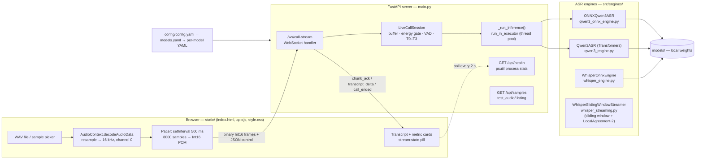
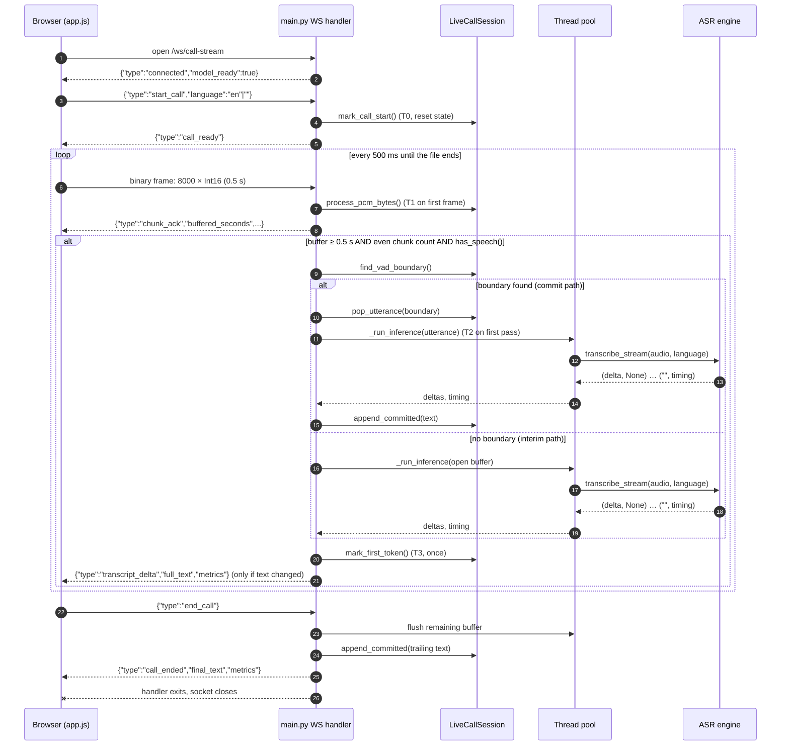
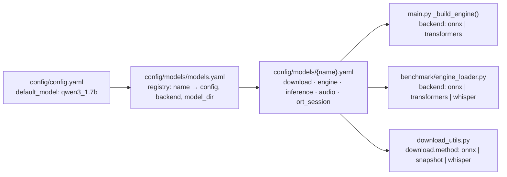

# RT-MASR-CPU — POC Architecture

This document describes how the proof of concept is built **as it exists in the
code today**: components, the per-call streaming flow, the WebSocket protocol,
the latency metrics and where their timestamps are captured, the engine
contract, and configuration resolution. Historical design changes are in
[`changes.md`](changes.md); the benchmark harness is described in
[`../benchmark/benchmarking.md`](../benchmark/benchmarking.md).

---

## 1. Component overview



| Layer | File(s) | Responsibility |
|---|---|---|
| UI / call-leg simulator | `static/index.html`, `static/app.js`, `static/style.css` | Load a WAV, decode/resample to 16 kHz mono, stream it at real-time pace, render the evolving transcript and telemetry |
| API / session layer | `main.py` | Serve the UI, `/api/*` endpoints and the `/ws/call-stream` WebSocket; one `LiveCallSession` per connection; schedule inference off the event loop |
| Session state | `src/engines/live_call_session.py` | PCM → float32 buffering, RMS energy gate, VAD boundary detection, committed transcript, timestamp anchors and metric assembly |
| ASR engines | `src/engines/*.py` | Model loading and inference; all expose `transcribe()` and `transcribe_stream()` with the same contract |
| Shared audio helpers | `src/utils/audio_utils.py` | Audio loading, 128-bin mel spectrogram for Qwen3, silence split points for long files |
| Vendored Whisper decoding | `src/whisper/` | Tokenizer, beam search / temperature fallback and segment logic (from `whisper-onnx-cpu`), driven by ONNX sessions |
| Configuration | `src/core/config.py`, `config/` | Resolve the active model from the registry |
| Model acquisition | `src/utils/download_utils.py` | Download weights from Hugging Face or the PINTO model zoo |

---

## 2. Per-call streaming flow

One WebSocket connection is one **call leg**. The browser plays the file
locally and, in parallel, pushes it to the server at the same pace it plays.



### 2.1 Audio format and normalisation

- **Baseline format:** 16 kHz, mono, Linear PCM.
- **Normalisation happens in the browser.** `AudioContext({sampleRate: 16000})`
  plus `decodeAudioData` decodes any WAV the browser understands (including the
  8 kHz Mandarin OSR files) and resamples it to 16 kHz. Only channel 0 is sent.
  Samples are clipped to [-1, 1] and converted to Int16.
- **Server side**, `process_pcm_bytes()` converts Int16 → float32 / 32768 and
  appends to `audio_buffer`.

### 2.2 Chunking, pacing and triggering

| Parameter | Value | Where |
|---|---|---|
| Chunk size | 8000 samples = 0.5 s | `app.js` (`chunkSize`) |
| Send interval | 500 ms (`setInterval`) → real-time pace | `app.js` |
| Inference trigger | buffer ≥ 8000 samples, every 2nd chunk (~1 s), and `has_speech()` | `main.py` |
| Energy gate | RMS of the last 0.5 s > 0.02 (~-34 dBFS) | `LiveCallSession.RMS_SPEECH_THRESHOLD` |
| VAD scan | 100 ms frames, starting 2 s into the buffer; first frame below the gate is the boundary | `find_vad_boundary()` |
| Minimum committed utterance | 2 s (`min_silence_samples = 32000`) | `find_vad_boundary()` |
| Forced commit | buffer ≥ 15 s (`max_utterance_samples = 240000`) | `find_vad_boundary()` |

The `streaming:` block in the per-model YAMLs (`min_buffer_samples`,
`infer_every_n_chunks`) documents these values but **is not read** by
`main.py`; the trigger values are hard-coded in the handler.

### 2.3 Partial vs final text

- **Committed text** (`session.committed_text`) is final. Each committed
  utterance is transcribed once and its samples are discarded, so inference cost
  is bounded by the 15 s window, not by call length.
- **Interim text** is the transcription of the open (uncommitted) buffer and is
  replaced on every pass.
- The server sends `committed_text`, `tentative_text` (the interim part) and
  `full_text` (both joined). The UI renders confirmed text normally and tentative
  text dimmed/italic.

### 2.3.1 Whisper: sliding-window streaming

Whisper cannot emit tokens as audio arrives, so when the active model has
`backend: whisper` the handler uses `WhisperSlidingWindowStreamer`
(`src/engines/whisper_streaming.py`) instead of the VAD-utterance path above.
`/api/health` and every WebSocket message report `stream_mode`
(`sliding_window` or `vad_utterance`).

1. Audio accumulates in `session.audio_buffer`, which *is* the window.
2. Every `hop_s` (1 s) of new audio the whole window is re-transcribed.
3. **LocalAgreement-2:** the longest common prefix of the current and previous
   hypothesis (compared case/punctuation-insensitively; per character for CJK) is
   committed and never changes. The rest is `tentative_text`.
4. **Sliding:** when the window exceeds `max_window_s` (12 s) it is cut forward to
   the end of the last fully committed Whisper segment, so pass cost stays bounded.
   At `hard_max_window_s` (20 s) the hypothesis is force-committed and the window cut.
5. **Silence flush:** speech followed by `silence_flush_s` (0.8 s) of silence
   commits everything and empties the window. Pure silence never reaches the model
   and only a `preroll_s` tail is kept.
6. The first detected language is locked for the rest of the call
   (`lock_language`), avoiding language flip-flop and the per-pass detection cost.

A reader task drains WebSocket frames into a queue and `_drain_audio` pulls
everything pending before each pass, so if a pass is slower than real time the
stream stays live (latency grows, the backlog does not). Knobs live in the
`streaming:` block of each `config/models/whisper_*.yaml`.

### 2.4 Concurrency and backpressure

- Inference runs in the default `ThreadPoolExecutor` via `run_in_executor`, so
  one call's inference does not block the event loop, other calls, or
  `/api/health`.
- Within a single call, the handler `await`s inference before calling
  `receive()` again. Frames that arrive during inference queue in the server's
  WebSocket receive buffer and are drained once inference returns. There is no
  explicit queue limit, drop policy or late-chunk counter.
- All calls share one engine instance (one loaded model per process).

### 2.5 End of stream

When the file has been fully sent the browser sends `end_call`. The server runs
one final pass on whatever is left in the buffer, commits it, replies with
`call_ended` (`final_text` + metrics including `total_call_time_s`) and exits the
handler. Pressing **Hang Up** sends `end_call` as well but tears the socket down
immediately on the client side.

---

## 3. WebSocket and HTTP API

| Endpoint | Method | Purpose |
|---|---|---|
| `/` | GET | Serves `static/index.html` |
| `/static/*` | GET | UI assets |
| `/api/health` | GET | `model_ready`, active model/backend, `stream_mode`, process CPU %, RSS/VMS MB, thread count |
| `/api/samples` | GET | Lists `test_audio/**/*.wav`; language inferred from the parent folder (`en`, `cn`/`zh`, `id`) |
| `/api/samples/{path}` | GET | Returns one sample WAV |
| `/ws/call-stream` | WebSocket | One call leg |

**Client → server**

| Message | Shape |
|---|---|
| Start | `{"type": "start_call", "language": "en" \| "zh" \| "id" \| ""}` (empty = auto-detect) |
| Audio | Binary frame of little-endian Int16 PCM, 16 kHz mono |
| End | `{"type": "end_call"}` |

**Server → client**

| Message | Fields |
|---|---|
| `connected` | `model_ready`, `stream_mode`, `message` |
| `call_ready` | `stream_mode`, `message` |
| `chunk_ack` | `buffered_seconds`, `chunks_received`, `total_bytes` |
| `transcript_delta` | `full_text`, `committed_text`, `tentative_text`, `metrics` (+ `stream_mode`, and `window_s` / `window_start_s` / `language` in sliding-window mode) |
| `call_ended` | `final_text`, `metrics` (+ `total_call_time_s`) |

---

## 4. Latency metrics and timestamp capture points

All timestamps are server-side wall-clock (`time.time()`).

| Anchor | Captured in | Moment |
|---|---|---|
| T0 | `mark_call_start()` | `start_call` message received |
| T1 | `process_pcm_bytes()` | First PCM frame received |
| T2 | `mark_infer_start()` (first call) | Just before the first inference pass is dispatched |
| Tx | `mark_infer_start()` (every call) | Just before each inference pass |
| Ty | `time.time()` in `main.py` | After `_run_inference()` returns for that pass |
| T3 | `mark_first_token()` | After the first pass that produced any text has **returned** |

| Metric | Formula | Meaning |
|---|---|---|
| `pipeline_latency_ms` | T3 − T0 | Call start → first usable transcript. Includes ~1 s of buffering before the first trigger |
| `ttft_ms` | T3 − T2 | First inference dispatch → first text available to the server |
| `infer_latency_ms` | Ty − Tx | Wall-clock of the most recent pass |
| `rtf` | `infer_latency_ms` / duration of `audio_buffer` at metric time | Real-time factor of that pass |
| `mel_ms`, `encoder_ms`, `prefill_ms`, `decode_ms` | From the engine's timing sentinel | Per-stage breakdown. ONNX Qwen, Transformers Qwen (forward hooks) and Whisper report measured values for all four (Whisper `prefill` = decoder prompt/language-id pass at KV offset 0; `decode` = later per-token steps) |
| `throughput_tps` | `tokens_generated / decode_s` | Decoder tokens per second |
| `audio_throughput_bps` | `total_bytes / (now − T0)` | Average PCM ingress rate |
| `rss_delta_mb` | `ru_maxrss(now) − ru_maxrss(T0)` | Peak-RSS growth during the call |

Measurement caveats, all visible in the code:

- Deltas are collected inside the worker thread and returned as a list, so T3 is
  stamped when the **whole first pass** finishes. `ttft_ms` is effectively the
  latency of the first text-producing pass, not true time-to-first-token.
- On the commit path `rtf` and `audio_duration_s` are computed against the
  buffer **after** `pop_utterance()`, i.e. the leftover audio rather than the
  utterance that was just transcribed.

---

## 5. Engine contract

Every engine exposes the same two methods, so `main.py` and the benchmark are
backend-agnostic:

```python
engine.transcribe(audio_path_or_array, language=None) -> dict
# {"text": str, "language": str, "timing": {"total_s", "audio_duration_s", "rtf", ...}}

engine.transcribe_stream(audio_array, language=None) -> Generator[tuple[str, dict | None]]
# yields (delta, None) ... then a final ("", timing) sentinel
```

| Engine | Runtime | What `transcribe_stream` yields |
|---|---|---|
| `ONNXQwen3ASR` (`qwen3_onnx`) | ONNX Runtime, INT8 decoder, no PyTorch | True token-level deltas from the greedy decode loop; timing has mel / encoder / prepare / prefill / decode |
| `Qwen3ASR` (`qwen3_0.6b`, `qwen3_1.7b`) | `qwen-asr` package on PyTorch, BF16 | One delta with the full text (the library call is blocking), then timing |
| `WhisperOnnxEngine` (`whisper_*`) | ONNX Runtime + vendored `src/whisper` decoding | One delta per Whisper segment after the full pass, then timing |

Qwen3 ONNX pipeline:

```
16 kHz wav → 128-bin log-mel → encoder_conv (100-frame chunks) → encoder_transformer
          → audio features replace <|audio_pad|> tokens in the chat prompt embeddings
          → decoder_init (prefill, KV cache) → decoder_step loop (greedy) → tokenizer.decode
```

Whisper ONNX pipeline:

```
16 kHz wav → 80-bin log-mel (30 s window) → {size}_encoder_11_{precision}.onnx
          → {size}_decoder_11_{precision}.onnx with KV cache, beam search 5,
            temperature fallback (0.0 … 1.0), language auto-detect
```

---

## 6. Configuration resolution



`resolve_model_config()` resolves registry and per-model paths relative to the
project root (the parent of `config/`).

---

## 7. Known limitations

- **Whisper streaming cost.** Each sliding-window pass re-encodes the window
  (padded to 30 s by Whisper), so tiny costs ~1 s per pass on an 8-core CPU and
  larger models cannot keep up with a 1 s hop (medium RTF > 2). Raise `hop_s` or
  use a smaller model; latency, not correctness, degrades.
- **LocalAgreement trade-off.** Committed text lags the speech by roughly one hop
  and a word that two consecutive passes agree on can still be wrong (tiny model).
- **No true incremental encoding.** Both model families use full-attention
  encoders; each interim pass re-encodes the whole open window (≤ 15 s).
- **Fixed energy threshold.** The 0.02 RMS gate was calibrated on the bundled
  test audio; quiet speakers or noisy lines need a real VAD (e.g. Silero / WebRTC
  VAD).
- **No queue limits or drop policy** for frames that arrive during inference.
- **Transformers streaming is pseudo-streaming** (single delta per pass).
- **Per-chunk BPE re-decode.** The ONNX decode loop re-decodes all generated
  tokens every step (O(n²) in tokens). This is negligible at ASR output lengths
  and keeps multi-byte characters correct.
