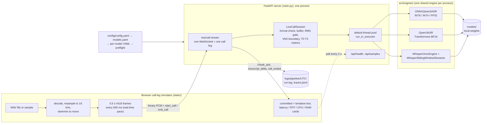
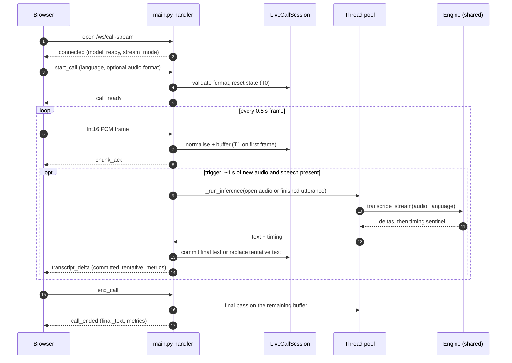
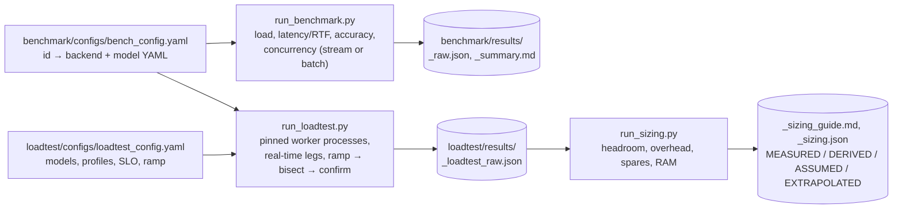
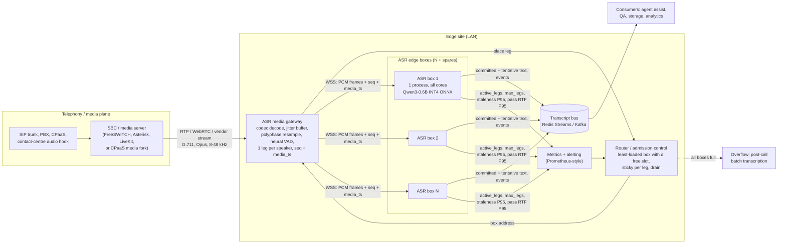
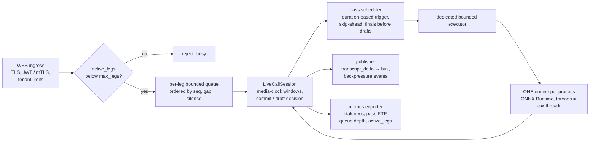
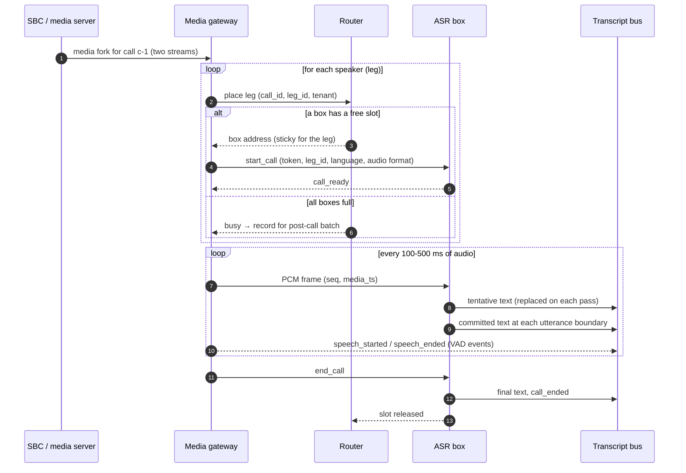
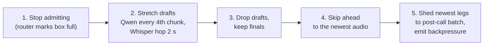
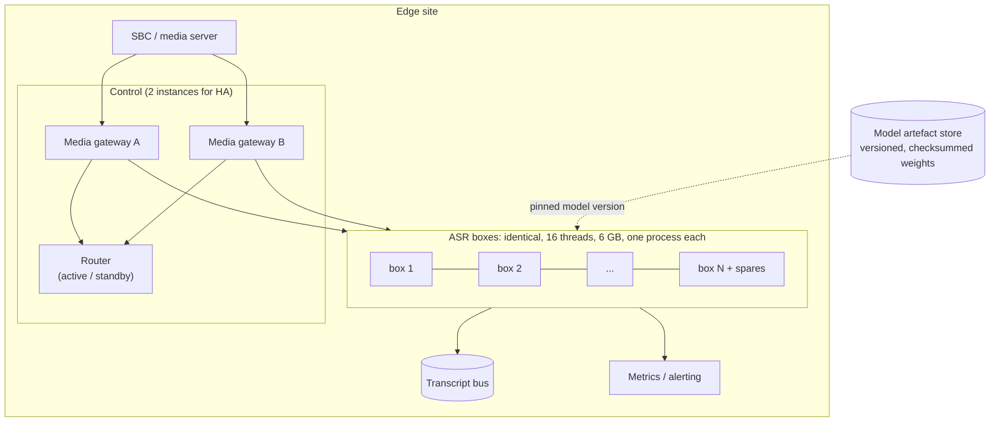

# RT-MASR-CPU: System Architecture (POC and Recommended Production)

This document describes the architecture end to end: the proof of concept **as it exists in the code today**, and the
**recommended production architecture** for live call transcription on edge CPUs, with the evidence behind each decision.

| Detail | Where |
|---|---|
| POC internals (protocol fields, timestamp anchors, engine contract, traces) | [`architecture.md`](architecture.md) |
| Streaming walkthrough for newcomers | [`../how-streaming-works.md`](../how-streaming-works.md) |
| Production design in depth (telephony ingest, VAD, jitter, interruptions, overload) | [`deployment.md`](deployment.md) |
| Measured results | [`../benchmark/final_result.md`](../benchmark/final_result.md), [`../loadtest/final_result.md`](../loadtest/final_result.md) |
| Sizing for 50-1,000 legs | [`../loadtest/sizing_guide.md`](../loadtest/sizing_guide.md) |
| Full technical report | [`../report/technical_report.md`](../report/technical_report.md) |

**Status labels**

| Label | Meaning |
|---|---|
| **IMPLEMENTED** | Exists in the repository today |
| **GAP** | The POC does something simpler than production needs; the fix is named |
| **PROPOSED** | Recommended design, not built |
| **MEASURED** | From the benchmark (`20261005T173127Z`) or load test (`20261007T202154Z`) on one Ryzen 7 6800H (8 cores / 16 threads, AVX2) |
| **EXTRAPOLATED** | Beyond what was measured (all fleet sizes) |

---

## 1. Requirements and constraints

| Requirement / constraint | Value | Architectural consequence |
|---|---|---|
| Languages | English, Mandarin, Indonesian | Multilingual model (Qwen3-ASR; Whisper as comparison) |
| Hardware | **CPU only**, edge boxes on a site LAN | ONNX Runtime with INT8 / INT4 weights; scale by adding boxes |
| Mode | Live streaming: text while the caller is still speaking | Draft (tentative) and final (committed) text; incremental delivery over WebSocket |
| Unit of load | **One call leg** = one independently streamed audio source (one direction of a call) | A two-party call is two legs; capacity is counted in simultaneous legs |
| Latency SLO (load test) | Every leg: P95 staleness and end-of-call lag ≤ 2 s | Admission control on a measured per-box cap; latency-based health signals |
| Input | 16 kHz mono Int16 PCM is the internal baseline; telephony is 8 kHz G.711 / Opus | All codec and telephony handling outside the ASR process |

*Staleness* = time from the arrival of the newest audio a pass covered to the moment that pass finished (how far the live
transcript trails the speaker, queueing included).

---

## 2. POC architecture (IMPLEMENTED)

### 2.1 Context and components



| Layer | Code | Responsibility |
|---|---|---|
| Call-leg simulator / UI | `static/app.js`, `index.html`, `style.css` | Streams a WAV at real-time pace; renders committed vs tentative text and telemetry |
| API and session layer | `main.py` | Serves the UI, `/api/*` and `/ws/call-stream`; one `LiveCallSession` per WebSocket; picks the streaming mode by backend (`_stream_mode`); runs inference off the event loop (`_run_inference`) |
| Session state | `src/engines/live_call_session.py` | Input-format contract (rate, channels, `pcm_s16le` only), resampling and downmix to 16 kHz mono, RMS energy gate, VAD boundary search, committed text, timestamps and metrics |
| Engines | `qwen3_onnx_engine.py`, `qwen3_engine.py`, `whisper_engine.py`, `whisper_streaming.py` | Same contract: `transcribe()` and `transcribe_stream()` (deltas, then a `("", timing)` sentinel with per-stage timing) |
| Configuration | `src/core/config.py`, `src/core/model_check.py`, `config/` | Registry lookup; preflight reports unknown names and missing files with the download command |
| Observability | `src/core/runlog.py`, `src/core/observe.py` | `run.log` + `run.meta.json` per run; one JSONL trace per inference, nested under its call |
| Offline tooling | `benchmark/`, `loadtest/` | Single-stream benchmark; multi-leg load test and sizing model (section 2.6) |

### 2.2 Per-call runtime flow



### 2.3 Streaming strategies

Neither model family decodes incrementally as audio arrives, so the server **re-transcribes buffered audio** and decides
which text is final. The strategy is chosen by backend.

| | Qwen3-ASR: `vad_utterance` | Whisper: `sliding_window` + LocalAgreement-2 |
|---|---|---|
| Trigger | Every 2nd 0.5 s chunk (~1 s) if the last 0.5 s has speech (RMS > 0.02) | Every `hop_s` = 1 s of new audio |
| Draft text | Re-transcribe the open utterance | Re-transcribe the window |
| Final text | At the first quiet 100 ms frame after 2 s; forced at **15 s** | Prefix two consecutive passes agree on; slide at 12 s, force at 20 s, flush after 0.8 s silence |
| Cost bound per pass | ≤ 15 s of audio, independent of call length | Window ≤ 20 s, always padded to Whisper's 30 s input |
| When passes fall behind | Frames queue; passes run on older audio (no skip-ahead) | `_ws_reader` + `_drain_audio` skip the backlog; latency grows, backlog does not |
| Decoding | Greedy | Greedy (`beam_size: 1` in streaming), language locked after the first pass |

Silence never reaches the model, which is why a conversational leg (about 47% speech) costs less than a dense one.

### 2.4 Inference pipeline (Qwen3 ONNX)

```
16 kHz audio → 128-bin log-mel → encoder → audio features replace <|audio_pad|> tokens in the chat prompt
             → decoder_init (prefill, KV cache) → decoder_step loop (greedy) → text after <asr_text>
```

Per-stage timing is recorded on every pass. Decoding is the dominant stage: 57-81% of pass time across the Qwen ONNX
configs, against ≤ 1% for the mel features (MEASURED).

### 2.5 Concurrency model

| Aspect | POC behaviour | Note |
|---|---|---|
| Process | One server process, one loaded engine shared by all legs | Weights exist once per process |
| Event loop | Inference is dispatched with `run_in_executor`, so audio frames and `/api/health` are never blocked | Fix from `changes.md` section 3 |
| Executor | Default `ThreadPoolExecutor` (`min(32, cpu+4)` workers) | **GAP**: unbounded relative to cores |
| ORT threads | `num_threads: 0` in the model YAMLs (all logical cores per pass) | **GAP**: concurrent passes oversubscribe the CPU |
| Per-leg ordering | The handler awaits each pass before reading the next frame | Qwen path has no queue limit or skip-ahead (**GAP**) |

### 2.6 Offline tooling architecture



The load test reuses the live server's stream logic (`StreamingConcurrencyRunner`) without the network, so its capacity
numbers describe the same code path the server runs.

### 2.7 What the POC measured (MEASURED)

| Property | Result |
|---|---|
| Single-stream speed | Qwen3-0.6B ONNX: INT8 RTF 0.151, INT4 0.141; Whisper tiny 0.245; Transformers BF16 0.6B 0.571 (ONNX 3.8x faster) |
| Accuracy (EN, 54 verified words) | Qwen3-0.6B INT8 WER 0.037 (INT4 0.038 excluding one empty clip); Whisper tiny 0.130. Whisper tiny is weak on Mandarin (CER 0.470) |
| Live capacity per 16-thread box (2 s SLO) | Qwen3-0.6B INT8 and INT4: **1 leg**; Whisper tiny: **3** conversational / **2** dense |
| Latency floor (1 leg) | P95 staleness 0.83-0.98 s (Qwen); time to first text 1.4-1.5 s |
| Why capacity is low | Re-transcription makes each audio second 2.3-3.7x more expensive than one batch pass (Qwen); each pass is a sequential decode loop |
| CPU at saturation | Only 38-68% of the 16 threads busy: legs are bound by single-pass latency, not total CPU |
| Memory | Weights 1.0 GB (Whisper tiny), 2.5 GB (Qwen INT4), 3.7-3.8 GB (Qwen INT8); about 0.1-0.3 GB per leg; ≥ 7.9 GB free in every run |

The ZH and ID references are unreviewed drafts derived from Qwen output, so ZH/ID accuracy favours Qwen.

### 2.8 POC limitations that shape production

| # | Limitation (GAP) | Production answer |
|---|---|---|
| 1 | Inference trigger counts messages (`chunks_received % 2`), assuming 0.5 s frames | Trigger on audio duration |
| 2 | Whisper hop counts raw input bytes, not normalised samples | Count normalised samples in the session |
| 3 | Unbounded per-leg queue; no backpressure | Bounded queue + overload policy (section 3.8) |
| 4 | Default executor and `num_threads: 0` oversubscribe the CPU | Dedicated bounded executor; ORT threads = box threads |
| 5 | Qwen path has no skip-ahead; lag grows without bound under overload | Process newest audio; drop stale drafts |
| 6 | Fixed RMS 0.02 gate calibrated on clean read speech | Neural VAD with hangover in the gateway |
| 7 | Stereo input is averaged into one stream | One leg per speaker, split in the gateway |
| 8 | G.711 rejected; linear-interpolation resampler | Codec decode + polyphase resampling in the gateway |
| 9 | No `call_id`, auth, TLS, limits; `uvicorn` with `host="0.0.0.0"`, `reload=True` | Authenticated WSS, tenant limits, production server settings |
| 10 | `/api/health` reports process CPU and RSS only | Per-box `active_legs`, `max_legs`, staleness P95, pass RTF P95, queue depth |
| 11 | Wall-clock arrival time is the audio clock | Media timestamps in the frame header |

Full list with code locations: [`deployment.md`](deployment.md), section 3.5.

---

## 3. Recommended production architecture (PROPOSED)

### 3.1 Design principles

1. **The ASR box only sees clean, ordered 16 kHz mono PCM for one speaker.** Codecs, RTP, jitter, channel splitting, DTX and
   VAD are solved before the WebSocket.
2. **One leg per speaker.** A two-party call is two legs; overlap never reaches the recogniser, and attribution is free.
3. **Scale out with identical edge boxes.** One box carries 1-3 legs (MEASURED); more threads in one process did not add legs.
4. **Admit by a measured cap, monitor by latency.** The per-box cap comes from the load test on that hardware; health is
   staleness and pass RTF, not CPU %.
5. **Final text is never dropped.** Under overload, draft passes are sacrificed first; committed text goes to a durable bus.
6. **Sticky legs, stateless enough to replace.** A leg stays on one box for its life; committed text already on the bus
   survives a box failure.

### 3.2 Logical architecture



| Component | Status | Responsibility |
|---|---|---|
| SBC / media server | Existing telephony | Terminates SIP/RTP; forks media per call (`mod_audio_fork`, AudioSocket, ExternalMedia, SIPREC, CPaaS media streams) |
| ASR media gateway | **PROPOSED** | Decodes G.711 / Opus; 40-80 ms adaptive jitter buffer and gap fill from RTP timestamps; polyphase resample to 16 kHz; splits channels into legs; neural VAD with hangover and pre-roll; emits `speech_started` / `speech_ended`; frames 100-500 ms of PCM with `seq` and `media_ts` |
| Router / admission control | **PROPOSED** | Places a new leg on the least-loaded box with `active_legs < max_legs`; refuses draining or unhealthy boxes; returns "busy" or routes to overflow when full; tracks site occupancy |
| ASR edge box | **IMPLEMENTED** (`main.py` + engines), needs the fixes in section 2.8 | Runs the streaming recogniser for its legs; publishes text; exports health |
| Transcript bus | **PROPOSED** | Durable, ordered per-leg transcript stream; consumers replay from an offset after reconnecting |
| Metrics and alerting | **PROPOSED** (signals exist in `/api/health` and the load test) | Occupancy, staleness, pass RTF, rejections, gaps; drives scale-out and alerts |
| Overflow batch path | **PROPOSED** | Transcribes the recording after the call when live capacity is exhausted |

### 3.3 ASR edge box internals



| Element | POC | Production change |
|---|---|---|
| Ingress | Plain WebSocket, no auth | WSS, authenticated `start_call` with `call_id`, `leg_id`, `role`, `tenant` |
| Admission | None (an extra leg slows every leg) | Hard cap = measured `max_legs` for the box; reject before allocating a session |
| Queue | Unbounded `asyncio.Queue` | Bounded per leg (for example 5 s of audio), ordered by `seq` |
| Time base | Arrival wall clock | `media_ts` from the frame header |
| Scheduling | Message-count trigger; no Qwen skip-ahead | Duration trigger; newest audio first; under load, drafts stretched or dropped, finals kept |
| Executor / threads | Default pool; ORT uses all cores per pass | Dedicated bounded executor; ORT `num_threads` = the box's logical CPUs |
| Output | WebSocket messages to the browser | Same messages to the gateway, plus committed text published to the bus |
| Health | Process CPU / RSS | `active_legs`, `max_legs`, staleness P95 and pass RTF P95 over 30 s, queue depth, gaps |

### 3.4 Model and runtime choice

| Decision | Recommendation | Evidence |
|---|---|---|
| Model | **Qwen3-ASR-0.6B, ONNX Runtime, INT4** | Same live capacity as INT8 (1 leg/box) with ~1.2 GB less memory and ~12% less compute per pass; best accuracy among configs fast enough to stream (MEASURED) |
| Language | Set per leg from call metadata; do not rely on auto-detect | INT4 returned empty text on one English clip with auto-detect; forcing English fixed it |
| Fallback | Whisper tiny INT8 only where its accuracy is acceptable | 3 / 2 legs per box, but EN WER 0.130 and weak Mandarin |
| Not for live use here | Qwen3-1.7B (expected ≤ 1 leg), Transformers BF16, Whisper small/medium (RTF 1.7 / 6.4) | MEASURED single-stream speed |
| Gate before committing | Re-run accuracy on real 8 kHz call audio, all three languages, with human-verified references | All benchmark audio is clean 16 kHz; ZH/ID references are drafts |

### 3.5 Production call flow



### 3.6 Protocol additions (backward compatible)

| Addition | Purpose |
|---|---|
| `call_id`, `leg_id`, `role`, `tenant`, `token` in `start_call` | Identity, re-joining two legs downstream, authentication, quotas |
| 12-byte binary header: `uint32 seq`, `uint64 media_ts_samples` | Gap detection and a media clock independent of arrival time |
| `format_change` | Codec or sample-rate switch mid-call (re-INVITE) |
| `resume.last_seq` | Reconnect to the same box within a short grace period |
| `speech_started` / `speech_ended` | Fast turn-taking and barge-in without waiting for text (text trails speech by 1-1.5 s) |
| `backpressure` (`degraded` / `shedding`) | Lets consumers show "transcript delayed" |
| Optional / batched `chunk_ack` | The POC acks every frame; at 1,000 legs that is about 2,000 messages per second for nothing |

Message shapes: [`deployment.md`](deployment.md), section 3.3.

### 3.7 Capacity, placement and scaling

**Box specification (Qwen3-0.6B INT4):** 16 logical CPUs (test-machine class), **6 GB RAM**, one ASR process using all
threads, nothing else heavy on the box. **Hard cap: 1 leg per box** on this CPU class (Whisper tiny: 3 conversational, 2 if speech density is unknown).

**Fleet size, conversational traffic (EXTRAPOLATED from one box; includes 10% spares):**

| Concurrent legs | Qwen3-0.6B INT4 boxes | CPU threads | Whisper tiny boxes | CPU threads |
|---|---|---|---|---|
| 50 | 55 | 880 | 30 | 480 |
| 100 | 110 | 1,760 | 59 | 944 |
| 200 | 220 | 3,520 | 116 | 1,856 |
| 500 | 550 | 8,800 | 289 | 4,624 |
| 1,000 | 1,100 | 17,600 | 577 | 9,232 |

Ranges, dense traffic, RAM totals, assumptions and confidence: [`../loadtest/sizing_guide.md`](../loadtest/sizing_guide.md).
These numbers are an order of magnitude. Re-run the load test on the target box before buying hardware.

| Concern | Design |
|---|---|
| Placement | Least-loaded box with `active_legs < max_legs`; sticky for the life of the leg |
| Headroom | Site occupancy ≤ about 65-70% of the sum of `max_legs`; N+1 (≥ 10%) spare boxes |
| Scale-out trigger | Occupancy above 60% for 2-3 minutes, or free slots below the spare reserve. Model load takes 2-5 s, so boxes join the pool pre-warmed (`model_ready`) |
| Health signals | Staleness P95 and pass RTF P95 over 30 s, queue depth, `active_legs / max_legs`. **Not CPU %**: ORT threads spin-wait, and at saturation only 38-68% of the CPU was busy |
| Alerts | Warn at staleness P95 > 1.5 s or pass RTF P95 > 0.5; stop admitting at > 2 s or > 0.7; shed at > 3 s |

### 3.8 Overload policy

The measured knee is sharp: one leg over the cap took Qwen INT8 from 0.98 s to 3.1 s P95 staleness across the box, because
all legs share the same engine and cores.
Overload is therefore handled before the box, and degraded in a fixed order on the box:



Steps 2-4 are expected to help but are not measured. Committed text is never dropped.

### 3.9 Reliability and failure handling

| Failure | Handling |
|---|---|
| Box crash | Gateway sees the WebSocket close, asks the router for a new box, resumes media. Text already on the bus stays; recognition restarts at the next utterance (a few seconds can be lost unless the gateway replays its buffer) |
| Network stall then burst (gateway → box) | Media clock recognises late audio; bounded queue; drafts skipped during catch-up |
| Packet loss / DTX (telephony → gateway) | Jitter buffer reorders; gaps filled with silence from RTP timestamps; large gaps force-commit the open utterance |
| Caller hangs up mid-pass | Stop scheduling, discard the in-flight result, release the slot immediately |
| Rolling deploy | Drain: stop admitting, let legs finish, then recycle the box |
| Consumer disconnects | Re-subscribe to the bus and replay from the last offset; the ASR leg is unaffected |
| Site full | Router returns "busy"; the call is recorded for post-call transcription rather than degrading live calls |

### 3.10 Deployment topology



Placing the gateway on the same LAN as the boxes keeps the WebSocket hop free of WAN jitter. Every box runs the same model
version, ONNX Runtime version and YAML; the per-box cap (`max_legs`) is part of that configuration and comes from the load
test on that box type.

### 3.11 Security and privacy

| Area | Requirement |
|---|---|
| Transport | TLS (WSS) end to end; no plain WebSocket outside a test bench |
| Authentication | JWT or mTLS between gateway and boxes; authenticated `start_call` |
| Limits | Per-tenant quotas, maximum call length, idle timeout |
| Data | Call audio and transcripts are personal data: no audio or full text in logs, PII redaction, retention and encryption at rest on the bus. The POC's `traces.jsonl` stores clipped transcripts and is not a production posture |
| Surface | Remove the dev settings (`host="0.0.0.0"`, `reload=True`) and the public `/api/samples` endpoint |

---

## 4. POC to production: what changes

| Area | POC (IMPLEMENTED) | Production (PROPOSED) | Priority |
|---|---|---|---|
| Audio source | Browser plays a WAV | Media gateway fed by the SBC / CPaaS | Required |
| Codecs and resampling | `pcm_s16le` only; linear resampler | G.711 / Opus decode, polyphase resampler in the gateway | Required |
| Speakers | Channels averaged | One leg per speaker | Required |
| VAD | RMS 0.02 gate, first quiet 100 ms frame | Neural VAD, hangover, pre-roll, adaptive noise floor | Required |
| Trigger | Message count | Audio duration | Required (code fix) |
| Overload | Unbounded queue; Qwen lag grows without bound | Bounded queue, skip-ahead, degrade ladder | Required (code fix) |
| Threads | Default executor; ORT all cores per pass | Bounded executor; ORT threads = box threads | Required (code fix) |
| Admission | None | Router + hard cap per box | Required |
| Output | WebSocket to the browser | Transcript bus | Required |
| Health | CPU / RSS | Staleness, pass RTF, occupancy | Required |
| Security | None | WSS, auth, quotas, privacy controls | Required |
| Model | Configurable; default `qwen3_onnx_0.6b_int4` | Qwen3-0.6B INT4 with language set per leg | Confirm on telephony audio |
| Capacity levers | None | Lower draft rate, cross-leg batching, prefix reuse, streaming-native models | Optional; each needs measuring |

---

## 5. Architecture decisions

| # | Decision | Alternatives considered | Rationale (evidence) |
|---|---|---|---|
| AD-1 | ONNX Runtime on CPU, quantised weights | PyTorch / Transformers BF16 | 3.8x faster at the same accuracy on 0.6B (RTF 0.151 vs 0.571) |
| AD-2 | Qwen3-0.6B INT4 as the production default | INT8, FP32, 1.7B, Whisper | INT4 = INT8 capacity with less RAM and compute; FP32 no more accurate and 1.8x slower; 1.7B and Whisper small+ too slow for live use |
| AD-3 | Re-transcription streaming (VAD utterances for Qwen, LocalAgreement for Whisper) | Native streaming models | The chosen models are not streaming-native; pass cost is bounded at 15 s (Qwen) / 20 s (Whisper) |
| AD-4 | One process per box using all threads | Several pinned processes per box | An earlier run with two Qwen processes doubled RAM (3.7 → 7.7 GB) without adding a leg |
| AD-5 | Scale out with identical edge boxes, legs sticky to a box | Bigger single machines | 4, 8 and 16 threads all carried 1 Qwen leg; capacity did not grow with cores in one process |
| AD-6 | Admission by measured `max_legs`; health by staleness and pass RTF | CPU-based autoscaling | Knee is sharp; CPU was only 38-68% busy at saturation, so CPU % does not show overload |
| AD-7 | Telephony handling in a gateway, ASR sees clean PCM | Codec and jitter handling inside the ASR process | Keeps the ASR box simple and testable; the existing format contract already expects normalised PCM |
| AD-8 | One leg per speaker | Diarization of a mixed stream | Removes overlap from the recogniser and gives attribution without a diarization model |
| AD-9 | Drop drafts before finals; overflow to post-call batch | Accept every call | An extra leg degrades every call on the box |

---

## 6. Risks and open questions

| Risk / question | Impact | Mitigation |
|---|---|---|
| Accuracy on real 8 kHz call audio is unmeasured | Model choice could change | Telephony accuracy test with verified EN/ZH/ID references before go-live |
| One Qwen leg per 16-thread box | Fleet cost roughly one box per live leg | Measure stronger CPUs (AVX-512 VNNI / AMX); evaluate lower draft rate, finals-only, cross-leg batching, streaming-native models |
| Run-to-run noise of about one leg | An earlier run measured Qwen dense at 0 legs | Repeat the load test on the target box; plan on the lower result |
| INT4 empty output with auto-detect | Missing text on some utterances | Set language per leg; retry on empty output |
| Scale-out, routing skew and correlated peaks not measured | Boxes can be pushed over the cap | Headroom and spares; a two-box test as part of rollout |
| Hour-long calls not measured (30 s test calls) | Memory growth or latency drift | 1-2 hour soak test; stream committed text out of the session |

---

## 7. Rollout path

1. Fix the POC gaps in section 2.8 (trigger, skip-ahead, bounded queue, executor, health metrics, TLS/auth).
2. Build the media gateway for one telephony source; verify end-to-end text on recorded 8 kHz calls.
3. Re-benchmark accuracy on real call audio in all three languages.
4. Re-run the load test on the target edge box with the production VAD and real speech density; replace extrapolated rows.
5. Soak test (1-2 h calls) and chaos tests (jitter, loss, stall, box kill, rolling deploy, overload).
6. Go live when P95 staleness stays within the SLO at 65-70% occupancy and admission control rejects rather than degrades.

Details: [`deployment.md`](deployment.md), section 11.
