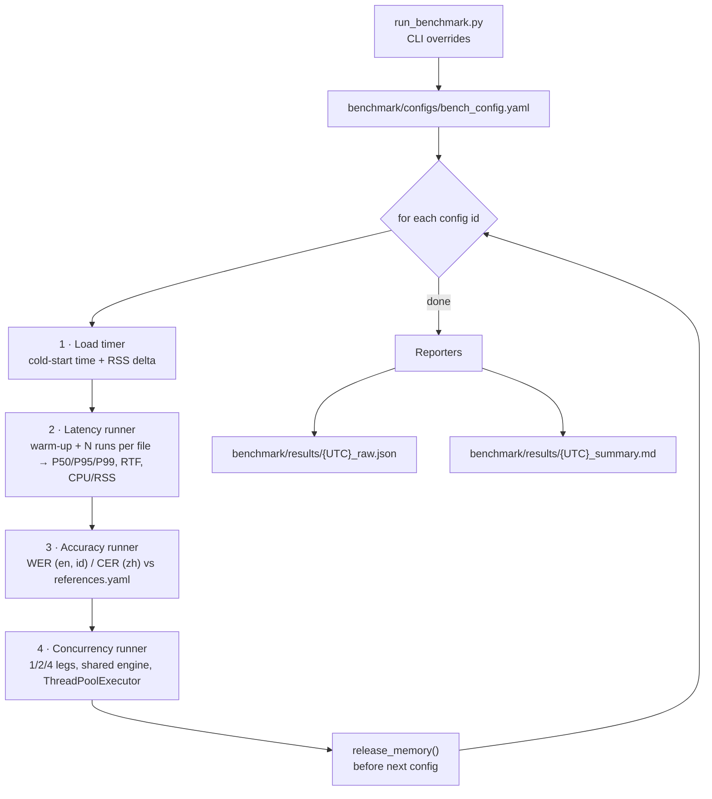

# Benchmark Pipeline

The benchmark measures each ASR configuration **offline, in-process** (no
WebSocket, no browser) so that model cost is isolated from the streaming layer.
Entry point: `benchmark/run_benchmark.py`.

---

## 1. Flow



The engine loaded in stage 1 is reused for stages 2–4. If one stage fails, that
config is recorded under `failures` and the run continues with the next config;
`Ctrl+C` writes partial results.

---

## 2. Configuration — `benchmark/configs/bench_config.yaml`

| Key | Meaning | Default |
|---|---|---|
| `configs[]` | `id`, `display_name`, `backend` (`onnx` / `transformers` / `whisper`), `model_config` (per-model YAML) | 3 Qwen3 + 4 Whisper INT8 |
| `runs` | Measured runs per audio file | 3 |
| `warmup_runs` | Discarded runs per audio file | 1 |
| `concurrency_legs` | Simultaneous legs to test | `[1, 2, 4]` |
| `concurrency_rounds` | Calls per worker (total calls = legs × rounds) | 2 |
| `concurrency_audio` | Fixed workload; call *i* uses file *i* mod len | `librispeech_0_1089_0.wav` |
| `audio` | Latency/accuracy files grouped by `en` / `zh` / `id` | 3 + 2 + 2 files |
| `references_file` | Reference transcripts | `benchmark/data/references.yaml` |
| `output_dir` | Where reports are written | `benchmark/results` |

Available config ids: `onnx_int8`, `transformers_bf16_0.6b`,
`transformers_bf16_1.7b`, `whisper_int8_tiny`, `whisper_int8_base`,
`whisper_int8_small`, `whisper_int8_medium`.

Missing audio files are skipped with a warning. All relative paths are resolved
from the project root, so the script can be launched from anywhere.

---

## 3. CLI

```bash
# Everything in bench_config.yaml
uv run python benchmark/run_benchmark.py

# Quick smoke run: ONNX only, 1 measured run, legs 1 and 2, no accuracy
uv run python benchmark/run_benchmark.py --models onnx_int8 --runs 1 --legs 1,2 --skip-accuracy

# Qwen3 ONNX INT8 vs Transformers 0.6B
uv run python benchmark/run_benchmark.py --models onnx_int8,transformers_bf16_0.6b --runs 3

# Qwen3 ONNX vs Whisper small, latency + accuracy only
uv run python benchmark/run_benchmark.py --models onnx_int8,whisper_int8_small --skip-concurrency
```

| Flag | Effect |
|---|---|
| `--config PATH` | Alternative bench config |
| `--models a,b` | Subset of config ids |
| `--runs N` | Override `runs` |
| `--legs 1,2,4,8` | Override `concurrency_legs` |
| `--skip-accuracy` | Skip stage 3 |
| `--skip-concurrency` | Skip stage 4 |
| `--output-dir DIR` | Override `output_dir` |

Exit code is `2` if any config failed, `1` for invalid arguments/inputs.

---

## 4. What each stage measures

### 4.1 Load (`runners/load_timer.py`)
Wall-clock time to construct the engine and the RSS before/after. "Cold" means a
fresh process-level load (new ORT sessions / PyTorch modules); model files are
usually in the OS page cache after the first run, so disk read time is mostly
excluded on repeat runs. The 1.7B row can show ~0 MB delta when allocator pages
freed by the previous config are reused.

### 4.2 Latency and RTF (`runners/latency_runner.py`)
For each audio file: `warmup_runs` discarded calls, then `runs` measured calls to
`engine.transcribe(path)`. Reports mean / P50 / P95 / P99 / min / max of latency
and RTF (latency ÷ audio duration). `SystemSampler` (`metrics/system_metrics.py`)
samples process CPU %, RSS and thread count during the measured block.

### 4.3 Accuracy (`runners/accuracy_runner.py`, `metrics/asr_metrics.py`)
- **WER** for English and Indonesian, **CER** for Mandarin. Wagner-Fischer edit
  distance, all edit costs 1.
- Normalisation: NFKC + lowercase + strip punctuation for EN/ID; NFKC + strip
  CJK punctuation for ZH.
- References with `verified: false` in `references.yaml` are drafts taken from
  agreeing Qwen3 outputs. Scores against them measure agreement with Qwen, not
  true accuracy. The Mandarin OSR files contain several sentences each, while
  the current references hold one sentence, which is why CER is > 1 for those
  rows. Fix the references before quoting ZH/ID accuracy.

### 4.4 Concurrency (`runners/concurrency_runner.py`)
One shared, warmed-up engine; `legs` worker threads each perform `rounds`
`transcribe()` calls on the fixed workload. Reports per-call latency
percentiles, RTF, aggregate throughput in audio-hours per wall-hour (> 1 means
faster than real time in aggregate), error count and peak RSS/CPU.

This is an offline capacity test: calls are submitted as fast as workers are
free, not paced at real time, and they do not go through the WebSocket path.

---

## 5. Outputs

| File | Contents |
|---|---|
| `<UTC>_raw.json` | Every measurement, including raw per-run latencies, hardware fingerprint and run parameters |
| `<UTC>_summary.md` | Hardware/software table, load, latency/RTF, CPU/memory, accuracy and concurrency tables |

Hardware fingerprint (`reporters/hardware_info.py`): CPU model, physical/logical
cores, RAM, OS, Python and key library versions.

---

## 6. Tests

```bash
uv run pytest benchmark/tests -v
```

Unit tests cover statistics, WER/CER, system sampling, each runner, the engine
loader and both reporters. They use fake engines and do not need model weights,
except one Whisper loader test that is skipped when
`models/whisper_int8/tiny_*` is absent.
