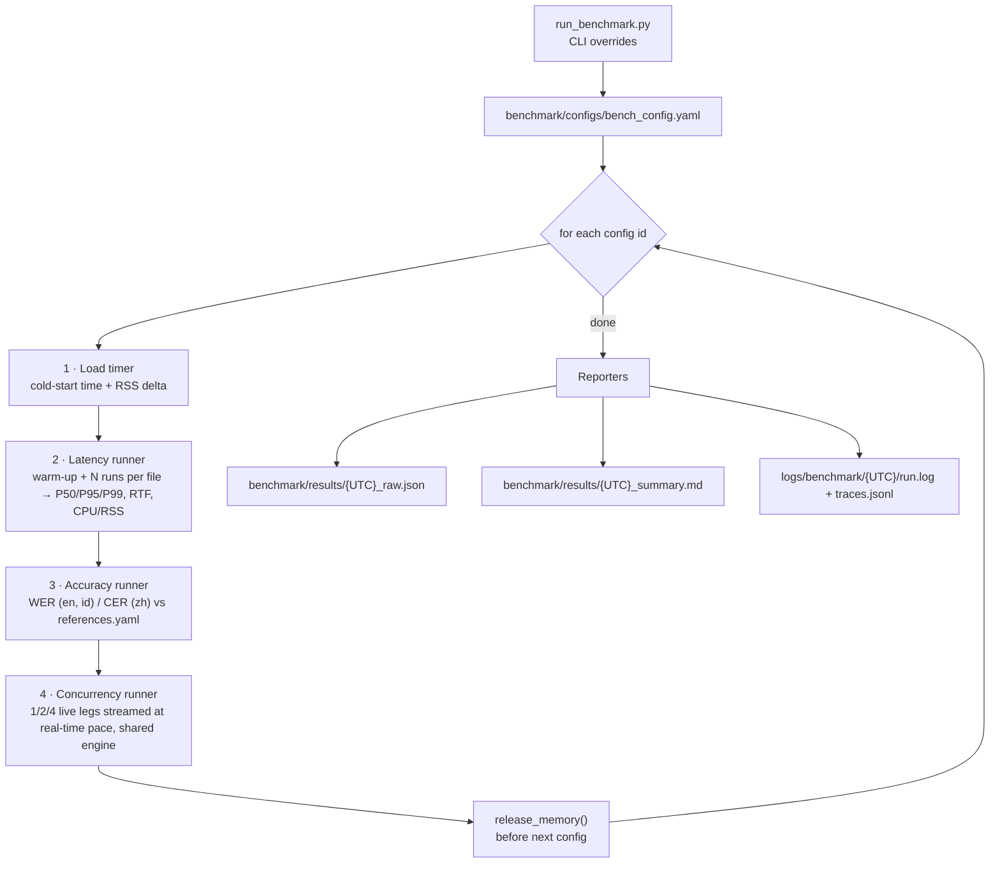

# Benchmark Pipeline

The benchmark measures each ASR configuration **offline, in-process** (no
WebSocket, no browser) so that model cost is isolated from the streaming layer.
Entry point: `benchmark/run_benchmark.py`.

---

## 1. Flow



The engine loaded in stage 1 is reused for stages 2–4. If one stage fails, that
config is recorded under `failures` and the run continues with the next config;
`Ctrl+C` writes partial results.

---

## 2. Configuration — `benchmark/configs/bench_config.yaml`

| Key | Meaning | Default |
|---|---|---|
| `configs[]` | `id`, `display_name`, `backend` (`onnx` / `transformers` / `whisper`), `model_config` (per-model YAML), optional `enabled` (default `true`) | 7 Qwen3 + 4 Whisper INT8 (`qwen3_onnx_fp32_1.7b` disabled) |
| `runs` | Measured runs per audio file | 3 |
| `warmup_runs` | Discarded runs per audio file | 1 |
| `concurrency_legs` | Simultaneous legs to test (one leg = one independently streamed audio source) | `[1, 2, 4]` |
| `concurrency_mode` | `stream` (live legs at real-time pace) or `batch` (offline request queue) | `stream` |
| `concurrency_chunk_s` | Stream mode: seconds of audio per chunk | 0.5 |
| `concurrency_stagger_s` | Stream mode: delay between leg start times (0 = all start together, worst case) | 0 |
| `concurrency_lag_threshold_s` | Stream mode: a leg "kept up" if p95 staleness and end lag stay below this | 2.0 |
| `concurrency_rounds` | Batch mode only: requests per worker (total requests = legs × rounds) | 2 |
| `concurrency_audio` | Audio sources; leg *i* (batch: request *i*) uses file *i* mod len | 3 `librispeech_*` files |
| `audio` | Latency/accuracy files grouped by `en` / `zh` / `id` | 3 + 2 + 2 files |
| `references_file` | Reference transcripts | `benchmark/data/references.yaml` |
| `output_dir` | Where reports are written | `benchmark/results` |

Available config ids: `qwen3_onnx_int8_0.6b`, `qwen3_onnx_fp32_0.6b`, `qwen3_onnx_int4_0.6b`,
`qwen3_onnx_fp32_1.7b`, `qwen3_onnx_int4_1.7b`, `qwen3_transformers_bf16_0.6b`,
`qwen3_transformers_bf16_1.7b`, `whisper_int8_tiny`, `whisper_int8_base`,
`whisper_int8_small`, `whisper_int8_medium`.

Missing audio files are skipped with a warning. All relative paths are resolved
from the project root, so the script can be launched from anywhere.

### Disabling / enabling a config

Add `enabled: false` to an entry to leave it out of the default run (useful for
models your machine cannot handle). Omitting the key means enabled. Example —
`qwen3_onnx_fp32_1.7b` (~10 GB of weights) is disabled in the shipped config:

```yaml
  - id: "qwen3_onnx_fp32_1.7b"
    enabled: false              # ← disabled: skipped by `run_benchmark.py` with no --models
    display_name: "Qwen3-ASR-1.7B FP32 (ONNX / CPU)"
    backend: "onnx"
    model_config: "config/models/qwen3_onnx_1.7b_fp32.yaml"
```

- **Disable:** set `enabled: false` (or delete/comment out the entry).
- **Enable permanently:** set `enabled: true` or remove the `enabled` line.
- **Enable for one run only:** name it explicitly; `--models` ignores `enabled`:
  `uv run python benchmark/run_benchmark.py --models qwen3_onnx_fp32_1.7b --runs 1`

A default run prints `Skipping disabled config(s): ...` so it is clear what was left out.

---

## 3. CLI

```bash
# Everything in bench_config.yaml
uv run python benchmark/run_benchmark.py

# Quick smoke run: ONNX only, 1 measured run, legs 1 and 2, no accuracy
uv run python benchmark/run_benchmark.py --models qwen3_onnx_int8_0.6b --runs 1 --legs 1,2 --skip-accuracy

# Qwen3 ONNX INT8 vs Transformers 0.6B
uv run python benchmark/run_benchmark.py --models qwen3_onnx_int8_0.6b,qwen3_transformers_bf16_0.6b --runs 3

# Qwen3 ONNX vs Whisper small, latency + accuracy only
uv run python benchmark/run_benchmark.py --models qwen3_onnx_int8_0.6b,whisper_int8_small --skip-concurrency
```

| Flag | Effect |
|---|---|
| `--config PATH` | Alternative bench config |
| `--models a,b` | Subset of config ids (not registry names; an unknown id prints the valid ids, their registry names and whether each is downloaded) |
| `--runs N` | Override `runs` |
| `--legs 1,2,4,8` | Override `concurrency_legs` |
| `--concurrency-mode stream\|batch` | Override `concurrency_mode` |
| `--skip-accuracy` | Skip stage 3 |
| `--skip-concurrency` | Skip stage 4 |
| `--output-dir DIR` | Override `output_dir` |

Exit code is `2` if any config failed, `1` for invalid arguments/inputs.

Before any config runs, its weights are checked on disk. A config that is not
downloaded prints the missing files and the command to fetch it
(`uv run python src/utils/download_utils.py --model <registry name>`). In a
default run it is skipped and the others continue; if it was named with
`--models`, the run stops with exit code `1`.

---

## 4. What each stage measures

### 4.1 Load (`runners/load_timer.py`)
Wall-clock time to construct the engine and the RSS before/after. "Cold" means a
fresh process-level load (new ORT sessions / PyTorch modules); model files are
usually in the OS page cache after the first run, so disk read time is mostly
excluded on repeat runs. The 1.7B row can show ~0 MB delta when allocator pages
freed by the previous config are reused.

### 4.2 Latency and RTF (`runners/latency_runner.py`)
For each audio file: `warmup_runs` discarded calls, then `runs` measured calls to
`engine.transcribe(path)`. Reports mean / P50 / P95 / P99 / min / max of latency
and RTF (latency ÷ audio duration). `SystemSampler` (`metrics/system_metrics.py`)
samples machine-wide CPU %, process CPU %, RSS and thread count during the measured
block (the summary table shows the machine-wide CPU %). Every metric is explained
in plain words in [section 5](#5-metrics-explained-in-plain-words).

### 4.3 Accuracy (`runners/accuracy_runner.py`, `metrics/asr_metrics.py`)
- **WER** for English and Indonesian, **CER** for Mandarin. Wagner-Fischer edit
  distance, all edit costs 1.
- Normalisation: NFKC + lowercase + strip punctuation for EN/ID; NFKC + strip
  CJK punctuation for ZH.
- References with `verified: false` in `references.yaml` are drafts taken from
  agreeing Qwen3 outputs. Scores against them measure agreement with Qwen, not
  true accuracy. The Mandarin OSR files contain several sentences each, while
  the current references hold one sentence, which is why CER is > 1 for those
  rows. Fix the references before quoting ZH/ID accuracy.

### 4.4 Concurrency (`runners/streaming_concurrency_runner.py`, `runners/concurrency_runner.py`)

**Definition: one leg = one independently streamed audio source** (one call).
N legs means N sources streaming at the same time into one shared, warmed-up
engine, as in the live server.

**Stream mode (default).** Each leg is a thread that plays its audio file into
the engine in `concurrency_chunk_s` chunks (0.5 s, like the browser) that arrive
at real-time pace: 0.5 s of audio every 0.5 s of wall clock. The leg runs the
same stream logic as `main.py`'s `/ws/call-stream` handler, minus the WebSocket:

| Backend | Stream logic | Source |
|---|---|---|
| Whisper | sliding window + LocalAgreement; backlog is skipped when a pass is slow | `WhisperSlidingWindowStreamer`, `streaming:` block of the model YAML |
| Qwen3 (ONNX / Transformers) | energy-gated, VAD-cut utterances; late chunks queue up | `LiveCallSession` + the trigger rules of `_handle_audio_vad` |

Leg *i* streams `concurrency_audio[i mod len]`, so with several files the legs
are different sources. Audio is decoded before the clock starts. Each stream
lasts as long as its audio (about 3–10 s for the shipped files), so a level
takes roughly as long as the longest leg.

The question answered is **"do all N legs keep up with live speech?"**:

- **Pass latency / pass RTF**: wall time of each inference pass, and that time ÷
  the audio the pass covered.
- **Staleness**: pass finish time − arrival time of the newest audio in it.
  This is how far the transcript trails the speaker, queueing included. When a
  pass is slower than the audio it covers, staleness grows.
- **First text**: stream start → first recognised text.
- **End lag**: end of audio → final transcript committed.
- **Kept up**: p95 staleness and end lag both ≤ `concurrency_lag_threshold_s`,
  no errors, at least one pass. The report also gives the **highest tested leg
  count at which every leg kept up** per config.
- **Text**: legs with a non-empty final transcript. If this is below the leg
  count the other numbers are suspect (e.g. the model produced no tokens).

`concurrency_stagger_s: 0` starts every call at the same instant, which is the
worst case (all legs hit the engine in the same hop). Real calls are not
aligned; set a stagger (e.g. 0.7) for a more typical load.

**Batch mode (`--concurrency-mode batch`).** The previous offline capacity test:
`legs` worker threads each perform `rounds` back-to-back `transcribe()` calls on
whole files (so *requests* = legs × rounds, e.g. 1 leg = 2 requests). Nothing is
paced at real time, so a "leg" here is a worker, not a live call. It reports
per-request latency percentiles, RTF, aggregate throughput in audio-hours per
wall-hour (> 1 means faster than real time in aggregate), error count and peak
RSS/CPU. Use it for raw throughput, not for live-call capacity.

---

## 5. Metrics explained in plain words

You do not need an ML background to read the reports. Each metric below says
**what it is**, **how to read it**, and **where it shows up** in
`<UTC>_summary.md`.

### 5.1 The one-minute version

| Question you have | Look at | Good looks like |
|---|---|---|
| Is it fast enough for live speech? | **RTF** | below 1.0 (lower is better) |
| How long does one request take? | **Latency** (P50 / P95) | small, and P95 close to P50 |
| Is it correct? | **WER** (English, Indonesian) / **CER** (Chinese) | close to 0 % |
| How long until it is ready after start-up? | **Load time** | a few seconds |
| How much memory does it need? | **RSS / Peak RSS** | fits in your RAM with room to spare |
| How many live calls can one machine handle? | **Kept up** and *Concurrent live legs supported* (Concurrency) | all legs kept up at the call count you need |

### 5.2 Speed metrics

**Latency**
The wall-clock time one `transcribe()` call takes from start to finish, in
seconds. Think of it as "how long did I wait for the answer". It includes
reading the audio, the model working, and producing the text.

**RTF — Real-Time Factor**
`RTF = latency ÷ audio length`

It compares how long the computer needed with how long the speech lasted.

| RTF | Meaning (for a 10 s recording) |
|---|---|
| 0.2 | finished in 2 s — 5× faster than live speech |
| 1.0 | finished in 10 s — exactly keeps up |
| 2.0 | finished in 20 s — falls behind live speech |

For live use you want **RTF below 1.0**. The lower, the more spare capacity.

**Mean, P50, P95, P99, min, max**
The same call is measured several times (`runs`), so the report summarises the
list of timings:

| Name | Plain meaning |
|---|---|
| Mean | the average |
| **P50** (median) | half of the calls were faster than this, half slower — the "typical" call |
| **P95** | 95 out of 100 calls were faster than this — the "bad day" number |
| **P99** | 99 out of 100 were faster — the "worst realistic case" |
| Min / Max | the fastest / slowest single call |

*Why not just the average?* A few slow calls hide inside an average. If P50 is
1.0 s but P95 is 4.0 s, one call in twenty feels four times slower, and a live
system has to plan for that.

**Overall RTF** (the table under *Latency*)
Total processing time of all measured calls ÷ total audio time of all calls. Long
files count more than short ones, so this is the fairest single speed number for a
configuration.

**Warm-up runs**
The first call after loading is often slower (caches are cold, memory is being
allocated). A few calls are made first and **thrown away**, so the numbers
describe normal running speed, not the first-call hiccup.

### 5.3 Start-up metrics

**Load time**
How long it takes to create the engine and load the model into memory — the
"cold start". It matters when the service restarts or scales up. Model files are
usually already cached by the operating system after the first run, so repeat
runs mostly measure model set-up, not disk reading.

**RSS (Resident Set Size)**
The amount of real RAM the process occupies, in MB. The load table shows:

| Column | Meaning |
|---|---|
| RSS Before | memory in use just before loading |
| RSS After | memory in use right after loading |
| RSS Delta | the difference — roughly **what the model costs in RAM** |

### 5.4 Resource metrics (CPU and memory while running)

A small background sampler checks the process ten times a second during the
measured runs.

| Metric | Plain meaning |
|---|---|
| **CPU Mean / CPU P95** | how busy the **whole machine** was (0–100 %, across all cores). 100 % means every core was fully used |
| **RSS Mean** | average RAM used by the process |
| **Peak RSS** | the highest RAM use seen — the number to size your server RAM against |
| **Peak Threads** | the most threads the process used at once. Models spread work across cores using threads |

*Reading tip:* CPU near 100 % with RTF below 1.0 means the model is fast but uses
the whole machine; there is no headroom to run other things next to it.

### 5.5 Accuracy metrics

**WER — Word Error Rate** (English, Indonesian)
Count how many word-level fixes are needed to turn the model's text into the
correct text, then divide by the number of words in the correct text.

`WER = (substitutions + deletions + insertions) ÷ words in the reference`

| Fix type | Example (reference: *the cat sat*) |
|---|---|
| Substitution — wrong word | "the **hat** sat" |
| Deletion — missing word | "the sat" |
| Insertion — extra word | "the cat **really** sat" |

One mistake in a 10-word sentence is a WER of 10 %. **Lower is better; 0 % is
perfect.** WER can exceed 100 % if the model writes far more words than were
spoken.

**CER — Character Error Rate** (Chinese)
Exactly the same idea but counted per **character**. Chinese is written without
spaces between words, so "word" is not a clear unit; one character is.

**Normalisation (why capitals and commas don't count)**
Before comparing, both texts are tidied so harmless differences are ignored:
upper/lower case, punctuation, and extra spaces for English/Indonesian
(`Don't!` and `dont` match); punctuation and symbols for Chinese. Only real
wording differences are counted.

**Corpus rate vs Mean rate** (Accuracy → *Aggregate* table)

| | How it is calculated | When it differs |
|---|---|---|
| **Corpus rate** | total mistakes ÷ total reference words (or characters) over all files | long files weigh more — usually the better overall number |
| **Mean rate** | simple average of each file's score | every file counts equally, even a 2-word clip |

**Draft references (`*`)**
Some reference transcripts are drafts (`verified: false`), copied from model
output rather than written by a person. A score against a draft only shows how
much a model **agrees with that draft**, not how correct it is. The report marks
those rows with `*`. Chinese rows can also exceed 1.0 (100 %) when the reference
holds one sentence but the recording has several.

**Detected language**
The language the engine says it heard (when it reports one). A wrong detected
language is a quick explanation for a very high error rate.

### 5.6 Concurrency metrics (many calls at once)

**One leg = one independently streamed audio source (one live call).** In the
default stream mode, each leg feeds its audio to **one** shared model at
real-time pace, and the report shows whether every leg still keeps up.

| Metric | Plain meaning |
|---|---|
| **Legs** | number of calls streaming at the same time |
| **Kept up** | legs that stayed live, as `kept/total` (see below) |
| **Pass P50 / P95** | how long one inference pass took while sharing the machine |
| **Pass RTF P95** | pass time ÷ audio covered by that pass; above 1.0 the pass is slower than the audio |
| **Stale P50 / P95 / Max** | how far the transcript trails the speaker, in seconds (includes waiting in line) |
| **First Text** | seconds from call start until the first words appear |
| **End Lag** | seconds from the end of the audio until the final transcript is done |
| **Text** | legs that produced a non-empty transcript (should equal Legs) |
| **Errors** | passes that raised an exception (should be 0) |
| **CPU Mean / Peak RSS** | machine-wide CPU and highest RAM used at that level |

**Kept up, simply:** a leg keeps up when the text appears close behind the
speech: its p95 staleness and its end lag both stay under
`concurrency_lag_threshold_s` (2 s by default). If the engine needs 3 s for every
2 s of audio, text falls further behind each second and the leg does not keep up.
The *Concurrent live legs supported* table shows, per config, the largest tested
leg count at which every leg kept up.

**What good scaling looks like:** going from 1 to 2 to 4 legs, staleness and end
lag should stay low and *Kept up* should stay `n/n`. When staleness grows with
the number of legs, the CPU is saturated and extra callers just wait in line.

**Batch mode metrics.** With `--concurrency-mode batch`, legs are worker threads
making back-to-back `transcribe()` requests with no pacing:

| Metric | Plain meaning |
|---|---|
| **Legs (workers)** | simultaneous worker threads |
| **Requests** | total `transcribe()` calls at that level (legs × rounds) |
| **Wall** | total real time to finish all of them |
| **Lat P50 / P95 / P99** | per-request latency while sharing the machine (see 5.2) |
| **RTF Mean** | average per-request RTF; it rises as workers are added |
| **Throughput** | audio seconds transcribed per second of real time, across all workers |

Throughput example: if the machine transcribed 60 s of audio while 20 s of real
time passed, throughput is **3.0×** (raw JSON: `audio-hours per wall-hour`). It
shows raw capacity only. It does not prove that live calls keep up, because
requests are not paced at real time.

### 5.7 Hardware fingerprint

CPU model, physical and logical cores, RAM, operating system, Python and
key library versions. Benchmarks are only comparable on similar hardware, so every
report records where it was run.

### 5.8 Per-stage timing (inside the engines)

Some engines also report where the time went inside one call. These appear in the
raw JSON (`timing_detail`) and in the live UI cards:

| Stage | Plain meaning |
|---|---|
| **Mel** | turning the sound wave into the picture-like input the model reads |
| **Encoder** | "listening": the model summarises the audio |
| **Prefill** | "getting ready to write": the model reads the summary plus its instructions once |
| **Decode** | "writing": producing the words one at a time — grows with how much was said |
| **Tokens** | how many word-pieces were produced |

### 5.9 Worked example

> Config `X`, one 10 s file, 3 measured runs: latencies 2.1 s, 2.0 s, 2.6 s.

- Mean latency = 2.23 s, P50 = 2.1 s, max = 2.6 s.
- RTF per run = 0.21, 0.20, 0.26 → the model is about 4–5× faster than live
  speech, so it can keep up in a live call.
- If the reference has 20 words and the model made 1 mistake, WER = 1 ÷ 20 = **5 %**.
- Batch mode, 2 workers: if 4 requests finish in 5 s of wall time: audio
  processed = 40 s, so throughput = 40 ÷ 5 = **8×**.
- Stream mode, 4 legs each streaming a 10 s clip: if the slowest pass finishes
  1.2 s after the audio it covers arrived and the final transcript is ready 0.8 s
  after the call ends, all four legs are under the 2 s threshold, so 4 legs kept up.

(These numbers are made up to show the arithmetic; real results are in your
generated `*_summary.md`.)

---

## 6. Outputs

| File | Contents |
|---|---|
| `<UTC>_raw.json` | Every measurement, including raw per-run latencies, hardware fingerprint and run parameters |
| `<UTC>_summary.md` | Hardware/software table, load, latency/RTF, CPU/memory, accuracy and concurrency tables (including *Concurrent live legs supported* in stream mode) |
| `logs/benchmark/<UTC>/run.log` | Console + logging for that invocation (same UTC stamp) |
| `logs/benchmark/<UTC>/traces.jsonl` | One JSON object per `transcribe` / `transcribe_stream` (stream-concurrency legs nest under a `call` chain) |

Hardware fingerprint (`reporters/hardware_info.py`): CPU model, physical/logical
cores, RAM, OS, Python and key library versions.

---

## 7. Tests

```bash
uv run pytest benchmark/tests -v
```

Unit tests cover statistics, WER/CER, system sampling, each runner (including the
streaming concurrency runner with fake engines and sped-up playback), the engine
loader and both reporters. They use fake engines and do not need model weights,
except one Whisper loader test that is skipped when
`models/whisper_int8/tiny_*` is absent.
