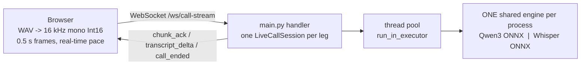
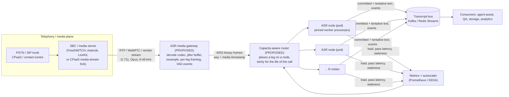
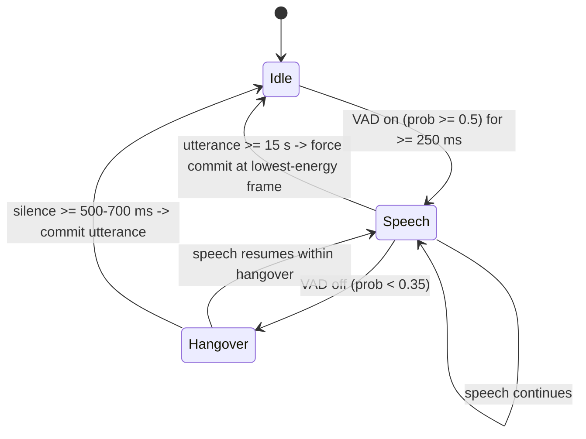
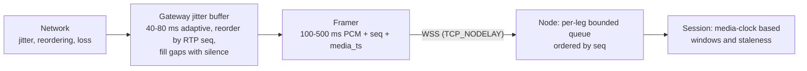

# Production Deployment Design

How the RT-MASR-CPU proof of concept would be taken from "a browser plays a WAV file" to "live telephony audio
transcribed on a CPU fleet". It covers real audio ingestion, silence / end-of-utterance / long speech /
interruptions / network jitter, the production headroom target and what happens when capacity is exceeded, and the
horizontal scaling plan with node counts.

> **Status labels used throughout**
>
> | Label | Meaning |
> |---|---|
> | **IMPLEMENTED** | exists in the repository today (file referenced) |
> | **GAP** | the POC does something simpler or wrong for production; the fix is described |
> | **PROPOSED** | new component or behaviour that does not exist yet |
> | **MEASURED / EXTRAPOLATED** | taken from the load test and [`loadtest/sizing_guide.md`](loadtest/sizing_guide.md) |
>
> Nothing in sections 3 to 7 has been run against real telephony traffic. Section 8 and 9 numbers come from one
> laptop CPU and are extrapolated beyond 1-3 legs per node (see the limitations in section 11).

---

## 1. What the POC is (the parts that drive the production design)



Facts about the code that matter for production:

- **One WebSocket = one call leg = one independent audio stream** (`main.py`, `LiveCallSession`). All legs in a process
  share a single loaded engine; weights exist once per process.
- **Two streaming strategies**, chosen by backend (`main.py: _stream_mode`):
  - Qwen3-ASR: `vad_utterance`. Audio accumulates, an energy gate skips silence, the open utterance is re-transcribed about
    once per second as *tentative* text, and at a silence boundary (or 15 s) the utterance is transcribed once more and
    *committed* (`LiveCallSession.find_vad_boundary`).
  - Whisper: `sliding_window` + LocalAgreement-2 (`src/engines/whisper_streaming.py`): re-transcribe the window every 1 s,
    commit the prefix two passes agree on, slide the window at 12 s, force-commit at 20 s, flush after 0.8 s of silence.
- **Cost is dominated by re-transcription.** Both families re-encode the open window every hop. One pass of one leg
  already costs 0.17-0.37 of real time, which is why a node saturates at 1-3 legs (section 8).
- **The input contract is already format-aware.** `start_call` may carry `{"audio": {"sample_rate", "channels", "encoding"}}`;
  the session downmixes, resamples to 16 kHz and rejects anything but `pcm_s16le` (`LiveCallSession.set_input_format`).

---

## 2. Production architecture



| Component | Status | Role |
|---|---|---|
| ASR node (`main.py` + engines) | **IMPLEMENTED** (needs the fixes in section 3.5) | Runs the streaming recogniser for the legs placed on it |
| Media gateway | **PROPOSED** | Terminates RTP / vendor media, decodes codecs, absorbs network jitter, frames audio, emits VAD events. Keeps codec and telephony concerns out of the ASR service |
| Router / admission controller | **PROPOSED** | Chooses the node for a new leg from live load, enforces the headroom target (section 8.3), drains nodes |
| Transcript bus | **PROPOSED** | Durable output; lets the ASR node stay stateless enough to be replaced mid-call (section 9.4) |
| Metrics / autoscaler | **PROPOSED** (metrics exist in `/api/health` and the load test) | Scales the fleet on the signals in section 8.3 |

Design rule: **the ASR node only ever sees clean, ordered 16 kHz mono PCM for one speaker.** Everything telephony-specific
(codecs, RTP, jitter, channel splitting, DTX) is solved before the WebSocket.

---

## 3. Accepting real telephony / media audio instead of a WAV simulator

### 3.1 How audio gets in

| Source | What arrives | How it reaches the ASR service |
|---|---|---|
| SIP trunk / PBX (Asterisk, FreeSWITCH, Kamailio + RTPengine) | RTP, G.711 mu-law/A-law 8 kHz (or G.722 / Opus) | Media-server module or media fork (e.g. `mod_audio_fork`, AudioSocket, ExternalMedia) streams decoded PCM to the gateway |
| SIPREC (call recording) | Two RTP streams (one per party) | Gateway treats each stream as one leg |
| CPaaS media streams (Twilio, Telnyx, Vonage style) | WebSocket with 8 kHz mu-law frames, base64 JSON, about 20 ms each | Thin adapter decodes to PCM and re-frames |
| Contact-centre audio hooks | Vendor-defined PCM / mu-law over WebSocket | Adapter per vendor |
| WebRTC softphone | Opus 48 kHz over SRTP | Media server / SFU decodes; same gateway path |

All of them are reduced by the gateway to the same thing the POC already consumes: a WebSocket carrying little-endian Int16
PCM for one stream.

### 3.2 One leg = one direction of one call

The load test defines a leg as "one independently streamed audio source", and production must keep that definition:

- A **dual-channel / dual-stream call is two legs** (caller and agent), each transcribed separately. This also solves
  speaker attribution for free and avoids overlap problems (section 6).
- **GAP:** `static/app.js` and `LiveCallSession` average all channels into one mono stream
  (`downmixToMono`, `input_channels > 1` branch). That is right for a stereo music file and wrong for a stereo call
  recording where each channel is a speaker. The gateway must split channels into separate legs and send mono; the
  server-side downmix stays as a fallback.
- A call therefore needs a `call_id` and a `leg_id` / `role` so the two transcripts can be re-joined downstream.

### 3.3 Wire protocol additions (PROPOSED, backward compatible)

The existing messages stay valid. New optional fields and messages:

```jsonc
// client -> server
{"type": "start_call",
 "call_id": "c-8f3a", "leg_id": "c-8f3a-agent", "role": "agent",      // new: identity
 "tenant": "acme", "token": "<JWT>",                                  // new: auth (section 10)
 "language": "en",
 "audio": {"sample_rate": 8000, "channels": 1, "encoding": "pcm_s16le"},   // exists today
 "resume": {"last_seq": 0}}                                           // new: reconnect (section 7.4)

// binary frame: 12-byte header + PCM          (new; the POC sends bare PCM)
//   uint32 seq | uint64 media_ts_samples | PCM bytes
// gaps in seq are visible, media_ts_samples gives the audio clock independent of arrival time

{"type": "format_change", "audio": {"sample_rate": 16000}}             // new: re-INVITE / codec switch
{"type": "end_call"}                                                  // exists
// server -> client
{"type": "call_ready", ...}  {"type": "transcript_delta", ...}  {"type": "call_ended", ...}   // exist
{"type": "speech_started"}  {"type": "speech_ended", "at_ts": 123456}                        // new: VAD events
{"type": "backpressure", "level": "degraded" | "shedding"}                                  // new: section 8
```

### 3.4 Codecs, sample rate and quality

| Concern | POC | Production |
|---|---|---|
| G.711 mu-law / A-law | **Rejected** (`SUPPORTED_ENCODINGS = ("pcm_s16le",)`) | Expand to Linear PCM in the gateway (a 256-entry lookup table; the server may also accept `pcmu` / `pcma` and expand them on arrival). Opus and G.722 are decoded by the media server |
| 8 kHz telephony | Linear-interpolation resampler in `_resample_to_baseline` | Replace with a polyphase resampler (`soxr` or `scipy.signal.resample_poly`) in the gateway; the linear one is a poor anti-alias filter |
| Narrowband accuracy | Not measured: all benchmark audio is 16 kHz wideband | **Must be measured.** Telephone audio has nothing above 3.4 kHz plus codec artefacts and noise. Re-run the benchmark accuracy suite on 8 kHz band-limited and real call audio before choosing a model; expect WER to be worse than the quoted figures |
| Loudness | Fixed RMS threshold calibrated on read speech | Normalise level in the gateway or use an adaptive VAD (section 4) |

### 3.5 Concrete code gaps found while reviewing the POC

These do not matter for a browser sending 0.5 s frames at 16 kHz, and all matter once real media arrives.

| # | Where | Problem | Fix |
|---|---|---|---|
| 1 | `main.py: _handle_audio_vad` | Inference trigger is `chunks_received % 2 == 0 and len(buffer) >= 8000`. It assumes 0.5 s frames. With 20 ms RTP-sized frames it would run inference every 40 ms | Trigger on **audio duration** (every ~1 s of new samples, like `WhisperSlidingWindowStreamer.ready()`), not on message count; the gateway also batches to 100-500 ms |
| 2 | `whisper_streaming.py: _total_samples` | Returns `session.total_bytes // 2`, i.e. **raw input** bytes, not normalised samples. For 8 kHz input the hop is twice as long; for stereo it is half | Count samples appended to the normalised buffer in `LiveCallSession.process_pcm_bytes` |
| 3 | `main.py: websocket_call_stream` | `incoming` is an unbounded `asyncio.Queue`; no drop or backpressure policy | Bounded per-leg queue plus the overload policy of section 8.4 |
| 4 | `main.py: _run_inference` | Uses the default executor (`min(32, cpu+4)` threads) and every pass can use all cores (`num_threads: 0`), so passes oversubscribe the CPU | Dedicated bounded executor per process, `num_threads` set to the pinned share (what the load test did) |
| 5 | Qwen path | No skip-ahead: a late pass is followed by passes over older queued frames (the Whisper path drains the backlog with `_drain_audio`, the Qwen path does not) | Apply the same "process the newest audio, skip stale interim passes" rule to the Qwen path; this is the largest robustness fix (section 8.2) |
| 6 | Session | No `call_id`, auth, TLS, limits; `uvicorn.run(..., reload=True)` and `host="0.0.0.0"` are development settings | Section 10 |
| 7 | `/api/health` | Reports process CPU and RSS only | Add per-node `active_legs`, `max_legs` (from the load test), pass latency p95, staleness p95, queue depth: these drive routing and autoscaling |
| 8 | Time base | All timing uses server wall clock (`time.time()`) at arrival | Use media timestamps from the frame header for staleness and for gap detection (section 7) |

---

## 4. Silence, VAD and end-of-utterance detection

### 4.1 What the POC does (IMPLEMENTED)

| Behaviour | Value / code |
|---|---|
| Silence gate | RMS of the last 0.5 s > 0.02 (`has_speech`); silent chunks never trigger inference (Qwen). Whisper: a pass is skipped while no speech is pending and only a 0.5 s pre-roll is kept |
| Qwen end of utterance | `find_vad_boundary`: scan 100 ms frames starting 2 s into the buffer, the **first** frame below the RMS gate is the boundary; force at 15 s |
| Whisper end of utterance | Speech followed by 0.8 s of silence flushes and empties the window (`silence_flush_s`) |
| Cost of silence | Zero model passes. This is why the **conversational** load profile (about 47% speech) sustains more legs than the dense one |

Limits for telephony (already listed in `architecture.md` section 8): a fixed energy threshold is calibrated on clean read speech;
line noise, comfort noise, AGC pumping, music-on-hold and a quiet speaker all break it. A single quiet 100 ms frame ends a Qwen
utterance, so a mid-sentence breath or dip can cut a sentence in two.

### 4.2 Production design (PROPOSED)

1. **A real VAD at the gateway.** A neural VAD (Silero VAD, which also supports 8 kHz) or WebRTC VAD on 20-32 ms frames,
   with speech-probability hysteresis (for example on at 0.5, off at 0.35) instead of one RMS threshold.
2. **Hangover and minimum durations.** End of speech only after a configurable **hangover** (default 500-700 ms; 300-400 ms for
   agent-assist latency, 800 ms+ for dictation-style speech); ignore speech bursts shorter than about 250 ms (clicks, coughs);
   keep 300 ms of **pre-roll** so the first phoneme is not clipped. This replaces "first quiet 100 ms frame" in `find_vad_boundary`
   and the fixed 0.8 s flush.
3. **Adaptive noise floor.** Track a running noise estimate per leg and gate relative to it, so the same code works on a
   noisy mobile line and a quiet headset.
4. **VAD events decoupled from ASR.** The gateway emits `speech_started` / `speech_ended` within a frame or two. ASR partials
   lag by 1-1.5 s (measured staleness floor, section 8.1), so anything that needs fast turn-taking (barge-in, section 6) uses the
   VAD event, not the transcript.
5. **Silence never reaches the model.** Gateway-side VAD can drop silent frames entirely (also saves bandwidth), provided it
   sends the media timestamp so the node still sees real gaps. The node keeps its own check as a safety net.
6. **DTX / comfort noise.** Many SIP endpoints stop sending RTP during silence. The gateway fills gaps from the RTP timestamp
   with digital silence, so utterance timing and `silence_flush_s` stay correct. (Packet arrival must never be used as the audio clock.)
7. **Per-use-case tuning.** Hangover, `min_speech`, hop and force-commit length are per-tenant configuration, loaded like the
   existing `streaming:` YAML block, and checked in the load test because they change the speech density (cost per leg).



---

## 5. Long speech and long calls

### 5.1 What the POC does (IMPLEMENTED)

- Qwen: utterances are committed at a pause or force-committed at **15 s**; committed samples are discarded, so a pass never
  covers more than 15 s and cost does not grow with call length.
- Whisper: window slides at **12 s**, hard commit at **20 s** (Whisper's own limit is 30 s).
- The first detected Whisper language is locked for the call.

### 5.2 Production design (PROPOSED)

| Concern | Approach |
|---|---|
| **Monologue / no pauses** | Keep the 15 s (Qwen) / 12-20 s (Whisper) bounds, but cut the force-commit at the **lowest-energy 100 ms frame in the last 3-4 s** instead of a hard sample index, so a word is not sliced in half |
| **Continuity across cuts** | Carry roughly 200-300 ms of overlap audio into the next window and de-duplicate the joined text; where the engine supports it, pass the last committed sentence as a text prompt/context so names and terms stay consistent |
| **Cost of long utterances** | Interim re-transcription cost grows with the open utterance (up to 15 s). Under load, lengthen the interim interval (`hop_s` 1 s -> 2 s, Qwen every 4th chunk) and keep finals; this is a degrade step (section 8.4) |
| **Hour-long calls** | Audio buffers are bounded, but `committed_text` grows in memory and the load test only ran **30 s calls**. Stream committed text out to the bus as it is final and keep only the last few sentences in the session. A **1-2 hour soak test** (memory, latency drift, thread count) is an exit criterion before launch (section 11) |
| **Language** | Lock language per leg (already done for Whisper); take it from call metadata when known instead of auto-detecting on noisy 8 kHz audio. Code-switching inside one leg is not handled by locking and needs evaluation |
| **Max duration and idle** | Per-tenant maximum call length and an idle timeout (no audio for N s) so a stuck leg cannot hold a slot |

---

## 6. Interruptions

"Interruptions" means four different things in production; each has a different answer.

| Case | Handling |
|---|---|
| **Speakers talking over each other** | Solved structurally by **one leg per speaker** (section 3.2): each leg only contains one voice, so overlap does not reach the recogniser. For a mono mix the POC offers no separation or diarization; that is a stated limitation unless a diarization stage is added |
| **Barge-in for a voice bot / agent assist** | Driven by the gateway's `speech_started` VAD event (about 100-200 ms), **not** by transcript text, which trails the speaker by 1-1.5 s. The ASR then simply continues; the consumer decides to stop playback |
| **Caller hangs up mid-pass** | A running ONNX pass cannot be assumed cancellable. On disconnect: stop scheduling new passes, mark the leg closed, and **discard the result of any in-flight pass** (a generation token on the session). Where the pinned ONNX Runtime version supports aborting a run through `RunOptions` terminate, use it; verify before relying on it. Release the slot immediately so the router can reuse it |
| **Hold, mute, transfer, re-INVITE** | Hold/mute shows up as silence or no RTP; the leg stays open with the idle timeout. A codec or sample-rate change sends `format_change`: the node commits the open utterance, re-initialises the resampler (the POC's `set_input_format` already resets it) and continues. A transfer starts a new `leg_id` under the same `call_id` |
| **Overload "interrupts" interim text** | Under load, interim passes are dropped before final passes (section 8.4). Committed text is never lost |
| **Consumer disconnects** | The UI / agent-assist client is separate from the ASR leg: it re-subscribes to the transcript bus and replays from its last offset |

---

## 7. Network jitter, loss and stalls

### 7.1 What the POC does (IMPLEMENTED)

The WebSocket runs over TCP, so frames arrive in order with no loss visible to the application. A reader task drains frames
into a queue (`_ws_reader`); the Whisper path pulls the whole backlog before each pass (`_drain_audio`) so a slow pass does not
build an ever-growing backlog. There are no sequence numbers, no gap detection, no media clock and no reconnect.

### 7.2 Production design (PROPOSED)



1. **Two hops, two different problems.**
   - Phone network to gateway (UDP/RTP): the gateway runs a **small adaptive jitter buffer** (about 40-80 ms) that reorders by RTP
     sequence number and conceals loss by inserting silence of the missing duration. ASR does not need playout quality, only
     ordered and gap-free audio, so the buffer can be much smaller than a voice-quality jitter buffer.
   - Gateway to ASR node (TCP/WebSocket): no packet loss, but **stalls**: a congested link holds frames and then delivers a burst
     faster than real time. Place the gateway in the **same region/AZ** as the ASR fleet, so this hop is a LAN.
2. **Media clock, not arrival clock.** Each frame carries `seq` and `media_ts`. Windows, silence timing, staleness and
   `silence_flush_s` use the media clock. A burst after a stall is then recognised as "old audio arriving late", not as
   "10 s of speech in 1 s".
3. **Catch-up after a stall.** The node's per-leg queue is bounded (for example 5 s of audio). During catch-up it skips interim
   passes and processes only the newest window plus any pending final (the Whisper path already skips; apply it to Qwen as well,
   gap #5). Audio is never dropped, interim work is.
4. **Gap handling.** A missing `seq` range becomes silence of that duration and a `gap` counter metric; large gaps (greater
   than about 2 s) force-commit the open utterance so text on either side of the gap is not stitched into one sentence.
5. **Reconnect and resume.** If the WebSocket drops, the gateway reconnects with `resume.last_seq`. The router sends it to the
   **same node** if the session is still held (keep state about 5-10 s after disconnect) or to another node, in which case the
   committed text already on the bus is kept and recognition restarts from the next utterance.
6. **Keepalive.** WebSocket ping every 10-20 s, dead-peer detection within about 30 s, so a vanished gateway does not hold a slot.
7. **Wire hygiene.** `TCP_NODELAY`, no per-message compression on binary frames, frames of 100-500 ms (fewer messages than
   20 ms RTP packets), and optional/batched `chunk_ack` (the POC acks every frame, which at 1,000 legs is about 2,000 JSON
   messages per second per fleet and is not needed in production).
8. **Chaos test.** Validate with `tc netem` at the gateway-to-node hop: 50-200 ms jitter, 1-5% loss on the RTP side, and a 2-5 s
   stall followed by a burst. Pass criteria: no crash, no duplicate text, bounded queue, staleness back under the SLO within a few
   seconds of the stall ending.

---

## 8. Load test and capacity sizing: headroom and what happens when capacity is exceeded

### 8.1 What was measured (MEASURED, one 8C/16T laptop CPU)

One leg = one stream at real-time pace. A box "keeps up" while every leg has p95 staleness and end-of-call lag of 2 s or less.
Staleness is how far the live transcript trails the speaker, queueing included.

Whole machine (16 threads, one process), run `20261007T202154Z` ([final results](loadtest/final_result.md)), every saturation point re-confirmed:

| Model, profile | Max legs kept up | Latency vs load (stale P95 / pass RTF P95) |
|---|---|---|
| Whisper tiny INT8, conversational | 3 | 1 leg 0.91 s / 0.19, 2 legs 1.04 s / 0.37, 3 legs 1.51 s / 0.43, **4 legs 2.70 s / 0.58, end lag 2.62 s (fails)** |
| Whisper tiny INT8, dense | 2 | 1 leg 0.91 s / 0.23, 2 legs 1.54 s / 0.34, **3 legs 3.24 s / 0.59, end lag 5.82 s (fails)** |
| Qwen3-0.6B INT8, conversational | 1 | 1 leg 0.98 s / 0.36, **2 legs 3.11 s / 0.80 (fails)** |
| Qwen3-0.6B INT8, dense | 1 | 1 leg 0.95 s / 0.36, **2 legs 2.22 s / 0.73, end lag 2.41 s (fails)** |
| Qwen3-0.6B INT4, conversational | 1 | 1 leg 0.83 s / 0.31, **2 legs 2.76 s / 0.82 (fails)** |
| Qwen3-0.6B INT4, dense | 1 | 1 leg 0.90 s / 0.31, 2 legs 1.72 s / 0.60 in the ramp but **2.30 s / 0.92 in the confirm run (fails)**, 3 legs 8.98 s / 1.23 |

The previous whole-machine run (`20261007T170448Z`, INT8 and Whisper only) found the same saturation points. An earlier October 6
run measured one leg less for Whisper (2 / 1) and for Qwen dense (0): treat every point as +/-1 leg.
Staleness is never below about 0.9-1.0 s even for a single leg: that is the cost of the hop and pass time, so a latency SLO
below about 1.5 s is not achievable with these engines regardless of capacity.

### 8.2 Failure mode when capacity is exceeded

Capacity is exceeded when the time to serve one pass of one leg becomes longer than the audio it covers (pass RTF approaches or
passes 1). The consequences follow from the code, and the load test saw them:

1. **It is not graceful per call; every leg on the node degrades together.** All legs share the same cores and one engine, so
   adding one leg too many slows every leg's passes. Measured: Qwen INT8 went from 0.98 s to **3.1 s** staleness (INT4 0.83 s to 2.8 s)
   when a second leg arrived (5.6 s in an earlier run pinned to 4 threads). The extra leg is not rejected; it makes the existing calls worse.
2. **Qwen path: unbounded lag.** The handler awaits each inference before reading the next frame and processes queued frames in
   order, with no skip-ahead and an unbounded queue. Staleness and **end-of-call lag grow with call length** (up to 5.9-6.9 s
   at 30 s calls in earlier pinned runs; the harness aborts legs at 8 s to stop the test running for minutes). Memory in the per-leg queue
   grows with it.
3. **Whisper path: latency instead of backlog.** `_drain_audio` skips to the newest audio, so the queue does not grow; instead
   the transcript arrives later and with fewer intermediate hypotheses (staleness rose 0.91 -> 1.04 -> 1.51 -> 2.70 s from 1 to
   4 conversational legs). Correctness degrades less than timeliness, but a sustained overload still ends in lost responsiveness.
4. **Thread contention makes it worse than linear.** Passes from several legs oversubscribe the CPU. ONNX Runtime threads also
   spin-wait, so CPU% is a poor overload signal: Whisper at its 3-leg limit showed only 57-61% CPU utilisation, Qwen at its
   1-leg limit 38-62%. **Alert on pass latency and staleness, not on CPU%.**
5. **Memory is not the trigger.** Per-leg memory is about 110-300 MB (regression) against weights of 1.0 GB (Whisper tiny), 2.5 GB (Qwen INT4) and 3.7-3.8 GB (Qwen INT8);
   CPU time is the constraint long before RAM.
6. **No automatic recovery.** Without admission control the node stays saturated until calls end. New calls routed to it deepen
   the problem.

### 8.3 Recommended production headroom target (PROPOSED)

Run the fleet at **about 65-70% of the measured saturation capacity on average, with N+1 (at least 10%) spare nodes.** This is
the planning rule the sizing guide already applies:

```
planning legs per node = measured saturation legs x 0.70 headroom / 1.10 serving overhead   (about 0.64 x saturation)
nodes                  = ceil(legs / planning legs per node) + max(1, ceil(10% x nodes))
```

Why that number rather than 80-90%:

- The measured knee is steep: one leg over saturation took Qwen INT8 from 0.98 s to 3.1 s and Whisper from 1.51 s to 2.7 s. At 1-3 legs per node, "one more leg" is
  33-100% more load, so there is little room between "healthy" and "collapsed".
- Real traffic is bursty (call starts cluster, dense speech spikes); the load test spread call starts over 6 s and used
  clean speech.
- A failed or draining node moves its legs elsewhere; the survivors must absorb them without crossing the knee.

How the target is enforced:

| Layer | Rule |
|---|---|
| **Per-box hard cap** | Never admit more than the measured saturation of the box (`max_legs` on the 16-thread test box: 1 for Qwen3; 3 for Whisper tiny with conversational traffic, 2 if speech is dense or unknown). Beyond it every existing call degrades |
| **Site average occupancy** | Keep the set of boxes at or below about 64-70% of the sum of `max_legs` (least-loaded placement keeps most boxes at or below the average) |
| **Scale-out trigger** | Add an identical edge box when occupancy is above 60% for 2-3 minutes, or free slots fall below the spare reserve. Start-up is slow (weights load 2-5 s plus warm-up), so scale on trend, not on emergency |
| **Health signals per box** | `staleness p95` and `pass RTF p95` over a 30 s window, in-flight/queued pass count, `active_legs / max_legs`. Do **not** use CPU% |
| **Alert thresholds** | Warn at staleness p95 above 1.5 s or pass RTF p95 above 0.5; stop admitting at above 2 s or RTF above 0.7; shed at above 3 s |

### 8.4 Overload policy when headroom is not enough (PROPOSED)

Degrade in this order so committed (final) text keeps flowing and no call is dropped silently:

1. **Stop admitting** to the node (router marks it full); overflow to other nodes.
2. **Stretch interim passes**: Whisper `hop_s` 1 s -> 2 s; Qwen interim every 2nd -> 4th chunk. Same final text, later partials,
   less CPU. (Expected to help; not measured.)
3. **Drop interim passes, keep finals**: only run the commit pass at the utterance boundary.
4. **Skip-ahead** (gap #5): never process stale queued audio; always the newest window.
5. **Shed**: if a leg is more than the abort lag (the load test used 8 s) behind, finalise and flag it, or move the *newest* legs
   to an overflow pool or batch transcription of the recording after the call. Reject at the router with a clear "busy" signal
   rather than accepting a call that cannot be served.
6. Emit `backpressure` events (section 3.3) so the consumer can show "transcript delayed".

---

## 9. Horizontal scaling and estimated edge-box counts

This project deploys on **edge CPUs**. Extra capacity is more identical boxes on the LAN, not a larger rented instance.

### 9.1 Why one box is not enough

Measured on a whole 16-thread box, one process: **at most 1-3 simultaneous legs at the 2 s SLO** (Whisper tiny: 3 conversational /
2 dense; Qwen3-0.6B INT8 and INT4: 1 / 1). After headroom and serving overhead that is about 1-2 legs per box. Any real site, even 50 legs,
therefore needs several boxes, and the unit of scale is **another edge box**, not a bigger chip.

| Finding (MEASURED) | Consequence for the design |
|---|---|
| One 16-thread box carries 1-3 legs | Scale **out** with identical boxes; one ASR process per box |
| Earlier runs pinned to 4 / 8 / 16 threads: more threads in one process did not add legs in proportion (Qwen stayed at 1) | A bigger chip is not assumed to add legs; re-measure any candidate box |
| Two Qwen processes doubled RAM (3.7 -> 7.7 GB) without adding a leg (earlier run) | Weights are duplicated per process: one process per box |
| NUMA | Test machine had one socket. On two-socket hosts run one pinned process per socket (**assumed**, not measured) |

### 9.2 Edge-box specification

| | Whisper tiny INT8 | Qwen3-0.6B INT4 | Qwen3-0.6B INT8 |
|---|---|---|---|
| Layout | **whole box** (16 CPU threads measured), one process, ORT threads = logical CPUs | same | same |
| RAM needed | about 3.5 GB (1.0 GB weights + about 0.11 GB/leg, x1.2, + 2 GB OS) | about 5.3 GB (2.5 GB weights + about 0.3 GB/leg, x1.2, + 2 GB OS) | about 6.7 GB (3.8 GB weights + about 0.3 GB/leg, x1.2, + 2 GB OS) |
| RAM to provision | **4 GB** (rounded-up need) | **6 GB** | **7 GB** |
| Planning capacity | 1.91 conversational legs / box (hard cap 3); 1.27 dense (hard cap 2) | 1.0 leg / box (hard cap 1) | 1.0 leg / box (hard cap 1) |
| Pinning | ORT `num_threads` equal to the box's logical CPUs; no other heavy process on the box | same | same |

### 9.3 Estimated number of edge boxes (EXTRAPOLATED, confidence Low to Very low)

Numbers come from [`loadtest/sizing_guide.md`](loadtest/sizing_guide.md): the measured saturation point x 0.70 headroom / 1.10
overhead, plus at least 10% spare boxes. **Edge boxes** shows the central estimate and, in parentheses, the range if the true
per-box capacity is one leg higher or lower than the 1-leg resolution of the test. RAM is per box, not a fleet total.

**Conversational profile (about half of each call is speech): the planning case**

| Concurrent legs | Whisper tiny: boxes (16 threads, 4 GB) | Qwen3-0.6B INT4 or INT8: boxes (16 threads, 6 GB INT4 / 7 GB INT8) |
|---|---|---|
| 50 | 30 (22-44) | 55 (44-55) |
| 60 | 36 (27-53) | 66 (53-66) |
| 100 | 59 (44-87) | 110 (87-110) |
| 200 | 116 (87-174) | 220 (174-220) |
| 500 | 289 (217-433) | 550 (433-550) |
| 1,000 | 577 (433-865) | 1,100 (865-1,100) |

Target at the operating load (MEASURED): Whisper pass RTF <= 0.40, P95 staleness <= 1.1 s; Qwen3 INT4 <= 0.35 / <= 0.9 s; Qwen3 INT8 <= 0.40 / <= 1.0 s.

**Dense profile (nearly continuous speech): the upper bound**

| Concurrent legs | Whisper tiny: boxes (16 threads, 4 GB) | Qwen3-0.6B INT4 or INT8: boxes (16 threads, 6 GB INT4 / 7 GB INT8) |
|---|---|---|
| 50 | 44 (30-55) | 55 (44-55) |
| 60 | 53 (36-66) | 66 (53-66) |
| 100 | 87 (59-110) | 110 (87-110) |
| 200 | 174 (116-220) | 220 (174-220) |
| 500 | 433 (289-550) | 550 (433-550) |
| 1,000 | 865 (577-1,100) | 1,100 (865-1,100) |

Targets (dense): Whisper RTF <= 0.35 / P95 <= 1.6 s, Qwen3 INT4 <= 0.35 / <= 0.9 s, Qwen3 INT8 <= 0.40 / <= 1.0 s.

Per-target CPU threads, physical cores and fleet RAM, and the measured-vs-extrapolated breakdown, are in
[`loadtest/sizing_guide.md`](loadtest/sizing_guide.md).

How to read this honestly:

- **About 1-3 conversational legs per 16-thread box before headroom** is the measured cost of this architecture on this CPU.
  100 legs is tens to a hundred identical edge boxes. That is a property of re-transcribing windows every second, not of the hardware.
- **Whisper vs Qwen3.** Qwen3-0.6B is more accurate in the benchmark (EN WER 0.037 for INT8 vs 0.130 for Whisper tiny;
  Whisper tiny is poor on Mandarin). INT4 needs the same number of boxes as INT8 with 1 GB less RAM per box and about 12% less
  compute per pass; its EN WER is 0.038 once the one clip it returned empty is excluded (set the language explicitly or retry on
  empty output, see [`benchmark/final_result.md`](benchmark/final_result.md), section 4). Whisper degrades more gracefully when overloaded (section 8.2); Qwen is more accurate but needs the skip-ahead fix first.
  Choose on accuracy for the target languages, measured on real 8 kHz call audio.
- **Blast radius** is tiny: one box loses 1-3 legs, so a box failure is a small event as long as spare capacity exists.
- Rows for 50 legs and above are **extrapolations** of 1-3 measured legs; confidence falls from Low (50-200) to Very low (500+).
  Sizing must be repeated on the actual edge CPU before purchase.

### 9.4 Routing, scaling and failure handling (PROPOSED)

| Concern | Design |
|---|---|
| **Placement** | Router picks the **least-loaded box with free slots** (`active_legs < max_legs`), refusing boxes that are draining or over the staleness alert. The leg then stays on that box for its whole life (sticky; the session holds buffers and Whisper state) |
| **Discovery and load** | Boxes publish `active_legs`, `max_legs`, staleness p95, pass RTF p95 via the health endpoint; the on-site router reads them |
| **Adding capacity** | Scale on occupancy (`sum(active_legs) / sum(max_legs)`) and trend, not CPU%. Bring another pre-warmed edge box online above 60% occupancy; take one out only above the spare reserve and only by draining |
| **Rolling deploys** | Drain: stop admitting, let calls finish (or move *new* calls first and recycle boxes as they empty). Never kill a box with active legs unless the call can resume |
| **Box failure** | Gateway detects the closed WebSocket, asks the router for a new box and resumes media; text already published to the bus stays valid, recognition restarts from the next utterance (a few seconds of speech may be lost unless the gateway replays its last few seconds from its buffer) |
| **Warm capacity** | Model load takes 2-5 s here, so pre-warm: a box joins the pool only after the load + warm-up pass completes (`/api/health: model_ready`) |
| **Overflow** | When every box is full, route to a deferred/batch queue (transcribe the recording after the call) rather than degrade live calls |

### 9.5 Levers that would change these numbers (NOT credited anywhere above)

| Lever | Expected direction | Status |
|---|---|---|
| Cross-leg batching of encoder/decoder passes | Fewer threads per leg; the biggest unmeasured lever | not implemented |
| Whisper without 30 s encoder padding (every pass pads to 30 s); larger hop | Cuts per-pass cost; trades latency | not implemented |
| Streaming-native model (incremental encoder, no window re-encode) | Removes the re-transcription multiplier | model change |
| INT8 on AVX-512 VNNI / AMX hardware | Higher per-core throughput than this laptop CPU | unmeasured |
| Gateway VAD dropping silence | Lowers speech density towards the conversational profile | proposed (section 4) |
| Larger SLO (3 s instead of 2 s) | Only the dense Qwen 2-leg runs would pass (worst leg 2.25-2.39 s); conversational Qwen and Whisper would not change | design choice |

---

## 10. Other production requirements (short)

| Area | Requirement |
|---|---|
| **Security** | TLS (WSS) end to end, authenticated `start_call` (JWT or mTLS between gateway and nodes), per-tenant quotas, no `0.0.0.0` dev server or `reload=True`, no public `/api/samples` |
| **Privacy** | Call audio and transcripts are personal data: do not log audio or full text, redact PII in logs, set retention on the bus, encrypt at rest. The POC `traces.jsonl` stores clipped transcripts (not waveforms); that is not a production privacy posture |
| **Observability** | Per leg: staleness, pass RTF, passes, gaps, aborts. Per node: active legs, queue depth. Fleet: occupancy, admission rejections, time-to-first-text. Use the load test's definitions of staleness and "kept up" so dashboards and capacity planning agree. The POC already writes per-inference JSONL traces (`src/core/observe.py`); production still needs metrics/dashboards on top |
| **Configuration** | Per-tenant VAD / hop / language settings loaded like the model YAML; the unused `streaming:` keys in the Qwen YAMLs (`min_buffer_samples`, `infer_every_n_chunks`) should become real settings (gap #1) |
| **Testing** | Fake-engine unit tests exist for the runner and sizing model; add protocol tests for `seq` gaps, `format_change`, resume, and overload policy |

---

## 11. Rollout plan and exit criteria

1. **Fix the gaps in section 3.5** (duration-based trigger, normalised-sample counting, bounded queues, dedicated executor,
   Qwen skip-ahead, health metrics, TLS/auth).
2. **Build the media gateway** against one telephony source and verify the end-to-end text with recorded 8 kHz calls.
3. **Re-benchmark accuracy on real telephony audio** (8 kHz, noise, accents, both channels) before choosing Whisper vs Qwen3.
4. **Re-run the load test on the target edge CPU** with the production VAD and the real speech density
   (`loadtest/run_loadtest.py`, `run_sizing.py`; only YAML and flags change). Replace the extrapolated rows with measured
   ones, and if possible run two boxes together to check routing skew.
5. **Soak test**: 1-2 hour calls at the target occupancy; memory flat, no latency drift.
6. **Chaos tests**: jitter, loss, stall + burst, box kill, rolling deploy, overload (push a box beyond `max_legs` and confirm the
   policy of section 8.4 engages).
7. **Go-live exit criteria**: p95 staleness at or below the SLO at 65-70% occupancy; zero unbounded queues; a failed box
   costs at most its legs for a few seconds; admission control rejects rather than degrades.

---

## 12. Assumptions and limitations

- Capacity numbers come from one laptop-class edge CPU (Ryzen 7 6800H, 8C/16T) on a shared machine with 1-leg resolution; they are
  starting points, not a guarantee. Another edge box will differ by tens of percent.
- Scale-out beyond one box is **assumed** (independent boxes, sticky calls). Load-balancer skew and correlated peaks were not measured.
- Test audio was clean 16 kHz English read speech in 30 s calls. Telephony audio, other languages and hour-long calls are
  unmeasured.
- The gateway, router, transcript bus, VAD, jitter buffer, admission control and overload policy in this document are **designs**,
  not code. Section 3.5 lists the specific POC changes they depend on.
- Network, TLS, JSON framing and balancer costs are covered only by the 1.1x serving-overhead assumption.
