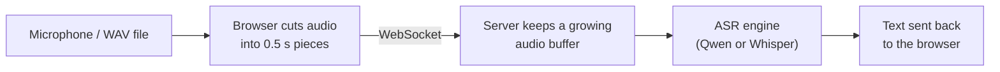
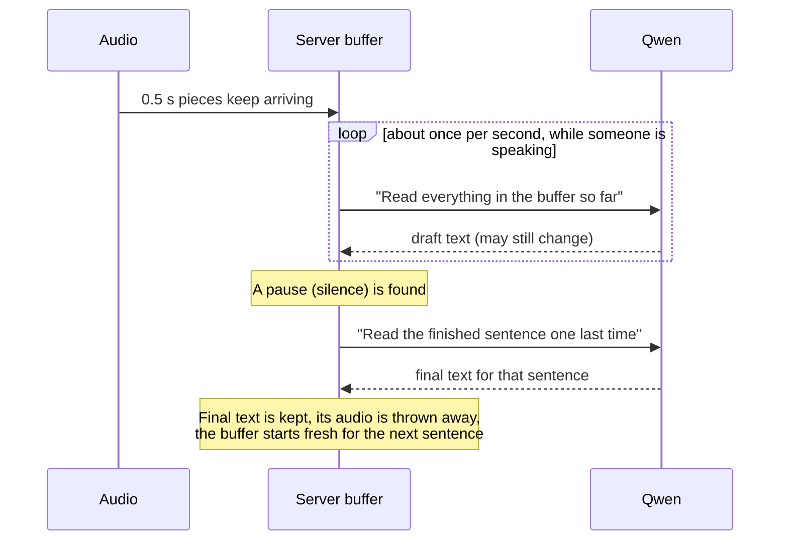
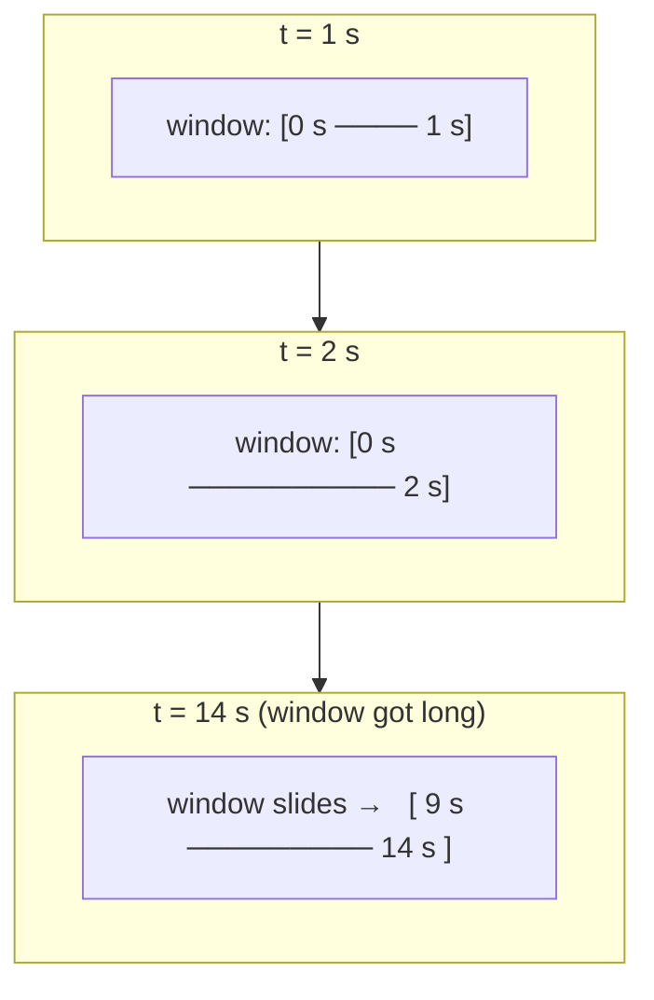

# How live streaming works (in plain words)

This project turns a stream of voice audio into text **while the person is still
talking**. This page explains how, without assuming any machine-learning
background. For protocol details and code-level notes see
[`arch/architecture.md`](arch/architecture.md).

---

## 1. The big picture



1. The browser sends a small piece of audio (half a second) every half second —
   the same speed as real speech.
2. The server collects those pieces in a **buffer** (a bucket of recent audio).
3. Every second or so the server asks the ASR (speech-to-text) engine to read the
   bucket and write down what it hears.
4. The text goes back to the browser and is shown on screen.

That's all "streaming" means here: **ask again and again as more audio arrives**,
and show the newest answer.

---

## 2. The catch: these models can't "listen live"

Speech models work like a person reading a recording: they need to see the audio
first and then write the text. They do not type out words the instant a sound is
heard. So we have to decide **what audio to hand them each time**. The two model
families need different tricks.

| | Qwen3-ASR | Whisper |
|---|---|---|
| Typical use here | Short sentences, pauses between them | Continuous speech |
| Trick | **Cut at pauses** (utterance mode) | **Sliding window** |
| Text shown as final | After a pause is detected | After two passes agree |
| Live-server mode name | `vad_utterance` | `sliding_window` |

The server picks the right trick automatically from the model you configured.

---

## 3. Qwen: "cut at pauses"

Think of a person who waits for you to finish a sentence before writing it down.



- **Is anyone speaking?** A simple loudness check (energy gate) skips silence so
  the model isn't wasted on quiet audio.
- **Draft text** is re-read every time, so it can change as more audio arrives.
  The page shows it dimmed.
- **Final text** is produced once, at a pause (or after 15 s if the speaker never
  pauses). After that the sentence is done and never re-processed, so a long call
  doesn't get slower and slower.

**Inside the engine:** the ONNX Qwen engine writes its answer one token (a word or
word-piece) at a time, so its `transcribe_stream` really does produce text
step by step. The Transformers Qwen engine produces the whole answer at once. In
both cases the server currently waits for the engine to finish a pass before
sending the text to the browser.

---

## 4. Whisper: "sliding window"

Whisper is built for chunks of audio up to 30 seconds and has no natural pauses to
cut at. So instead of cutting at pauses, we look at a **window** of recent audio
and **slide** it forward as time passes.



Every **1 second** of new audio, the whole window is read again. That means the
same words get transcribed several times, and the model may change its mind about
the last few words. To avoid showing text that then flips around, we use a rule
called **LocalAgreement**:

> A word becomes **final** only when two passes in a row both wrote it in the same
> place. Anything newer is shown as **tentative** (dimmed).

Real output from the tiny model reading a 10-second recording:

```
t=1s   final: (nothing yet)                         tentative: He hoped.
t=2s   final: He hoped                              tentative: there would be stew for it.
t=3s   final: He hoped there would be stew for      tentative: dinner, turn it.
t=4s   final: ... stew for dinner,                  tentative: turnips and carrots and...
```

Notice "for it" became "for dinner" — that is why the last words are tentative.

**Keeping it fast as the call goes on:**

- **Slide:** once the window is longer than 12 s, the confirmed part at the front
  is cut off. The model only ever reads the recent audio, never the entire call.
- **Hard limit:** if nothing could be confirmed by 20 s, the current text is
  accepted as final and the window is cut anyway.
- **Silence ends a sentence:** after 0.8 s of silence following speech, everything
  is made final and the window is emptied.
- **Language lock:** the language is detected on the first pass and reused, so it
  doesn't flip between languages mid-call and saves time.

All of these numbers can be changed in the `streaming:` block of
`config/models/whisper_*.yaml`.

---

## 5. What the screen shows

| What you see | Meaning |
|---|---|
| Normal text | **Confirmed** — will not change |
| Dim italic text | **Tentative** — may still be corrected |
| *sliding window* / *VAD utterances* label | Which trick the current model uses |
| `window 3.0s→9.0s` in the transcript line | (Whisper) which part of the call the model just read |
| Encoder / Prefill / Decode cards | Where the engine spent its time (see below) |

**The three timing stages**, in everyday terms:

- **Encoder** — "listening": turning sound into an internal summary.
- **Prefill** — "getting ready to write": the model reads the instructions and the
  summary once.
- **Decode** — "writing": producing the words one by one. More words = longer.

---

## 6. Which one should I use?

| Situation | Suggestion |
|---|---|
| Smoothest live demo on a normal CPU | `qwen3_onnx_0.6b_int8` or `whisper_int8_tiny` |
| Best accuracy, slower than real time is OK | `qwen3_1.7b` (Transformers) |
| Whisper but better quality than tiny | `whisper_int8_base` / `small` — expect more delay |

**Why bigger Whisper models lag:** every 1-second hop re-reads the whole window,
and Whisper always pads its input to 30 s. A small model finishes a pass in well
under a second; a big one may take longer than the hop. When that happens the
server skips ahead to the newest audio instead of falling further behind, so text
stays current but arrives later.

---

## 7. Quick glossary

- **ASR** — Automatic Speech Recognition, i.e. speech-to-text.
- **Buffer / window** — the piece of recent audio the model reads.
- **Hop** — how much new audio must arrive before we read again (1 s for Whisper).
- **VAD** — Voice Activity Detection: finding where someone is talking or silent.
- **Committed / confirmed / final** — text that will not change.
- **Tentative / interim / draft** — text that may still change.
- **RTF (real-time factor)** — processing time ÷ audio length. Under 1.0 means the
  engine keeps up with live speech.
- **Token** — a word or piece of a word, the unit a model writes in.
