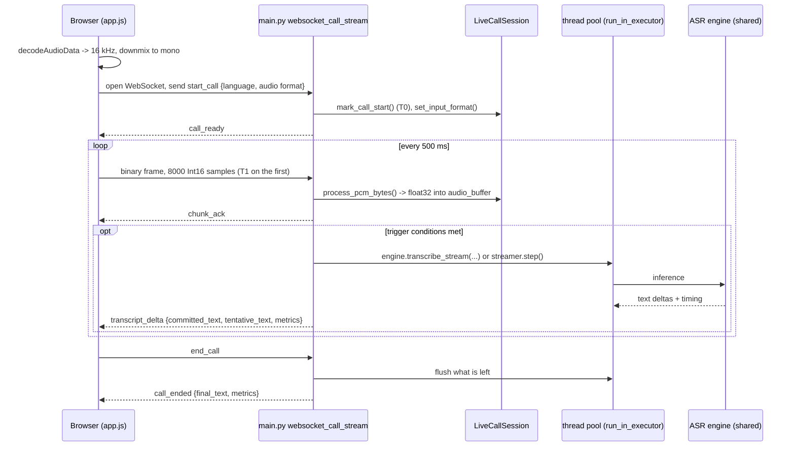

# Project Guide: understand RT-MASR-CPU well enough to defend it

This guide is for the person who has to **present and defend** the project, including code-level questions.
It explains what every part does, why it is built that way, how the numbers were produced, where the
weak spots are, and gives model answers to the questions a reviewer is likely to ask.

How to use it:

| Time you have | Read |
|---|---|
| 20 minutes | sections 1, 2, 4, 9 and skim 11 |
| 2 hours | sections 1-9, then run the commands in section 12 |
| Before the review | section 10 (questions), 11 (weak spots), 12 (live demo and "where would I change X") |

File names and function names are used instead of line numbers so the guide stays correct when code moves.
Open the file next to this guide and follow the function names.

---

## 1. The project in one minute

**What it is.** A proof of concept for **real-time speech-to-text on CPU only** (no GPU). A browser plays a WAV
file as if it were a phone call and streams the audio to a Python server over a WebSocket. The server runs an ASR
(automatic speech recognition) model on the CPU and sends back text while the "caller" is still talking.

**What is in it** (three deliverables, each builds on the previous):

1. **Live demo** (`main.py`, `static/`, `src/engines/`): the streaming server and a browser UI that shows
   confirmed text, tentative text and telemetry (latency, RTF, CPU, memory).
2. **Benchmark pipeline** (`benchmark/`): compares 10 model configurations on load time, latency/RTF,
   accuracy (WER/CER) and concurrency, and writes JSON + Markdown reports.
3. **Load test and capacity sizing** (`loadtest/`): simulates many simultaneous real-time call legs, finds how
   many one node can carry, and turns that into a sizing guide for 50-1,000 legs.

Plus documents: `docs/arch/architecture.md`, `docs/how-streaming-works.md`, `docs/benchmark/*`,
`docs/loadtest/*`, `docs/deployment.md` (production design).

**Two model families**

| | Qwen3-ASR (0.6B / 1.7B) | Whisper (tiny ... medium) |
|---|---|---|
| Runtime | ONNX Runtime (no PyTorch) or Transformers (PyTorch) | ONNX Runtime |
| How it streams here | **VAD utterance mode**: cut audio at pauses | **Sliding window + LocalAgreement** |
| Strength | Accurate, multi-lingual, fast on CPU (RTF about 0.15) | Mature; tiny is fast but weak on Mandarin |
| Weak spot | One failure mode: lag grows without bound when overloaded | Re-reads a 30 s padded window every second, so only tiny/base keep up |

**One sentence to remember:** *"Neither model can listen live, so the server repeatedly asks the model to read the
audio collected so far; the clever part is deciding what audio to hand over each time and which text is safe to
show as final."*

---

## 2. Repository map (what every file is for)

```
main.py                      FastAPI server: /ws/call-stream WebSocket, /api/health, /api/samples, serves the UI
static/                      Browser UI: app.js (stream a WAV at real-time pace), index.html, style.css
config/
  config.yaml                server settings + default_model
  models/models.yaml         registry: model name -> config file, backend, model_dir, HF repo
  models/*.yaml              per-model settings (download, engine, inference, streaming, ort_session)
src/
  core/config.py             YAML loading + registry resolution (config.yaml -> models.yaml -> model yaml)
  core/model_check.py        model preflight: unknown name -> available list, not downloaded -> download command
  core/runlog.py             per-run log session: logs/<pipeline>/<UTC>/run.log + run.meta.json
  core/observe.py            AI inference traces (LangSmith-style JSONL, no UI): traces.jsonl
  engines/
    live_call_session.py     per-call state: PCM normalisation, energy gate, VAD boundary, T0-T3 timestamps, metrics
    qwen3_onnx_engine.py     Qwen3-ASR on ONNX Runtime (mel -> encoder -> prompt -> prefill -> greedy decode)
    qwen3_engine.py          Qwen3-ASR on Transformers/PyTorch (via the qwen_asr package), stage timing via hooks
    whisper_engine.py        Whisper on ONNX Runtime; a proxy lets the vendored Whisper decoding code drive ONNX
    whisper_streaming.py     WhisperSlidingWindowStreamer: sliding window + LocalAgreement-2 state machine
  whisper/                   VENDORED from PINTO0309/whisper-onnx-cpu (MIT): tokenizer, beam search, segment loop
  utils/
    audio_utils.py           load audio, mel spectrogram (Whisper-compatible, no torch), silence split for long files
    download_utils.py        download models (HF Hub, PINTO zoo), 4 methods selected by config
    check_models.py          "which model can MY PC run?" self-test, each model in its own subprocess
benchmark/                   offline benchmark (see section 7)
loadtest/                    load test + sizing (see section 8)
tests/                       server/session/streaming tests
logs/                        per-run capture: run.log, run.meta.json, traces.jsonl
docs/                        architecture, benchmark, load test, deployment, this guide
```

**What is original and what is borrowed** (be ready to say this clearly):

| Part | Origin |
|---|---|
| Qwen3-ASR model weights and ONNX exports | Third party: `Daumee/Qwen3-ASR-0.6B-ONNX-CPU` (INT8 split layout), `andrewleech/qwen3-asr-*-onnx` (fused FP32/INT4), original `Qwen/Qwen3-ASR-*` for Transformers |
| Whisper ONNX models | Third party: PINTO model zoo exports |
| `src/whisper/` (decoding, tokenizer, segment loop) | Vendored, trimmed from `whisper-onnx-cpu` (MIT). The `_WhisperModelProxy` in `whisper_engine.py` is the adapter that makes it run on ONNX sessions |
| Server, session logic, streaming strategies, engine wrappers, UI | Project code |
| Benchmark pipeline, load test, sizing model, docs | Project code |

---

## 3. Concepts you must be able to explain

| Term | Plain explanation | Where it appears |
|---|---|---|
| **ASR** | Speech to text | everywhere |
| **PCM / Int16 / 16 kHz mono** | Raw uncompressed audio: 16,000 samples per second, one channel, each sample a signed 16-bit integer. 0.5 s = 8,000 samples = 16,000 bytes | wire format; `LiveCallSession` |
| **Mel spectrogram** | The audio turned into a picture: time on one axis, 128 (Qwen) or 80 (Whisper) frequency bands on the other, log-scaled. Hop 160 samples = 100 frames per second | `audio_utils.compute_mel_spectrogram` |
| **Encoder** | Neural net that turns the mel picture into a sequence of "audio feature" vectors. For Qwen about **13 vectors per second** of audio (three stride-2 convolutions shrink 100 frames to 13) | `OnnxAsrPipeline._encode_audio` |
| **Decoder / autoregressive decoding** | A language model that writes the text one token at a time, each token conditioned on the audio features and the tokens already written | `_prefill`, `_step` |
| **Prefill** | The first decoder pass: reads the whole prompt (instructions + audio features) once and fills the **KV cache** | `_prefill` (`decoder_init.onnx`) |
| **KV cache** | The attention keys/values already computed for earlier tokens, so each new token costs one small step instead of recomputing everything | `_step` (`decoder_step.onnx`) |
| **Greedy decoding** | At each step take the single most probable token (`argmax`). Whisper beam search keeps several candidates | `_transcribe_chunk` |
| **Token** | A word piece. The text is rebuilt by decoding all tokens so far with the tokenizer | `SimpleTokenizer` |
| **Quantisation (INT8 / INT4)** | Storing weights with 8 or 4 bits instead of 32 so the model is smaller and faster on CPU, with a small accuracy cost | model names `int8`, `int4` |
| **ONNX / ONNX Runtime (ORT)** | A portable model format and its CPU inference engine; `intra_op_num_threads` = threads used inside one operation | `ort.SessionOptions` |
| **RTF (real-time factor)** | Processing time / audio duration. 0.2 means 1 s of audio takes 0.2 s. Below 1 = faster than real time | benchmark, metrics |
| **WER / CER** | Word / character error rate = (substitutions + insertions + deletions) / reference length, via edit distance | `benchmark/metrics/asr_metrics.py` |
| **Energy gate** | "Is there sound?": RMS of the last 0.5 s above 0.02 | `LiveCallSession.has_speech` |
| **VAD** | Voice activity detection: finding speech vs silence. Here it is just energy based, not a neural VAD | `find_vad_boundary` |
| **Utterance** | A stretch of speech between pauses (a sentence or phrase) | Qwen mode |
| **Committed vs tentative text** | Committed = final, never changes. Tentative = current best guess for the unfinished tail, shown dimmed | server messages, UI |
| **LocalAgreement-2** | A word becomes committed only when two consecutive passes both output it in the same place | `whisper_streaming.py` |
| **Hop** | New audio that must arrive before re-transcribing (Whisper: 1 s) | `StreamingConfig.hop_s` |
| **Call leg** | One independently streamed audio source = one WebSocket connection = one call direction | whole project |
| **Staleness** | How far the transcript lags the speaker: time a pass finished minus time its newest audio arrived | load test |
| **Saturation point (`l_sat`)** | Highest number of simultaneous legs at which every leg still keeps up | load test |
| **Headroom** | Running each edge box below saturation (70%) so bursts do not collapse latency | sizing |
| **CPU threads** | Logical CPUs pinned on this edge machine (a physical core has two on SMT) | `loadtest/topology.py` |
| **Trace / run** | One JSONL record per model inference, nested under a live call or load-test leg (`trace_id` / `parent_id`). No UI | `src/core/observe.py`, `logs/.../traces.jsonl` |

---

## 4. Follow one call end to end

### 4.1 The big picture



### 4.2 Browser side (`static/app.js`)

1. `AudioContext({sampleRate: 16000})` + `decodeAudioData` decodes any WAV and **resamples to 16 kHz** (the browser does
   the resampling).
2. `downmixToMono()` averages all channels.
3. `streamAudioBuffer()` takes `chunkSize = 8000` samples (0.5 s), converts float32 to Int16
   (`clip to [-1,1]` then `* 0x7FFF`) and sends one binary frame every 500 ms with `setInterval`.
   That interval is what makes it behave like a live call: **real-time pace**.
4. On open it sends `start_call` with `language` (empty string = auto-detect) and the audio format
   `{sample_rate: 16000, channels: 1, encoding: "pcm_s16le"}`. When all audio is sent it sends `end_call`.
5. Incoming `transcript_delta` is rendered with confirmed text normal and tentative text dimmed;
   it also polls `/api/health` about once a second for CPU and RSS.

### 4.3 Server side: the WebSocket handler (`main.py: websocket_call_stream`)

Per connection it creates:

- a `LiveCallSession` (all per-call state),
- a `_CallState` (the language, the last full text),
- for Whisper a `WhisperSlidingWindowStreamer`,
- an `asyncio.Queue` called `incoming` plus a **reader task** (`_ws_reader`) that does nothing but pump raw
  WebSocket messages into that queue.

Why the reader task and queue? So the handler can **look ahead** at what has arrived while an inference pass is
running (`_drain_audio`). If the handler awaited `websocket.receive()` directly, it could not skip a backlog.

The loop pulls one message at a time:

- binary frame -> `_handle_audio_sliding` (Whisper) or `_handle_audio_vad` (Qwen);
- text `start_call` -> reset the session, read `audio` format and call `session.set_input_format()` (invalid format
  -> send `error` and close), reset the streamer, reply `call_ready`;
- text `end_call` -> flush remaining audio (see 4.6), reply `call_ended`, exit.

Inference never runs on the event loop: `_run_inference` (and the Whisper `run_in_executor(None, streamer.step)`) run in
the default thread pool, so frames keep arriving and `/api/health` stays responsive. **All calls share one engine
instance** (`_engine`), so weights exist once per process. The executor copies `contextvars` so each pass stays nested
under the call's observability parent (`src/core/observe.py`). `mark_call_start` / `mark_call_end` open and close that
parent; every engine `transcribe` / `transcribe_stream` writes a child run to `traces.jsonl`.

### 4.4 The session: audio in (`LiveCallSession.process_pcm_bytes`)

For each frame it:

1. counts it and stamps **T1** on the first;
2. prepends bytes left over from a previous partial frame (`_byte_carry`) so a mid-sample split cannot crash;
3. `np.frombuffer(int16)` then `/ 32768` gives float32 in [-1, 1];
4. if the declared input has more than one channel: reshape and **average** to mono;
5. if the declared sample rate is not 16 kHz: **linear-interpolation resample**, with phase and tail carried
   across packets (`_resample_pos`, `_resample_carry`) so chunk boundaries do not click;
6. appends to `audio_buffer`.

`set_input_format` accepts `pcm_s16le` only, rates 4,000-192,000 Hz, channels 1-8; anything else raises
`ValueError`, which `main.py` reports as `unsupported_audio_format`. The browser always sends the baseline, so the
conversion code is for non-browser clients (a media gateway, the load test).

### 4.5 When does the server run the model?

**Qwen (`_handle_audio_vad`)**: inference runs only if **all three** hold:

```
len(audio_buffer) >= 8000          at least 0.5 s buffered
chunks_received % 2 == 0           every 2nd chunk  -> about once per second
session.has_speech()               RMS of the last 0.5 s > 0.02  (skip silence)
```

Then `find_vad_boundary()` decides between two paths:

- **Commit path** (boundary found): `pop_utterance(boundary)` removes `audio_buffer[:boundary]`, transcribes
  **that** utterance once, `append_committed(text)`. The text is final and its audio is gone, so cost stays bounded.
- **Interim path** (no boundary): re-transcribe the whole open `audio_buffer`; the result is *tentative* text and is
  replaced on every pass.

`find_vad_boundary` in detail (`min_silence_samples = 32000` = 2 s, `max_utterance_samples = 240000` = 15 s):

```
if len(buf) < 64000: return None          # needs 4 s buffered before it even judges
if len(buf) >= 240000: return 240000      # force-commit at 15 s
for i in range(32000, len(buf)-1600, 1600):      # 100 ms frames, starting 2 s in
    if mean(frame**2) < 0.02**2: return i + 800  # first quiet frame -> boundary at its middle
return None
```

Worked example. Speaker talks 0-5 s, pauses 5-6 s, talks again 6-10 s. At t = 6.5 s speech is present again, the
buffer holds 0-6.5 s, the scan finds the first quiet 100 ms frame at about 5.0 s, so audio 0-5.05 s is committed and
5.05-6.5 s stays in the buffer as the start of the next utterance.

Two consequences worth knowing (questions may probe them):

- Commits are **lazy**: inference only runs while `has_speech()` is true, so the boundary is noticed on the first
  speech chunk *after* the pause, or at `end_call`.
- The docstring says the minimum committed chunk is 2 s, but the function needs 4 s of buffer before it looks, and
  one quiet 100 ms frame is enough to cut (no hangover).

**Whisper (`_handle_audio_sliding`)**: after each frame `streamer.ready()` is checked (at least `hop_s` = 1 s of new
audio and at least 1 s in the window). If ready, `_drain_audio` first moves every already-queued frame into the
buffer (**skip the backlog**), then `streamer.step()` runs in the thread pool.

### 4.6 Whisper streaming in detail (`whisper_streaming.py`)

State: `_committed` (final units), `_prev` (previous hypothesis), `_n_committed` (how many leading units of the
current hypothesis are already committed), `_tentative`, `_pending` (speech seen since the last flush),
`_window_start_samples`.

A **unit** is a word, or one character for Chinese/Japanese/Korean (`_TOKEN_RE`). Each has `text` (as shown) and
`key` (lower-cased, punctuation stripped, NFKC-normalised, used for comparing).

`step()`:

```
if window < 1 s: return None
if speech in the last hop: _pending = True
if not _pending: trim to a 0.5 s pre-roll; return None        # pure silence never reaches the model
tail_silent = no speech in the last 0.8 s
return _infer(flush = tail_silent)
```

`_infer(flush)`:

1. `engine.transcribe(window, language, beam_size=1, fallback=False)` (greedy, no temperature retries: speed).
2. Lock the detected language after the first pass with text (`lock_language`).
3. Flatten the segments into units.
4. **LocalAgreement-2**: `agree = common_prefix_len(_prev, units)`; commit `units[_n_committed:agree]` so
   committed text only ever grows. If `flush`, commit everything and empty the window.
5. Otherwise `_slide()`: if the window is at least `max_window_s` (12 s), cut it forward to the end of the last segment
   whose words are all committed; if the window reached `hard_max_window_s` (20 s) with nothing confirmed, force-commit
   the hypothesis and cut. This keeps one pass's cost bounded for any call length.

Worked example (from `docs/how-streaming-works.md`):

```
t=1s  hyp "He hoped."                       committed ""            tentative "He hoped."
t=2s  hyp "He hoped there would be stew"    committed "He hoped"    tentative "there would be stew"
t=3s  hyp "He hoped there would be stew for dinner"
                                            committed "... stew for" tentative "dinner"
```

"He hoped" appeared identically in two consecutive passes, so it is final. The last words stay tentative because the
next pass may change them ("for it" became "for dinner" in a real run).

`finish()` (at `end_call`): transcribe what is left with `flush=True`, or just promote the tentative tail.

### 4.7 What goes back to the browser

`transcript_delta` carries `full_text` (committed + tentative), `committed_text`, `tentative_text` and `metrics`.
It is sent only when the text changed. `call_ended` carries `final_text` and the last metrics plus
`total_call_time_s`.

### 4.8 The metrics and where they are captured (`LiveCallSession.get_metrics`)

| Anchor | Moment |
|---|---|
| T0 | `start_call` received (`mark_call_start`) |
| T1 | first PCM frame (`process_pcm_bytes`) |
| T2 | first inference starts (`mark_infer_start`) |
| T3 | first pass that produced text has **returned** (`mark_first_token`) |

`pipeline_latency_ms = T3 - T0`; `ttft_ms = T3 - T2`; `infer_latency_ms` = duration of the last pass;
`rtf = infer_time / audio_buffer_duration`; `throughput_tps = tokens / decode_s`; plus mel/encoder/prefill/decode
milliseconds from the engine timing dict. Known caveat: all deltas of a pass are collected in a worker thread and
returned as a list, so T3 is stamped when the **whole** first pass ends and `ttft_ms` is not a true time to first
token. On the commit path `rtf` is computed against the leftover buffer, not the utterance just transcribed.

---

## 5. The engines, at code level

### 5.1 The engine contract (what makes everything pluggable)

Every engine exposes:

```python
engine.transcribe(audio_path_or_array, language=None) -> {"text", "language", "timing": {...}}
engine.transcribe_stream(audio_array, language=None) -> generator of (delta, None) ... then ("", timing)
```

The final `("", timing)` is a **sentinel**: an empty delta carrying the full timing dict, so the caller gets the
timing without a second pass. This uniform contract is why `main.py` and the benchmark do not care which backend is
loaded.

### 5.2 Qwen3 ONNX (`qwen3_onnx_engine.py`)

Two classes: `OnnxAsrPipeline` (the pipeline) and `ONNXQwen3ASR` (config-driven wrapper with `from_config`).

**Loading.** The layout is auto-detected: `encoder_conv.onnx` present means the **split** layout (Daumee INT8:
conv + transformer encoder graphs, INT8 decoder, FP32 embeddings); otherwise the **fused** layout (andrewleech FP32/INT4:
one `encoder.onnx`). `pick(name)` chooses `{name}{suffix}.onnx` (e.g. `decoder_init.int8.onnx`) and falls back to FP32 if
the quantised file is missing. `intra_op_num_threads` is set only when `num_threads > 0` (0 = ORT decides).
`embed_tokens.bin` is the token embedding matrix (151,936 x 1,024), read from disk and kept as is; rows are cast to FP32
on lookup.

**One chunk (`_transcribe_chunk` / `transcribe_stream`)**, in order, each stage timed:

1. **Mel** (`_compute_mel`): librosa STFT (n_fft 400, hop 160, hann), power spectrum, 128-bin Slaney mel filterbank,
   `log10`, clamp to `max - 8`, `(x + 4) / 4`. Whisper-compatible. The fused encoder drops the last frame.
2. **Encoder** (`_encode_audio`): mel to audio features `[N, 1024]`, about 13 tokens per second.
3. **Prompt** (`_build_prompt_ids`): a chat-style prompt:
   `<|im_start|>system ... <|im_end|> <|im_start|>user <|audio_start|> <|audio_pad|> x N <|audio_end|> <|im_end|>
   <|im_start|>assistant`, and, if a language is forced, `language English<asr_text>`.
4. **Fuse** (`_prepare_decoder_inputs`): the N `<|audio_pad|>` positions are replaced by the audio features. Newer
   decoders (v3) do this inside the graph (`input_ids + audio_features + audio_offset`); older ones (v1) take
   pre-fused `input_embeds`. The code detects which from the graph inputs.
5. **Prefill** (`_prefill`, `decoder_init`): runs the whole prompt, returns logits and the KV cache.
6. **Greedy loop** (`_step`, `decoder_step`): `argmax` the last logits, feed the token back with the KV cache, repeat
   until `<|im_end|>` / `<|endoftext|>` or `max_new_tokens` (512).
7. **Parse**: with auto language the model writes `language English<asr_text>Hello ...`; the code splits on
   `<asr_text>` to get the language and the text.

**Streaming deltas.** `transcribe_stream` is a generator. After every generated token it decodes **all** tokens so far
(correct for multi-byte characters), takes the text after `<asr_text>` (or the whole text if a language was forced),
and yields the new suffix. Re-decoding every step is O(n squared) in tokens, negligible at ASR lengths.

**Long files** (`transcribe`): `find_silence_split_points` splits audio longer than 45 s (1.5 x target 30 s) at the quietest
point near 30 s, using RMS in dB; each sub-chunk is transcribed and joined. Not used by the live path (the live path
bounds utterances itself).

**Languages**: `LANGUAGE_MAP` maps `en`, `zh/cn/mandarin/chinese`, `id/bahasa...` to the names the model expects.

### 5.3 Qwen3 Transformers (`qwen3_engine.py`)

Same contract, but it wraps the `qwen_asr` package (`Qwen3ASRModel.from_pretrained`, BF16 on CPU). Its API is a single
blocking call, so `transcribe_stream` yields the **whole text as one delta**, then the sentinel ("pseudo-streaming").
`_StageTimer` registers PyTorch forward hooks to measure encoder, prefill and decode time. This backend exists mainly as
the accuracy/speed reference for the benchmark (ONNX is 3.8x faster at 0.6B).

### 5.4 Whisper (`whisper_engine.py`)

- `WhisperOnnxPipeline` loads `{model}_encoder_11_{precision}.onnx` and the decoder. The model files are read into
  bytes by `_load_onnx`. Threads: `num_threads` 0 means logical CPUs minus 1 (different default from Qwen).
- `_WhisperModelProxy` is the adapter: the vendored `whisper.transcribe()` / `whisper.decoding` code expects a PyTorch
  model object (`encoder`, `decoder`, `logits`, `detect_language`, `new_kv_cache`). The proxy provides those methods
  and routes each call to the ONNX sessions. It also **times** the stages: decoder calls at KV offset 0 are counted as
  **prefill**, later single-token calls as **decode**. A new proxy is created for every `transcribe()` call, so the
  accumulators are not shared between concurrent calls on the same pipeline.
- `transcribe()` pads/trims to Whisper's 30 s context and runs the vendored segment loop: language detection (or forced
  language), beam search or greedy (`beam_size <= 1` means greedy), temperature fallback retries (`fallback=True`),
  timestamps. The live path passes `fallback=False, beam_size=1` to bound latency.
- **Why only tiny/base are real time:** every pass pads to 30 s, so encoder cost is nearly constant per pass regardless
  of window length, and the streamer re-runs it every second.

### 5.5 Model selection and configuration

```
config/config.yaml         default_model: "qwen3_onnx_0.6b_int4"
   -> config/models/models.yaml     registry entry: name, config path, backend, model_dir, hf_repo
        -> config/models/<name>.yaml    download / engine / inference / streaming / ort_session
```

`resolve_model_config()` (`src/core/config.py`) walks that chain, resolving paths relative to the project root.
`RT_MASR_MODEL=<name>` overrides the default for one run. `main.py` picks the stream mode from the backend:
`whisper` -> `sliding_window`, everything else -> `vad_utterance`.

Before the engine is built, `main.py` calls `check_registry_model` (`src/core/model_check.py`). A misspelled name stops
startup with "did you mean" and a table of registry names (with a `DOWNLOADED` column); a model whose files are missing
stops with `uv run python src/utils/download_utils.py --model <name>`. The benchmark and load test run the same check on
their ids and show the registry name each id downloads as (ids and registry names differ).

Gotcha: the `streaming:` block in the **Qwen** YAMLs (`min_buffer_samples`, `infer_every_n_chunks`) is documentation
only; `main.py` hard-codes those values. The `streaming:` block of the **Whisper** YAMLs *is* read
(`StreamingConfig.from_dict`).

---

## 6. Tests

| Area | File | What it proves |
|---|---|---|
| Session | `tests/test_live_call_session.py` | PCM conversion, 8 kHz resampling continuous across chunks, stereo averaged, partial frames carried, unsupported format rejected, energy gate, VAD boundary (short buffer, silence after speech, force-commit at 15 s), `pop_utterance`, committed-text joining |
| Whisper streamer | `tests/test_whisper_streaming.py` | Unit splitting (words / CJK), common prefix ignores case and punctuation, commit only after two agreeing passes, garbage tail never committed, committed text append-only with no duplicates, window slides and bounded cost, hard-cap force-commit, silence flush, pure silence never calls the engine, language lock, WebSocket end-to-end with a fake engine |
| Benchmark | `benchmark/tests/*` (about 90 tests) | Statistics, WER/CER, runners with fake engines, reporters, load timer, streaming concurrency (kept up, aborts, global leg offsets) |
| Load test | `loadtest/tests/*` (28 tests) | Topology, tiled call audio, ramp logic (stops, bisects, confirms, memory guard), sizing arithmetic, USL fit, rendered report |
| Logging | `tests/test_runlog.py` | Run directory, `run.log` / `run.meta.json`, env overrides, pytest skip |
| AI traces | `tests/test_observe.py` | Nested call/inference JSONL, errors, stream wrap, no waveform stored, `RT_MASR_OBSERVE=0` |
| Model preflight | `tests/test_model_check.py` | Unknown name suggests and lists available models, missing files give the download command, benchmark id -> registry name mapping |

Run: `uv run pytest benchmark/tests loadtest/tests` (about 120 tests, models not needed) and
`uv run pytest tests/test_live_call_session.py tests/test_runlog.py tests/test_observe.py`. Fake engines are used so tests are fast and need no model files.

---

## 7. The benchmark pipeline (`benchmark/`)

Entry: `python benchmark/run_benchmark.py [--models ids] [--runs N] [--legs 1,2,4] [--concurrency-mode stream|batch]`.

`run_benchmark.py: main` loads `bench_config.yaml`, then for each config calls `_benchmark_one_config` (kept in its
own function so the engine goes out of scope and the next config's memory baseline is clean). The four stages:

| Stage | File | What and how |
|---|---|---|
| 1 Load | `runners/load_timer.py` | `release_memory()` (GC + `malloc_trim`), sleep 0.5 s, record RSS, build the engine, time it, record RSS. Gives load time and RSS delta. Returns the engine so it is reused |
| 2 Latency | `runners/latency_runner.py` | per audio file: `warmup_runs` discarded, then `n_runs` timed `engine.transcribe`. RTF = wall latency / duration read from the **file header** (`audio_info.audio_duration_s`), not from the engine, so RTF is comparable across engines. P50/P95/P99 via `statistics.summarise` (linear interpolation percentile). `SystemSampler` records CPU / RSS / threads in a background thread |
| 3 Accuracy | `runners/accuracy_runner.py` + `metrics/asr_metrics.py` | normalise hypothesis and reference, then edit distance (Wagner-Fischer). WER over words for English/Indonesian, CER over characters for Mandarin. Corpus rate = total edits / total reference length. Entries with `verified: false` are flagged as draft references |
| 4 Concurrency | `runners/streaming_concurrency_runner.py` (default) or `concurrency_runner.py` (`batch`) | see below |

Normalisation (`normalise`): NFKC; for en/id lower-case, delete apostrophes ("don't" = "dont"), other punctuation to
spaces; for zh remove all punctuation/symbol characters. Without it WER would punish "Hello," vs "hello".

### 7.1 Two concurrency modes (a classic question)

| | `batch` (old) | `stream` (current default) |
|---|---|---|
| What a "leg" does | a worker thread calls `transcribe()` on a whole file, back to back | a leg streams audio at real-time pace and runs the live server's stream logic |
| Measures | throughput (audio seconds per wall second) | does every leg keep up with live speech |
| Result (final runs) | INT8 0.6B: 6.7x real time at 4 workers, RTF 0.59 per call (`docs/benchmark/final_result.md`) | INT8 / INT4 0.6B: **1 live leg** per box; Whisper tiny 3 / 2 (`docs/loadtest/final_result.md`) |

Why they disagree: batch mode transcribes each complete 10 s file **once**. A live call re-transcribes the open
window every second, so the compute per second of audio is several times larger (2.3-3.7x for Qwen), and each leg also
has a latency requirement. An earlier reading of the batch row as "about 4 live calls" was too high; batch throughput is an
offline capacity figure, the streaming load test is what a live deployment needs.

### 7.2 The streaming concurrency runner (shared by benchmark and load test)

`StreamingConcurrencyRunner._stream_leg` replays what `main.py` does, without the network:

- converts the waveform to Int16 bytes and cuts it into 0.5 s chunks;
- `arrival(k)` = leg start + time at which chunk k has fully arrived; `_sleep_until(arrival(k))` paces the leg at real time;
- feeds a real `LiveCallSession` and, for Whisper, a real `WhisperSlidingWindowStreamer` (with the same backlog skip as
  `_drain_audio`); for Qwen it uses the same trigger rules and `find_vad_boundary`;
- `record()` stores per pass: **latency**, **pass RTF** (latency / window audio) and **staleness**
  (`t_end - arrival(newest chunk the pass covered)`);
- `kept_up` = no errors, not aborted, p95 staleness <= `lag_threshold_s` **and** end lag <= `lag_threshold_s` (default 2 s);
- **overload guard** (`abort_lag_s`): a leg more than 8 s behind stops, so an overloaded level does not run for minutes.

All legs run as threads in one process on one shared engine, like the server.

---

## 8. The load test and sizing (`loadtest/`)

### 8.1 Goal and the key idea

Find, for this whole edge CPU, the **maximum number of simultaneous real-time legs that all keep up** (the saturation
point), then size more identical boxes from that measured point. The sizing never just multiplies single-leg cost.

### 8.2 Pieces and what each does

| File | Role |
|---|---|
| `loadtest/audio.py` | `tile_call_audio`: repeat a clip with `gap_s` of silence until the call is `duration_s` (30 s). The gap defines the **profile**: `dense` (gap 1 s, about 85% speech), `conversational` (gap 7 s, about 47% speech) |
| `loadtest/topology.py` | `ordered_cpus` / `cpu_set(n)`: pick logical CPUs as **hardware-thread sibling pairs** (reads `/sys/.../thread_siblings_list`). `split_cpus` splits a set across processes. 8 threads = 4 physical cores; taking one thread per core would flatter the result |
| `loadtest/runners/worker_pool.py` | `WorkerPool`: starts P **spawned** worker processes, each pinned with `os.sched_setaffinity` to its CPUs, with its own engine whose ORT `num_threads` is set (via `overrides` merged by `engine_loader._deep_update`). The parent sends `("level", n_legs, leg_offset, stagger, start_at)` and workers answer with a `StreamingConcurrencyResult`. Legs inside a process share that process's engine |
| `loadtest/runners/ramp.py` | `run_ramp`: the saturation search |
| `loadtest/metrics/tree_sampler.py` | `TreeSampler`: per level, CPU % of the **pinned CPUs only**, CPU seconds consumed by the workers, summed RSS (peak), minimum free RAM |
| `loadtest/run_loadtest.py` | CLI; one run per profile × model on this whole machine (all threads, 1 process), writes JSON + summary |
| `loadtest/sizing/model.py`, `report.py`, `run_sizing.py` | the sizing model, the guide generator and its CLI |

Why **spawn** processes instead of fork or threads: a clean interpreter and ORT state per worker, no inherited threads,
separate memory (so duplicated weights are counted honestly), and per-process CPU pinning. It also avoids the GIL
shared between processes.

Memory safety: the first worker is started alone and its real RSS (after load + warm-up) is checked against free RAM
(`InsufficientMemory` skips a layout that does not fit); during a level a monitor kills workers if free RAM drops below
`hard_floor_mb` (`MemoryAbort`); `_MemoryModel` predicts the RSS of the next level so the ramp stops before it
(`stop_reason: memory`).

### 8.3 The saturation search (`ramp.py: run_ramp`)

```
levels = [1, 2, 3, 4, 6, 8, 12, 16, ...]
lo = 0; hi = None
for n in levels:                         # ladder
    if memory would not fit: stop (memory)
    run level n  ->  healthy?
    healthy: lo = n          else: hi = n; stop (saturated)
while hi - lo > 1 and steps < 4:        # bisect between last healthy and first failing
    mid = (lo + hi) // 2 ; run mid ; healthy -> lo = mid  else hi = mid
re-run lo to confirm; if it fails, lo -= 1 and retry (max 2 times)
l_sat = lo ; l_fail = hi
```

A level is **healthy** (`evaluate_level`) only if every leg kept up, no errors, nothing aborted and every leg produced
text. Leg start times are spread over a 6 s window (`stagger = spread / n`) because real calls are not aligned.

### 8.4 What was measured (the numbers to remember)

Machine: AMD Ryzen 7 6800H, 8 cores / 16 threads, 15 GB RAM, shared with an IDE and browser (so noisy).

Saturation on this whole machine (16 threads, 1 process) at the 2 s SLO, conversational / dense (final run
`20261007T202154Z`, all six confirmed; write-up in `docs/loadtest/final_result.md`):

| Model | Max legs kept up | p95 staleness around the knee (conversational) |
|---|---|---|
| Qwen3-0.6B INT4 | **1** / 1 | 0.83 s at 1 leg, 2.76 s at 2 |
| Qwen3-0.6B INT8 | **1** / 1 | 0.98 s at 1 leg, 3.11 s at 2 |
| Whisper tiny INT8 | **3** / 2 | 1.04 s at 2 legs, 1.51 s at 3, 2.70 s at 4 |

Takeaways: capacity is **1-3 legs on this box**. Extra legs need extra boxes. INT4 carries the same legs as INT8 with
about 1.2 GB less memory and about 12% less compute per pass. The previous run (`20261007T170448Z`) found the same points;
an earlier October 6 run measured Whisper 2 / 1 and Qwen 1 / 0, so treat every point as +/-1 leg.

### 8.5 The sizing model (`sizing/model.py`)

```
planning legs per box = max(1, l_sat * headroom(0.70) / serving_overhead(1.10))
boxes  = ceil(N / legs_per_box) + max(1, ceil(10% * boxes))        # spare edge boxes
RAM    = ceil( (processes*weights + legs*MB_per_leg) * 1.2 + 2 GB OS )   # whole GB this box needs
```

Worked example, Whisper tiny conversational, `l_sat = 3` on 16 CPU threads, 100 legs:
`cap = 3 * 0.70 / 1.10 = 1.91`; `ceil(100 / 1.91) = 53`; spares `max(1, ceil(5.3)) = 6`; **59 boxes** (16 threads, ~4 GB each).
For Qwen `l_sat = 1` gives `cap = max(1, 0.64) = 1.0`, so 100 legs = 100 + 10 = **110 boxes** (~6 GB each for INT4, ~7 GB for INT8).

Stricter flags (`run_sizing.py --headroom 0.6 --serving-overhead 1.25 --spare-fraction 0.2`): Whisper
`cap = 3 * 0.6 / 1.25 = 1.44`, so 100 legs = 70 + 14 = **84 boxes**; Qwen stays on the one-leg floor, 100 + 20 = **120 boxes**.
Full tables in `docs/loadtest/loadtest.md`; sizing for 50-1,000 legs with measured vs extrapolated tags in `docs/loadtest/sizing_guide.md`.

Other parts: `memory_fit` (least-squares MB per leg over healthy levels), `fit_usl` (Universal Scalability Law
`C(v) = lambda*v / (1 + sigma*(v-1) + kappa*v*(v-1))` fitted by linear least squares on `v/C` to the measured thread
sweep only; it describes diminishing returns on *this* chip and is not used to predict other CPUs), a confidence label that
falls with `N / l_sat` (<=10x Medium, <=50x Low-Medium, <=200x Low, beyond Very low, one notch lower when `l_sat <= 2`),
and a +/-1 leg range. Every number is tagged MEASURED / DERIVED / ASSUMED / EXTRAPOLATED / NOT MODELLED, and batching
is **not credited**.

Why CPU time per leg is not used: ORT worker threads spin-wait, which inflates CPU time and makes per-leg CPU cost
non-constant. The sizing is therefore driven from the measured saturation point.

---

## 9. Design decisions and the reasoning behind them

| Decision | Reason | Cost / alternative |
|---|---|---|
| ONNX Runtime, no PyTorch | Light dependency, 3.8x faster than the PyTorch BF16 path at 0.6B, runs on any CPU | needs ONNX exports from third parties |
| INT8 / INT4 quantised weights | Smaller, faster on CPU; FP32 gave no accuracy gain on the test set and was 1.8x slower | INT4 0.6B returned **empty text on one clip** with language auto-detect (works when the language is forced); documented in `final_result.md` |
| Two streaming strategies | Qwen has no streaming decoder: cut at pauses. Whisper is offline and pads to 30 s: slide a window and commit what two passes agree on | Both re-transcribe, so cost per leg is high |
| Shared engine per process | Weights loaded once; many legs per process | Legs contend for the same ORT thread pool and GIL-bound Python code |
| Inference in a thread pool | Event loop stays free so audio keeps arriving and health works | Default pool size is `min(32, cpus+4)`, unbounded oversubscription of cores |
| Reader task + queue + `_drain_audio` (Whisper) | Skip stale backlog so latency stays bounded | Intermediate hypotheses are lost under load |
| Energy gate instead of a neural VAD | No extra model, deterministic, cheap | Fixed threshold calibrated on read speech; real noise needs a real VAD |
| 15 s / 12 s / 20 s limits | Bound pass cost and memory regardless of call length | A forced commit can cut mid-word |
| RTF measured against the file duration | Comparable across engines | none |
| Spawned, pinned worker processes in the load test | Honest model of this edge CPU and of memory duplication | More complex than threads |
| Sibling-pair CPU pinning | Uses whole physical cores (both SMT threads) | A bit pessimistic vs one thread per core |
| Staleness as the main load metric | It is what a user feels (how late the text is) and includes queueing | needs real-time pacing, so tests are slow (30 s calls) |
| Saturation-point-based sizing + headroom | Honest about extrapolation, avoids linear multiplication | Resolution is whole legs (1-3), so error bars are wide |

---

## 10. Questions you may be asked, with model answers

### Concept and architecture

**Q1. How does streaming work if the models cannot stream?**
They cannot decode while audio is still arriving, so the server keeps a buffer and calls the model repeatedly on it.
Qwen: re-transcribe the open utterance about once per second (tentative text) and transcribe it once more at a pause
to commit it. Whisper: re-transcribe a sliding window every second and commit the words two consecutive passes agree on
(LocalAgreement-2).

**Q2. What is the difference between committed and tentative text?**
Committed text is final and append-only; tentative text is the model's current guess for the unfinished tail and may
change on the next pass. The UI shows tentative text dimmed.

**Q3. Why one WebSocket per call leg, and what does one leg mean?**
A leg is one independently streamed audio source (one call direction). One connection holds one `LiveCallSession`
(buffer, state, timestamps), so legs are isolated while sharing one loaded model.

**Q4. Where does real-time pacing come from?**
The browser sends 8,000 samples every 500 ms with `setInterval`, which is exactly the audio rate. The load test does
the same with `_sleep_until(arrival(k))`.

**Q5. How is inference kept off the event loop?**
`loop.run_in_executor(None, ...)` in `_run_inference` and for `streamer.step`, so the sync, CPU-bound code runs in the
default thread pool and the async loop keeps receiving frames.

**Q6. Is the engine thread-safe with many legs?**
One engine instance is shared by all legs. ONNX Runtime `InferenceSession.run` is thread-safe, the Whisper proxy that
holds per-call timers is created per call, and the load test ran many legs concurrently with no errors. It is not proven
for every backend under all conditions; the Transformers backend was not load tested.

### Qwen path

**Q7. How does the server decide an utterance ended?**
`find_vad_boundary`: it scans the buffer in 100 ms frames starting 2 s in, and the first frame whose energy is below the
speech threshold (RMS 0.02) becomes the boundary (at its midpoint). At 15 s of buffer it force-commits.

**Q8. What are the weaknesses of that?**
Fixed energy threshold, no hangover (one quiet frame ends an utterance), needs 4 s buffered before it judges, commits
lazily because inference only runs while speech is present, and silence is not trimmed from the buffer on the Qwen path.

**Q9. Walk me through one Qwen pass.**
Mel spectrogram (128 bins) -> encoder gives about 13 feature vectors per second -> build a chat prompt with that many
`<|audio_pad|>` placeholders -> replace the placeholders with the features (inside the graph for v3 decoders) -> prefill
once to fill the KV cache -> greedy loop with the `decoder_step` graph until the end token -> decode tokens, split at
`<asr_text>` to get language and text.

**Q10. What is prefill, what is decode?**
Prefill reads the whole prompt in one decoder call and builds the KV cache; decode generates one token per step reusing
that cache. Prefill/encoder cost scales with audio length; decode cost with number of tokens.

**Q11. Why does `transcribe_stream` yield a sentinel at the end?**
To return the timing dict through the generator without a second inference pass.

**Q12. The UI shows text only after a pass finishes. Is that "token streaming"?**
The ONNX Qwen engine does produce tokens incrementally, but `main.py` collects all deltas into a list inside a worker
thread and sends them when the pass returns, so on the wire it is per pass. Transformers Qwen yields everything as one delta.

### Whisper path

**Q13. Explain LocalAgreement-2 with an example.**
Pass 1 says "he hoped", pass 2 says "he hoped there would", the common prefix "he hoped" is committed; "there would"
is tentative. Comparison ignores case and punctuation; for Chinese it compares per character. Committed units are
never changed, so text never flickers once final.

**Q14. How does the window avoid growing forever?**
At 12 s the window is cut forward to the end of the last fully committed segment; at 20 s with nothing confirmed the
hypothesis is force-committed. Silence of 0.8 s after speech flushes and empties the window. A test
(`test_pass_cost_does_not_grow_with_call_length`) covers the bound.

**Q15. Why are Whisper small and medium not usable live?**
Each pass pads to 30 s and re-runs the encoder every second; small has RTF about 1.7 and medium about 6.4, so a pass
takes longer than the 1 s hop.

**Q16. What if a pass takes longer than the hop?**
The handler drains all queued frames and processes the newest audio (skip-ahead), so latency grows but the backlog does
not. The Qwen path has no such skip-ahead.

**Q17. Why `fallback=False` and `beam_size=1` in streaming?**
Temperature-fallback retries and beam search multiply decode time; for a live path the latency bound matters more.

### Benchmark

**Q18. How is RTF computed and why from the file header?**
RTF = wall time of `transcribe()` / audio duration. Duration comes from the file, not from the engine's own report, so
different engines cannot mis-report it.

**Q19. How is WER computed?**
Normalise both texts, split into words, edit distance (substitution = insertion = deletion = 1), divide by reference
words; corpus WER is total edits / total reference length. Mandarin uses characters (CER).

**Q20. Can you trust the accuracy numbers?**
Partly. The English set is 3 files (about 54 words), so one word is about 2 points; Mandarin and Indonesian references
are draft transcripts, so those scores measure agreement with a draft. Treat gaps under about 2 points as noise.

**Q21. Why was the INT4 0.6B result flagged?**
It produced 0 tokens on one clip with auto language (first token was EOS), which inflated its English WER (0.537 vs
0.038) and made its concurrency throughput invalid. Forcing the language fixes it.

**Q22. Why do the benchmark concurrency numbers differ from the load test?**
See section 7.1: batch throughput of whole files versus real-time streaming legs with a latency requirement.

**Q23. What is `SystemSampler`?**
A daemon thread polling `psutil` every 0.1 s for CPU, RSS and thread count; `cpu_percent` needs a priming call because
the first reading is always 0.

**Q24. Why call `malloc_trim` and sleep before measuring load?**
So RSS from a previous engine is returned to the OS; otherwise the next config's RSS delta is under-reported.

### Load test and sizing

**Q25. What is the saturation point and how do you find it?**
The highest leg count where every leg keeps up (p95 staleness and end lag <= 2 s, no errors or aborts). Climb a ladder
of leg counts to the first failure, bisect between the last pass and first fail, then re-run the answer to confirm.

**Q26. Why spawn processes and pin CPUs?**
To get a clean interpreter and ORT thread pool per worker, to count model memory per process honestly, and to control
exactly which CPUs the test uses. By default one process pins the whole machine; `--cpus N` pins fewer for a smoke run.
Pinning uses `sched_setaffinity` with sibling pairs, so 4 threads are two full cores, not four threads on four cores.

**Q27. What does staleness measure, and how is it different from latency?**
Latency is one pass's duration. Staleness is when the pass finished minus when the newest audio it covered arrived, so
it includes queueing and the hop. A node can have a fast pass and still be stale if passes queue up.

**Q28. Why is the capacity so low (1-3 legs per box)?**
Streaming re-transcribes windows every second; with one leg a pass already has a P95 pass-RTF of about 0.19-0.36 on the whole
machine (Qwen at two legs jumps to about 0.6-0.9, Whisper at four to about 0.58), and
the shared engine means legs compete for the same cores. It is an architectural cost (re-transcription), not a hardware
problem. Cross-leg batching or a streaming-native model would change it; neither is implemented or credited.

**Q29. Why not just multiply one leg's cost by N?**
Per-leg cost is not constant: spin-waiting threads inflate CPU time (Whisper's CPU-seconds per audio-second fall from
6.9 at one leg to 3.5 at three), throughput did not scale with cores in earlier pinned-width runs (Qwen 4 = 8 = 16 threads
= 1 leg), and queueing makes latency rise sharply near saturation. So the model starts from the measured knee
and applies headroom, overhead, spares and memory rules.

**Q30. What does the 70% headroom mean?**
Boxes are planned at 70% of the measured saturation (then divided by 1.1 for serving overhead), because staleness is flat
and then climbs steeply (Qwen INT8: 0.98 s p95 staleness with one leg, 3.11 s with two; Whisper: 1.04 s at two legs,
1.51 s at three, 2.70 s at four).

**Q31. How confident are the 500 and 1,000 leg numbers?**
Low to very low. They extrapolate from 1-3 measured legs on one laptop, so each row says EXTRAPOLATED with a confidence
label and a +/-1 leg range. The right use is a starting point to be re-measured on the target edge CPU.

**Q32. What is the USL and why include it?**
Universal Scalability Law models throughput versus cores with a contention term (serialisation) and a coherency term
(cross-talk). It is only fitted when a result file has several thread counts (older runs did); then it *describes*
diminishing returns on this chip. It is never used to predict other CPUs. A default whole-machine run has one point, so
no fit is shown.

**Q33. Why two load profiles?**
Silence costs nothing, so speech density changes capacity. Dense (about 85% speech) is the stress case; conversational
(about 47%) is the planning case, and also gave finer resolution because more legs fit per node.

**Q34. What does the overload guard do?**
A leg whose staleness exceeds 8 s is marked aborted and stops, so an overloaded level ends quickly; aborted legs never
count as kept up.

**Q35. Why did a repeat run give different numbers?**
The first whole-machine run (October 6) measured Whisper 2 / 1 and Qwen 1 / 0 legs (conversational / dense); the two later
runs (`20261007T170448Z` and the final `20261007T202154Z`) both measured Whisper 3 / 2 and Qwen 1 / 1 (INT4 too, in the final run).
Nothing in the inference code changed: the laptop is shared and thermally limited, and Whisper's saturation level sits at
1.51-1.63 s against a 2 s threshold, so small noise flips one leg. That is why the
guide shows a +/-1 leg range and why a conservative plan repeats the run and uses the lower result.

### Production

**Q36. How would this accept real phone audio?**
Through a media gateway that terminates RTP/WebRTC, decodes G.711/Opus, resamples, splits channels into one leg each and
sends framed PCM with sequence numbers; the server already supports declared sample rate, channels and Int16 PCM.
Details and the code gaps (message-count trigger, `_total_samples`, unbounded queue) are in `docs/deployment.md`.

**Q37. What happens when capacity is exceeded?**
Every leg on the box degrades together. Qwen: lag grows without bound because there is no skip-ahead and the queue is
unbounded; Whisper: latency rises but backlog does not. Hence admission control with a hard cap per box and about
65-70% occupancy across the site.

**Q38. How would you scale out?**
More identical edge boxes (one ASR process per box), calls sticky to a box, N+1 spares, add a box on staleness and
pass RTF (not CPU%, because spin-waiting makes it misleading). The box table is in `docs/deployment.md` section 9.

---

## 11. Honest weak spots (say them before they are found)

1. **Tiny, partly draft evaluation data**: 7 audio files; Mandarin/Indonesian references not human-verified.
2. **Energy-based VAD** with a fixed threshold; no hangover; lazy commits on the Qwen path.
3. **No admission control, queue limit or skip-ahead on the Qwen path**; unbounded `asyncio.Queue`.
4. **`ttft_ms` is a whole-pass time**, and on the commit path `rtf` is computed on the leftover buffer.
5. **Hard-coded trigger values** in `main.py`; the Qwen YAML `streaming:` keys are unused.
6. **Whisper hop counting uses raw bytes** (`_total_samples`), wrong for non-16 kHz or multi-channel input; fine for the browser.
7. **Default model** in `config.yaml` is `qwen3_onnx_0.6b_int4`, which has the empty-output issue on one clip with auto-detect; check `config/config.yaml` before the demo.
8. **Load test**: one laptop CPU, shared machine, whole-leg resolution (1-3 legs), repeated runs differ by one leg
   (Whisper conversational was 2 legs in the October 6 run and 3 in `20261007T170448Z` and `20261007T202154Z`, which moves
   100 legs between 87 and 59 boxes), clean English speech only, 30 s calls.
9. **Sizing for 50+ legs is extrapolated**, scale-out across identical edge boxes is assumed, batching not credited.
10. **Production pieces are designs**, not code (`docs/deployment.md`).

---

## 12. Run it, demo it, and "where would I change X?"

### Commands

```bash
uv sync                                                    # install locked dependencies
uv run python src/utils/download_utils.py --model whisper_int8_tiny      # fetch a model (registry names)
uv run python src/utils/check_models.py                    # which models can this PC run?
uv run uvicorn main:app --port 8000                        # live demo, open http://localhost:8000 (default model from config.yaml)
RT_MASR_MODEL=whisper_int8_tiny uv run uvicorn main:app --port 8000   # run the demo with Whisper
uv run python benchmark/run_benchmark.py --models qwen3_onnx_int8_0.6b --runs 1 --legs 1,2 --skip-accuracy   # benchmark ids differ from registry names
uv run python loadtest/run_loadtest.py --list              # list load-test runs (model x profile)
uv run python loadtest/run_loadtest.py --levels 1,2 --duration 15 --models whisper_int8_tiny --cpus 4
uv run python loadtest/run_sizing.py                       # build a sizing guide from the newest raw result
ls logs/loadtest/latest/                                   # run.log, run.meta.json, traces.jsonl
uv run pytest benchmark/tests loadtest/tests tests/test_live_call_session.py tests/test_runlog.py tests/test_observe.py
```

### Where to change things

| If asked to ... | Change |
|---|---|
| Make silence detection more or less sensitive | `LiveCallSession.RMS_SPEECH_THRESHOLD` (0.02) |
| Commit utterances sooner / later | `find_vad_boundary(min_silence_samples, max_utterance_samples)` |
| Change how often Qwen runs | `chunks_received % 2` in `_handle_audio_vad` |
| Change Whisper latency / cost | `config/models/whisper_*.yaml` `streaming.hop_s`, `max_window_s`, `silence_flush_s` |
| Add a language | `LANGUAGE_MAP` in `qwen3_onnx_engine.py` (and `qwen3_engine.py`), plus a sample folder name (`test_audio/<en|cn|zh|id>`) mapped in `main.py: list_samples` |
| Add a model | entry in `config/models/models.yaml`, a per-model YAML, and (new family) a branch in `main.py: _build_engine` and `benchmark/engine_loader.py` |
| Change the chunk size | `chunkSize` / interval in `app.js` **and** the hard-coded 8000 / `% 2` trigger in `main.py` |
| Change the pass/fail SLO of the load test | `slo.lag_threshold_s` in `loadtest/configs/loadtest_config.yaml` |
| Change headroom / spares / overhead | `SizingAssumptions` in `loadtest/sizing/model.py`, or `run_sizing.py --headroom ...` |
| Add a model to the load test | an `id` under `models:` in `loadtest/configs/loadtest_config.yaml`. That id must already exist in `benchmark/configs/bench_config.yaml`, which maps it to `backend` and `model_config`. `--models` only selects from the load-test roster. |
| Turn AI traces off | `RT_MASR_OBSERVE=0` (still writes `run.log`) |
| Change what an inference run records | `src/core/observe.py` (`record_asr`, `audio_inputs`, `_METRIC_KEYS`) |

### A good 5-minute demo flow

1. Start the server and open the UI; pick an English sample; show tentative (dim) turning into confirmed text.
2. Point at the cards: RTF, latency, encoder/prefill/decode, CPU, RSS. Explain that tentative text is the model re-reading
   the buffer.
3. Switch the model (`RT_MASR_MODEL=whisper_int8_tiny`) and show the label change (sliding window vs VAD utterances).
4. Open `benchmark/results/..._summary.md` and `docs/benchmark/final_result.md`: RTF, WER, the INT4 caveat.
5. Open `docs/loadtest/final_result.md` and `docs/loadtest/sizing_guide.md`: the tables, the MEASURED vs EXTRAPOLATED tags,
   and the explanation of why capacity is only 1-3 legs per node. `docs/report/technical_report.md` has the full write-up with figures.

### Self-check (can you answer without notes?)

1. What exactly triggers inference on the Qwen path, and on the Whisper path?
2. Why is committed text never wrong-then-corrected?
3. Why does `find_vad_boundary` need 4 s of audio when its "minimum chunk" is 2 s?
4. What is the difference between batch and stream concurrency, and which one says "4 calls"?
5. Why is staleness not equal to pass latency?
6. How is `cap = 1.91` derived for Whisper and what does it become at 100 legs?
7. Which failure mode is worse when overloaded, Qwen or Whisper, and why?
8. Which parts of the project are third-party, and which are yours?
