# RT-MASR-CPU — Technical Report

**Real-time multilingual speech recognition (English, Mandarin, Bahasa Indonesia) on CPU only**

| | |
|---|---|
| Benchmark run | `20261005T173127Z` ([raw](../../benchmark/results/20261005T173127Z_raw.json) · [summary](../../benchmark/results/20261005T173127Z_summary.md) · [curated](../benchmark/final_result.md)) |
| Load-test run | `20261007T202154Z` ([raw](../../loadtest/results/20261007T202154Z_loadtest_raw.json) · [summary](../../loadtest/results/20261007T202154Z_loadtest_summary.md) · [curated](../loadtest/final_result.md)) |
| Sizing run | `20261007T203650Z` ([JSON](../../loadtest/results/20261007T203650Z_sizing.json) · [guide](../../loadtest/results/20261007T203650Z_sizing_guide.md)) |
| Figures | `docs/report/figures/`, regenerated from the raw JSON with `python3 docs/report/make_figures.py` |

Every number is labelled by its origin where it matters: **MEASURED** (read from a result file), **DERIVED** (arithmetic
on measured values, recomputed from the raw JSON for this report), **ASSUMED** (an input that could not be measured) or
**EXTRAPOLATED** (a prediction beyond what one machine could run).

---

## 1. Executive summary

**Goal.** Show that live call audio can be transcribed in real time on a CPU without a GPU, choose a model and runtime,
measure speed, accuracy and resource use, and estimate how many CPU boxes 50–1,000 concurrent call legs need.

**What was built.** A FastAPI WebSocket server that streams 16 kHz PCM through Qwen3-ASR (ONNX Runtime) or Whisper
(ONNX Runtime), a browser call-leg simulator, a benchmark harness (10 configurations: load time, latency/RTF, WER/CER,
CPU/RAM, concurrency) and a load-test pipeline that ramps simultaneous real-time legs until the CPU saturates and turns
the result into a sizing model.

**Key results.**

1. **Qwen3-ASR on ONNX Runtime is the best CPU option tested.** Qwen3-ASR-0.6B INT8 transcribes at **RTF 0.151**, about
   6.6x faster than real time, and INT4 at 0.141. Both are about **3.8x faster than the PyTorch BF16 path** of the same model. Its
   English WER is 0.037 (2 errors in 54 words, one of them a British/American spelling). Qwen3-1.7B INT4 has the best ONNX
   accuracy (EN WER 0.000, ZH CER 0.000) at RTF 0.245. (MEASURED)
2. **Whisper is not competitive on this CPU.** Whisper tiny is as fast as Qwen 1.7B INT4 (RTF 0.245) but has EN WER 0.130
   and ZH CER 0.470. Whisper small and medium reach Qwen-level English accuracy only at RTF 1.7 and 6.4, slower than real time. (MEASURED)
3. **Precision:** FP32 brings no accuracy gain over INT8 and is 1.8x slower with ~2.5 GB more RAM. INT4 0.6B is the
   smallest and fastest, but it returned **empty text on one clip** with language auto-detect. Forcing the language fixes it. (MEASURED)
4. **Live capacity is low: one 8-core/16-thread laptop CPU keeps up with 1 live Qwen leg or 2–3 Whisper-tiny legs.**
   A single request is fast, but streaming re-transcribes the open audio about once per second. One live leg costs
   0.38–0.65 s of inference per audio second, 2.3–3.7x the batch cost for Qwen, and legs compete for the same cores. (MEASURED / DERIVED)
5. **CPU is the constraint, not memory.** A Qwen box needs ~7 GB RAM (INT8) or ~6 GB (INT4). Free RAM never fell below
   7.9 GB during the load test. (MEASURED)
6. **Sizing (EXTRAPOLATED, confidence Low):** 100 concurrent conversational legs need about **110 Qwen3-0.6B boxes** of this class
   (range 87–110) or **59 Whisper-tiny boxes** (range 44–87), including 10% spares. 1,000 legs need about 1,100 or 577.

**Recommendation.** Use **Qwen3-ASR-0.6B on ONNX Runtime** for accuracy (INT8, or INT4 with the language forced). Before
building a fleet, fix the streaming cost: per-leg capacity, not model speed, is now the limiting factor. The next experiments are
a lower draft-pass rate, cross-leg batching, a Qwen skip-ahead, and accuracy tests on real 8 kHz telephony audio
(section 13).

---

## 2. Environment and hardware

All measurements ran on one development laptop that is also the reference "edge box" for sizing.

| Item | Value |
|---|---|
| CPU | AMD Ryzen 7 6800H (Zen 3+), **8 physical / 16 logical cores**, max 4.79 GHz, 1 socket, 1 NUMA node |
| Caches | L2 4 MiB (8 x 512 KiB), L3 16 MiB |
| SIMD | AVX2 + FMA. **No AVX-512, no AVX-VNNI, no AMX**, so INT8 has no dedicated dot-product instructions |
| RAM | 14.9 GB |
| GPU | none used (CPU-only by design) |
| OS | Linux 6.8.0-138-generic (x86_64) |
| Python | 3.12.13 (`uv`-managed, pinned in `.python-version`) |
| Runtime libraries | onnxruntime 1.30.0, onnx 1.23.1, numpy 2.5.3, librosa 1.0.0, soundfile 0.14.0, psutil 7.2.2 |
| PyTorch path (reference only) | torch 2.14.1, transformers 4.57.6, `qwen_asr` package |
| ORT session | `CPUExecutionProvider`, graph optimisation `ALL`, `intra_op_num_threads` = all logical CPUs |

**Conditions.** It is a shared, thermally limited laptop: an IDE was running, and boost clocks vary. Interference can
only make results worse, but it adds noise. Repeat load-test runs differ by up to one leg (section 8.3).

---

## 3. Model/runtime selection and research

### 3.1 Requirements that drove the choice

| Requirement | Consequence |
|---|---|
| CPU only, edge deployment | Quantised weights (INT8/INT4), a lean runtime, no GPU-only kernels |
| English, Mandarin, Indonesian, auto-detect | A multilingual model; Mandarin accuracy rules out models trained mostly on English |
| Live calls (text while the caller speaks) | Single-request RTF far below 1, so the model can be re-run repeatedly on a growing window |
| Many simultaneous legs | Low memory per process (weights shared by all legs), predictable per-pass cost |

### 3.2 Candidates evaluated

| Family | Configs in the benchmark | Runtime | Source of weights |
|---|---|---|---|
| Qwen3-ASR 0.6B | INT8 (split encoder, INT8 decoder), INT4 (RTN, block 64), FP32 | ONNX Runtime | `Daumee/Qwen3-ASR-0.6B-ONNX-CPU` (INT8), `andrewleech/qwen3-asr-0.6b-onnx` (FP32/INT4) |
| Qwen3-ASR 1.7B | INT4 (FP32 export exists but needs ~10 GB, disabled) | ONNX Runtime | `andrewleech/qwen3-asr-1.7b-onnx` |
| Qwen3-ASR 0.6B / 1.7B | BF16 | Transformers / PyTorch | `Qwen/Qwen3-ASR-0.6B`, `Qwen/Qwen3-ASR-1.7B` |
| Whisper tiny / base / small / medium | INT8 | ONNX Runtime + vendored decoding (from `whisper-onnx-cpu`, MIT) | PINTO model zoo exports |

Qwen3-ASR is an audio-encoder plus LLM-decoder model: a conformer-style audio encoder (about 13 feature vectors per
second of audio) feeds a Qwen3 language-model decoder through a chat-style prompt. It covers all three target languages
and detects the language itself. Whisper is the established multilingual baseline with mature ONNX exports.

### 3.3 Why ONNX Runtime

- **Speed:** on the same 0.6B model, ONNX INT8 is 3.8x faster than PyTorch BF16 (RTF 0.151 vs 0.571). On 1.7B, ONNX INT4 is 4.4x faster
  (0.245 vs 1.070). (MEASURED)
- **Footprint:** no PyTorch dependency in the serving path, and one `InferenceSession` per graph, shared by all legs (`run` is thread-safe).
- **Portability:** the same graphs run on any x86 or ARM CPU with the CPU execution provider.
- **Cost:** it depends on third-party exports. Two export layouts exist (split INT8 vs fused FP32/INT4); `qwen3_onnx_engine.py`
  detects which one it has from the files and graph inputs.

### 3.4 Selection outcome

| Decision | Basis |
|---|---|
| **Primary: Qwen3-ASR-0.6B ONNX (INT8, or INT4 with forced language)** | Fastest configs that are also accurate on all three languages |
| Accuracy option: Qwen3-ASR-1.7B ONNX INT4 | Best ONNX accuracy, still RTF 0.245 for one request; not load-tested |
| Reference only: Transformers BF16 | 3.8–4.4x slower than ONNX; kept as the accuracy reference |
| Baseline only: Whisper tiny | Cheapest live leg, but poor accuracy on Mandarin |
| Rejected for live use: Whisper small/medium, Qwen 1.7B BF16 | RTF > 1 on a single request |
| Rejected: FP32 0.6B | No accuracy gain, 1.8x slower, ~2x RAM |

---

## 4. POC architecture and implementation

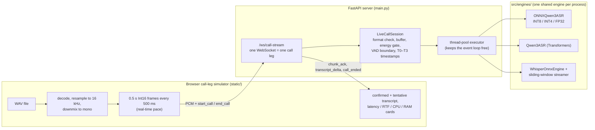

| Component | File(s) | Responsibility |
|---|---|---|
| Call-leg simulator / UI | `static/app.js`, `index.html`, `style.css` | Streams a WAV at real-time pace, renders committed vs tentative text and telemetry |
| API / session layer | `main.py` | `/ws/call-stream`, `/api/health`, `/api/samples`; one `LiveCallSession` per WebSocket; inference via `run_in_executor` |
| Session state | `src/engines/live_call_session.py` | Input-format validation (rate, channels, `pcm_s16le`), resampling to 16 kHz mono, RMS energy gate, VAD boundary, committed text, timestamps and metrics |
| Engines | `qwen3_onnx_engine.py`, `qwen3_engine.py`, `whisper_engine.py`, `whisper_streaming.py` | Same contract: `transcribe()` and `transcribe_stream()` (deltas, then a `("", timing)` sentinel with per-stage timing) |
| Configuration | `config/config.yaml` → `config/models/models.yaml` → per-model YAML | Model registry; preflight (`model_check.py`) reports unknown names and missing files with the download command |
| Benchmark | `benchmark/` | Load, latency/RTF, accuracy, concurrency (batch or streaming) → JSON + Markdown |
| Load test + sizing | `loadtest/` | Pinned worker processes, real-time legs, ramp/bisect/confirm, sizing model |
| Observability | `src/core/runlog.py`, `src/core/observe.py` | Per-run `run.log`, and a JSONL trace per inference nested under its call |

**Qwen3 ONNX inference pass** (per-stage timing is recorded for each step):

```
16 kHz audio → 128-bin log-mel → encoder (≈13 vectors/s) → chat prompt with <|audio_pad|> × N
  → audio features replace the pad tokens → decoder_init (prefill, KV cache)
  → decoder_step loop (greedy, ≤ 512 tokens) → text after <asr_text> (language before it)
```

**Implementation decisions that came from debugging** (from `docs/arch/changes.md`):

| Problem found | Fix |
|---|---|
| Inference blocked the asyncio event loop, so audio frames and `/api/health` stalled | `_run_inference()` runs the engine in the thread pool |
| Re-transcribing the whole call every second grew as O(N²) with call length | VAD commit path: a finished utterance is transcribed once, committed, and its audio dropped; open audio is capped at 15 s |
| The model **hallucinated whole English sentences on silence and noise** (for example "I'm a little bit nervous." on 0.5 s of silence) | Energy gate raised from RMS 0.003 to 0.02 (5x above the measured noise ceiling), and a minimum 2 s committed utterance. A token-density filter was tried first, did not work, and was reverted |
| Mixed client formats | Server-side format contract: declared sample rate and channels are normalised; non-PCM encodings are rejected |

---

## 5. Streaming design

Neither model family can decode while audio is still arriving. The server therefore re-runs the model on buffered
audio and decides which text is final. Two strategies are used, selected by backend.

| | Qwen3-ASR: `vad_utterance` | Whisper: `sliding_window` + LocalAgreement-2 |
|---|---|---|
| Trigger | Every 2nd 0.5 s chunk (~1 s), only if the last 0.5 s has speech (RMS > 0.02) and ≥ 0.5 s is buffered | Every `hop_s` = 1 s of new audio |
| Draft (tentative) text | Re-transcribe the whole open utterance | Re-transcribe the window |
| Final (committed) text | At a pause: first 100 ms frame below the gate, scanning from 2 s into the buffer; forced at **15 s** | Prefix that two consecutive passes agree on; window slides at **12 s**, forced commit at **20 s**, flush after **0.8 s** silence |
| Decoding | Greedy | Greedy (`beam_size: 1`, no temperature fallback), language locked after the first pass |
| Cost bound | ≤ 15 s of audio per pass, independent of call length | Every pass pads to 30 s (Whisper's fixed input) |
| When passes fall behind | Frames queue; passes run on older audio (**no skip-ahead**) | Backlog is skipped; the newest audio is processed |

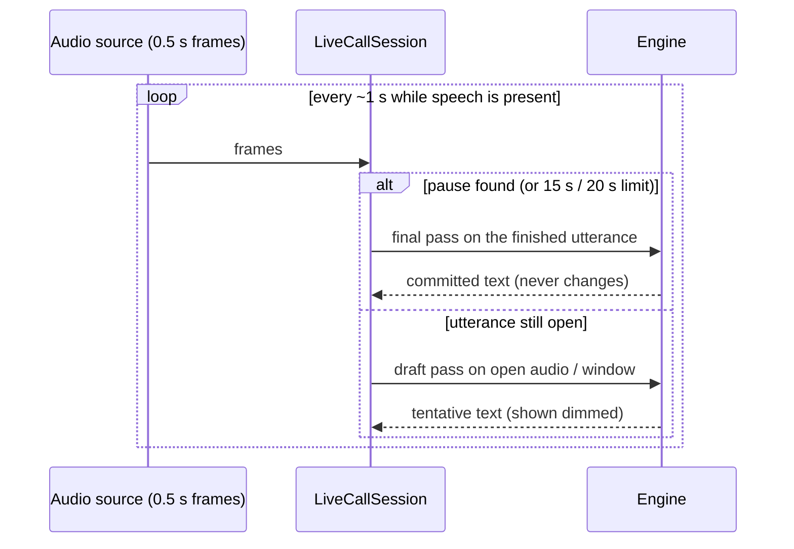

**Latency floor (MEASURED, load test, 1 leg).** Time to first text is 1.4–1.5 s. P95 staleness (how far the live
transcript trails the speaker) is 0.83–0.98 s, even with an idle CPU. That floor is the ~1 s trigger interval plus pass time,
so an SLO below about 1.5 s is not reachable with this design, whatever the capacity.

---

## 6. Test dataset and accuracy methodology

### 6.1 Benchmark audio

| File | Language | Duration | Native rate | Source | Reference |
|---|---|---|---|---|---|
| `librispeech_0_1089_0.wav` | EN | 10.4 s | 16 kHz | LibriSpeech speaker 1089 | corpus transcript (verified) |
| `librispeech_1_1089_1.wav` | EN | 3.3 s | 16 kHz | LibriSpeech | verified |
| `librispeech_2_1089_2.wav` | EN | 6.6 s | 16 kHz | LibriSpeech | verified |
| `OSR_cn_000_0072_8k.wav` | ZH | 20.0 s | 8 kHz | Open Speech Repository, Chinese | **draft** |
| `OSR_cn_000_0073_8k.wav` | ZH | 21.9 s | 8 kHz | Open Speech Repository, Chinese | **draft** |
| `ind_001.wav` | ID | 8.5 s | 48 kHz | project recording | **draft** |
| `ind_002.wav` | ID | 13.4 s | 48 kHz | project recording | **draft** |

Total 84.1 s per pass; 3 measured runs plus 1 warm-up per file, so 252.3 s of audio per config. The clips are on the Hugging
Face dataset `naseemap47/RT-MASR-CPU`. All audio is resampled to 16 kHz mono before inference.

**Draft references** were taken from the agreeing output of Qwen3-ASR 0.6B and 1.7B and have not been proof-read. ZH and ID scores therefore
measure **agreement with Qwen**, and they are biased in favour of Qwen. Only the English set (54 words) is true accuracy.

### 6.2 Metrics

| Metric | Definition |
|---|---|
| WER (EN, ID) | (substitutions + insertions + deletions) / reference words, via edit distance |
| CER (ZH) | the same over characters |
| Corpus rate | total edits / total reference length (long files weigh more); the headline figure |
| Normalisation | NFKC; EN/ID lower-case, apostrophes deleted, other punctuation removed; ZH all punctuation/symbols removed |
| RTF | wall-clock latency of `transcribe()` / audio duration read from the **file header** (so engines cannot misreport it) |
| Latency percentiles | P50/P95/P99 over the measured runs (linear interpolation) |
| CPU / RSS | `psutil` sampled every 0.1 s in a background thread; machine-wide CPU %, process RSS and thread count |
| Load time | cold load with `malloc_trim` and a pause between configs, so RSS from the previous engine is released |

**Known normalisation artefacts** visible in the per-file results: "counseled" vs "counselled" (spelling variant) counts as one EN
error; numerals ("19", "9" vs "sembilan") and colloquial spellings ("capek" vs "capai") count as ID errors; and Whisper tiny/base often write
**Traditional** characters, which NFKC does not map to the Simplified reference, so their ZH CER partly measures script rather than recognition.

### 6.3 Load-test method (summary; details in section 8)

One leg is one independently streamed audio source (one direction of one call). Each leg plays 30 s calls tiled from the three English clips,
in 0.5 s chunks at real-time pace, through the **same stream logic as the live server**. All legs in a process share one engine.
Call starts are spread over 6 s. Two speech-density profiles are used: **dense** (1 s silence after each clip, 85% speech) and
**conversational** (7 s silence, 47% speech). A leg **keeps up** if its P95 staleness and end-of-call lag are ≤ 2.0 s with no
errors and a non-empty transcript. The leg count is ramped (1, 2, 3, 4, 6, …) to the first failure, bisected, and the result is
re-run to confirm it.

---

## 7. Single-leg baseline results

### 7.1 Speed and latency

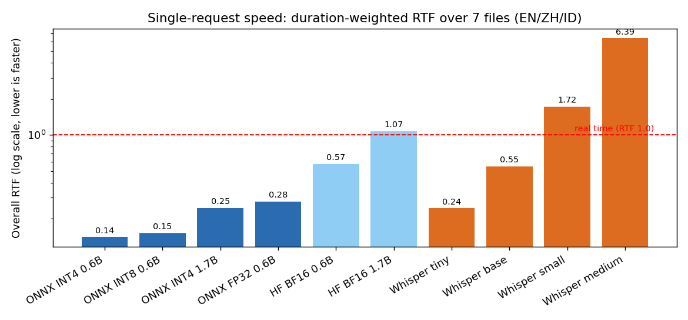

| Config | Overall RTF | EN RTF | ZH RTF | ID RTF | Latency P50, 10.4 s EN clip | Cold load |
|---|---|---|---|---|---|---|
| Qwen3 ONNX INT4 0.6B | 0.130 (**0.141** without the empty clip) | 0.105 ⚠ | 0.155 | 0.107 | 0.59 s ⚠ (empty output) | 2.8 s |
| **Qwen3 ONNX INT8 0.6B** | **0.151** | 0.192 | 0.156 | 0.106 | 2.22 s | 5.2 s |
| Qwen3 ONNX INT4 1.7B | 0.245 | 0.287 | 0.253 | 0.192 | 3.04 s | 5.9 s |
| Qwen3 ONNX FP32 0.6B | 0.278 | 0.346 | 0.291 | 0.190 | 3.49 s | 8.2 s |
| Qwen3 HF BF16 0.6B | 0.571 | 0.667 | 0.539 | 0.541 | 6.70 s | 7.0 s |
| Qwen3 HF BF16 1.7B | 1.070 | 1.263 | 1.016 | 0.994 | 12.86 s | not a cold load\* |
| Whisper tiny INT8 | 0.245 | 0.279 | 0.275 | 0.155 | 3.20 s | 0.45 s\* |
| Whisper base INT8 | 0.548 | 0.597 | 0.638 | 0.329 | 7.15 s | 0.48 s\* |
| Whisper small INT8 | 1.716 | 1.613 | 2.278 | 0.736 | 16.74 s | 1.34 s\* |
| Whisper medium INT8 | 6.387 | 5.390 | 8.362 | 3.533 | 54.25 s | 3.55 s\* |

\* Configs run in one process; later rows start with ~1.5 GB of leftover RSS and warm page cache, so their load times are not cold.
Latency is very stable: P95 is within ~1–3% of P50 for most files. Qwen's English RTF is the highest of the three languages because
English yields the most output tokens per audio second (INT8: 4.1 tokens/s for EN, 2.7 for ZH, 1.9 for ID), and decoding dominates
the pass (section 9.2). (MEASURED; per-language RTF and token rates DERIVED)

### 7.2 Accuracy

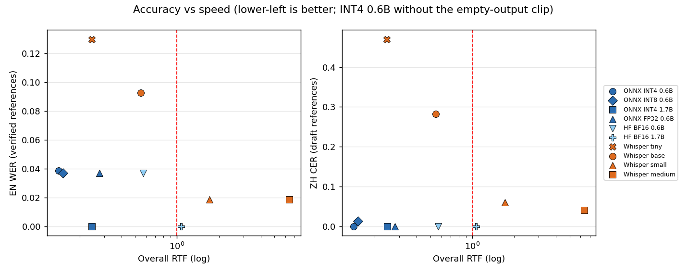

| Config | EN WER (verified) | ZH CER (draft) | ID WER (draft) |
|---|---|---|---|
| Qwen3 ONNX INT4 0.6B | 0.537 ⚠ (**0.038** without the empty clip) | 0.000 | 0.125 |
| Qwen3 ONNX INT8 0.6B | 0.037 | 0.013 | 0.188 |
| Qwen3 ONNX INT4 1.7B | **0.000** | 0.000 | 0.063 |
| Qwen3 ONNX FP32 0.6B | 0.037 | 0.000 | 0.188 |
| Qwen3 HF BF16 0.6B | 0.037 | 0.000 | 0.188 |
| Qwen3 HF BF16 1.7B | 0.000 | 0.000 | 0.000 |
| Whisper tiny INT8 | 0.130 | 0.470 | 0.000 |
| Whisper base INT8 | 0.093 | 0.282 | 0.063 |
| Whisper small INT8 | 0.019 | 0.060 | 0.063 |
| Whisper medium INT8 | 0.019 | 0.040 | 0.063 |

- **Quantisation costs essentially nothing here.** INT8 and FP32 0.6B produce the same EN and ID output; they differ by one ZH character.
- **1.7B INT4 matches 1.7B BF16** on EN and ZH and differs on one ID file, while being 4.4x faster.
- **Whisper is the weak option on Mandarin**, and the gap is larger than script differences alone explain (Whisper base, which writes
  Simplified on the first file, still produces near-homophone errors such as 地铁杂 for 地铁站 and 由于 for 邮局).
- One EN word is ~2 WER points; treat gaps under ~2 points as noise. ZH/ID favour Qwen because the references are Qwen drafts.

**INT4 0.6B empty-output issue (MEASURED).** On `librispeech_0_1089_0.wav` with auto-detect, the first predicted token was end-of-sequence
in all 3 runs, so 0 tokens were generated. With `language="English"` forced, the same clip gives 37 correct tokens. In live streaming
(shorter VAD utterances) the issue did not occur. INT4 also detected Malay instead of Indonesian on one file (1.7B INT4 on another),
though the text was still correct. `config/config.yaml` currently defaults to `qwen3_onnx_0.6b_int4`, so the live demo is exposed to this.

### 7.3 CPU and memory

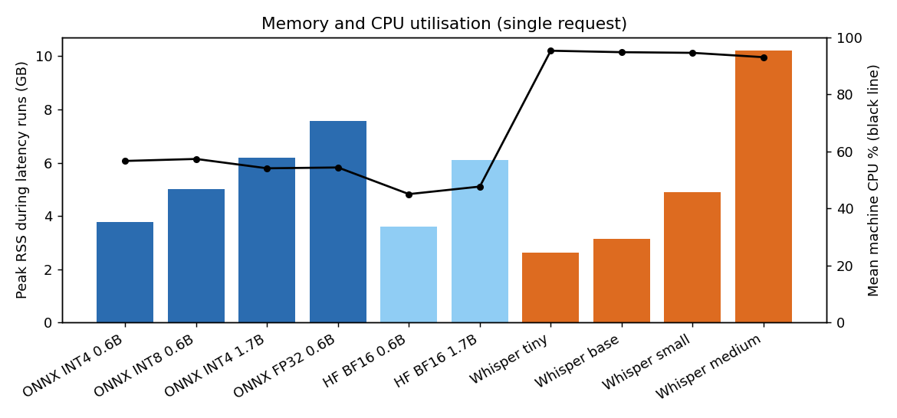

| Config | Disk | Peak RSS | Mean machine CPU | Peak threads |
|---|---|---|---|---|
| Qwen3 ONNX INT4 0.6B | 1.9 GB | 3.9 GB | 57% | 70 |
| Qwen3 ONNX INT8 0.6B | 2.5 GB | 5.1 GB | 57% | 79 |
| Qwen3 ONNX INT4 1.7B | 3.9 GB | 6.3 GB | 54% | 72 |
| Qwen3 ONNX FP32 0.6B | 3.8 GB | 7.8 GB | 54% | 72 |
| Qwen3 HF BF16 0.6B | 1.8 GB | 3.7 GB | 45% | 71 |
| Qwen3 HF BF16 1.7B | 4.4 GB | 6.3 GB | 48% | 72 |
| Whisper tiny / base / small / medium | 5.5 GB (all sizes) | 2.7 / 3.2 / 5.0 / 10.4 GB | 93–95% | 101–104 |

- Peak RSS includes memory kept from earlier, longer audio, so treat it as an upper bound. The load test measured a lower
  steady-state base RSS: 2.5 GB for INT4, 3.7 GB for INT8 and 1.0 GB for Whisper tiny.
- **Qwen ONNX uses only ~55% of the machine for one request**, while Whisper saturates it (~95%). ONNX Runtime threads also spin-wait,
  so CPU % overstates useful work and is a poor capacity signal (section 9).

---

## 8. Concurrency/load-test results

### 8.1 Batch-mode concurrency (benchmark): offline throughput

Here N workers call `transcribe()` on the same whole 10.4 s file back to back, on one shared engine. This shows how much audio
the box can push through when latency does not matter.

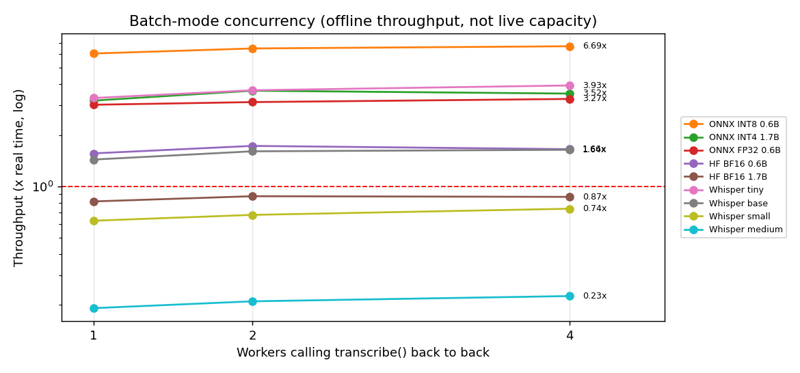

| Config | Throughput 1 / 2 / 4 workers (x real time) | Per-call RTF at 4 workers |
|---|---|---|
| Qwen3 ONNX INT8 0.6B | 6.06 / 6.49 / 6.69 | 0.59 |
| Qwen3 ONNX INT4 1.7B | 3.20 / 3.66 / 3.52 | 1.10 |
| Qwen3 ONNX FP32 0.6B | 3.02 / 3.14 / 3.27 | 1.17 |
| Whisper tiny | 3.32 / 3.68 / 3.93 | 1.01 |
| Qwen3 HF BF16 0.6B | 1.56 / 1.73 / 1.66 | 2.40 |

Throughput grows only ~10% from 1 to 4 workers, because one ORT session already uses all cores; extra workers mostly add
latency. The INT4 0.6B row (17.96 / 19.69 / 21.73x) is **invalid**: its workload is the clip that returned empty output, so no
decoding happened. Because each file is transcribed only once, this mode overstates live capacity (section 9.1).

### 8.2 Streaming load test: live capacity per box

Whole machine (16 logical CPUs pinned, 1 process x 16 threads), legs at real-time pace, P95 staleness and end lag ≤ 2 s.

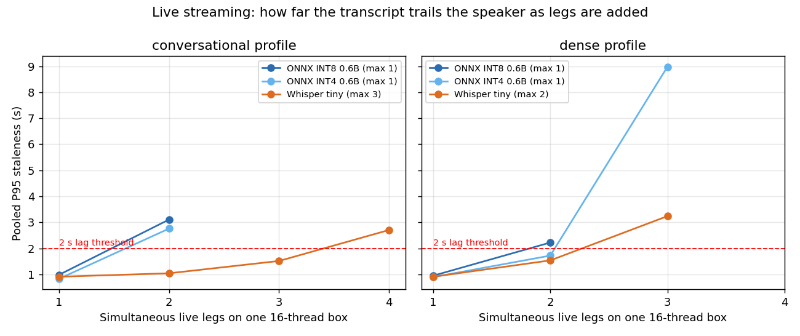

| Model | Profile | Max legs kept up | First failing | Stale P95 at max | Pass RTF P95 at max | Base RSS | Peak RSS at max |
|---|---|---|---|---|---|---|---|
| Whisper tiny INT8 | conversational | **3** | 4 | 1.51 / 1.59 s | 0.43 / 0.41 | 1.0 GB | 1.4 GB |
| Whisper tiny INT8 | dense | **2** | 3 | 1.54 / 1.63 s | 0.34 / 0.42 | 1.0 GB | 1.3 GB |
| Qwen3 ONNX INT4 0.6B | conversational | **1** | 2 | 0.83 / 0.90 s | 0.31 / 0.31 | 2.5 GB | 3.1 GB |
| Qwen3 ONNX INT4 0.6B | dense | **1** ⚠ | 2 | 0.90 / 0.87 s | 0.31 / 0.31 | 2.5 GB | 3.0 GB |
| Qwen3 ONNX INT8 0.6B | conversational | **1** | 2 | 0.98 / 0.97 s | 0.36 / 0.35 | 3.7 GB | 4.2 GB |
| Qwen3 ONNX INT8 0.6B | dense | **1** | 2 | 0.95 / 0.96 s | 0.36 / 0.35 | 3.7 GB | 4.1 GB |

Two values in a cell are the ramp run and the confirm run. ⚠ INT4 dense passed 2 legs once (stale P95 1.72 s) and failed the confirm
run (2.30 s); it is right at the threshold. Every scenario stopped on CPU saturation; free RAM never fell below 7.9 GB. Every leg at
every level produced a transcript. (MEASURED)

**Latency vs load (the knee).** Staleness is flat until saturation, then jumps:

| Model, profile | 1 leg | 2 legs | 3 legs | 4 legs |
|---|---|---|---|---|
| Whisper tiny, conversational | 0.91 s | 1.04 s | 1.51 s | **2.70 s ✗** |
| Whisper tiny, dense | 0.91 s | 1.54 s | **3.24 s ✗** | – |
| Qwen3 INT4 0.6B, conversational | 0.83 s | **2.76 s ✗** | – | – |
| Qwen3 INT4 0.6B, dense | 0.90 s | 1.72 s / **2.30 s ✗** | **8.98 s ✗** (2 legs aborted) | – |
| Qwen3 INT8 0.6B, conversational | 0.98 s | **3.11 s ✗** | – | – |
| Qwen3 INT8 0.6B, dense | 0.95 s | **2.22 s ✗** | – | – |

(Pooled P95 staleness; ✗ = at least one leg did not keep up.)

**INT4 vs INT8 under load (DERIVED).** INT4 has the same capacity but costs ~12–14% less inference time per audio second, has ~14% lower
pass RTF and ~1.2 GB less base memory.

### 8.3 Repeatability

The previous whole-machine run (`20261007T170448Z`) measured exactly the same saturation points for INT8 (1 / 1) and Whisper tiny (3 / 2).
An earlier run on 2026-10-06 was one leg lower in three of four cases. Treat **±1 leg** as the error bar. At 1–3 legs per box that is
a 33–100% uncertainty in per-box capacity.

---

## 9. Bottleneck analysis

### 9.1 Re-transcription multiplies the cost of a leg

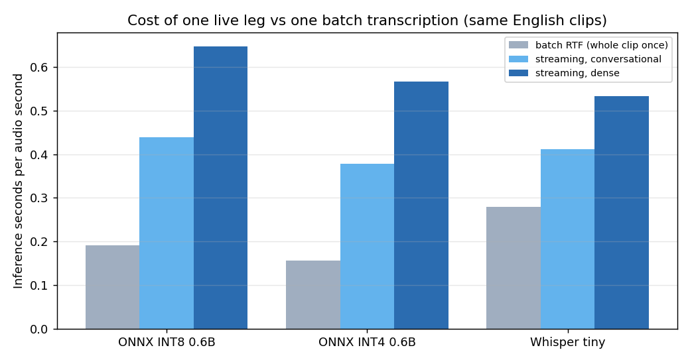

| Model | Batch RTF (same EN clips, once) | Streaming cost, 1 leg, conversational | Streaming cost, 1 leg, dense | Multiplier |
|---|---|---|---|---|
| Qwen3 INT8 0.6B | 0.19 | 0.44 | 0.65 | 2.3–3.4x |
| Qwen3 INT4 0.6B | 0.16\* | 0.38 | 0.57 | 2.4–3.7x |
| Whisper tiny | 0.28 (beam 5) | 0.41 (greedy) | 0.53 (greedy) | 1.5–1.9x |

Streaming cost = sum of pass latencies / call audio (DERIVED). \* Excludes the empty-output clip.

A Qwen draft pass re-reads the whole open utterance (up to 15 s) about once a second, so a 10 s sentence is encoded and prefilled
about ten times before it is committed. **At one leg the engine is already busy 49–60% of wall time (dense) or 35–41% (conversational).**
A second Qwen leg makes passes overlap, every pass slows down, and staleness crosses 2 s. Whisper's multiplier looks smaller partly
because its batch figure used beam search 5 while streaming is greedy.

### 9.2 The decoder dominates each pass

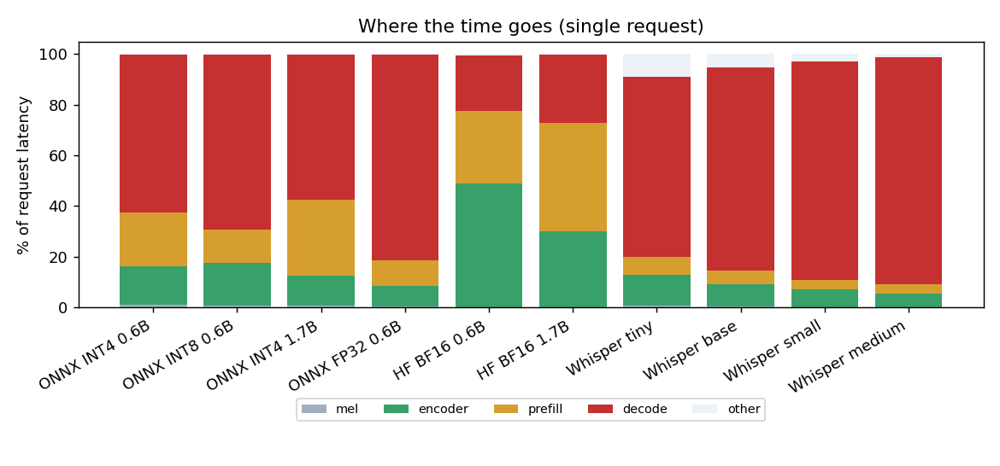

| Config | Mel | Encoder | Prefill | Decode | Decode tokens/s |
|---|---|---|---|---|---|
| Qwen3 ONNX INT8 0.6B | 1% | 17% | 13% | **69%** | 27 |
| Qwen3 ONNX INT4 0.6B | 1% | 15% | 21% | **62%** | 31 |
| Qwen3 ONNX INT4 1.7B | 1% | 12% | 30% | **57%** | 20 |
| Qwen3 ONNX FP32 0.6B | 0% | 8% | 10% | **81%** | 12 |
| Qwen3 HF BF16 0.6B | 0% | 49% | 29% | 22% | 23 |

(Single-request benchmark, DERIVED from per-stage timing.) On ONNX, **autoregressive decoding is 57–81% of the time**: one
`decoder_step` call per output token, each one memory-bandwidth-bound and too small to keep 16 threads busy. INT8 and INT4
help mainly by shrinking the weight stream. This is also why one request leaves ~45% of the CPU idle: the step loop is
sequential. Streaming repeats the decode on every draft pass, for tokens that were already produced on the previous pass.

### 9.3 Thread contention and a misleading CPU signal

- All legs share one ORT session whose intra-op pool spans all 16 threads. Concurrent passes from different legs oversubscribe
  the cores instead of running in parallel. Python orchestration (VAD, prompt building, token loop) also contends for the GIL.
- ORT threads spin-wait. At saturation, the pinned CPUs were only **43–62% utilised** (Qwen at 1 leg) and **57–61%** (Whisper at 3 legs),
  while the per-leg CPU-seconds per audio-second fell as legs were added (Whisper conversational 6.9 → 3.5). **CPU % cannot be used
  to detect overload; pass latency and staleness can.**
- Earlier pinned-width runs found Qwen at 1 leg with 4, 8 and 16 threads alike, and two Qwen processes doubled RAM (3.7 → 7.7 GB)
  without adding a leg. More threads or more processes did not buy capacity on this chip.

### 9.4 Queueing behaviour differs by path

- **Qwen has no skip-ahead.** When a pass is late, queued frames are processed in order, so lag accumulates (2 of 3 INT4 legs were
  stopped by the 8 s overload guard at 3 dense legs).
- **Whisper drains the backlog** and transcribes the newest audio, so it degrades into later text, not an ever-growing queue.
- With 1–3 legs per box, "one leg too many" is 33–100% more load. The knee is therefore abrupt, and every leg on the box degrades together.

### 9.5 What is not a bottleneck

- **Memory:** base RSS 1.0–3.7 GB plus ~0.1–0.3 GB per leg (DERIVED, low R²), with ≥ 7.9 GB free throughout.
- **Audio front end:** mel extraction is ≤ 1% of a pass; resampling and VAD are negligible.
- **Model load:** 2.3–4.0 s in the load test, a one-off cost per process.

---

## 10. Capacity/sizing model

Sizing starts from the **measured saturation point**, not from `legs x per-leg cost`, because per-leg cost is not constant
(spin-wait, contention, queueing).

```
legs/box = max(1, max_legs_kept_up × 0.70 headroom / 1.10 serving overhead)     (ASSUMED factors)
boxes    = ceil(N / legs/box) + max(1, ceil(10% × boxes)) spare boxes            (ASSUMED)
RAM/box  = ceil((weights + legs × MB/leg) × 1.20 + 2 GB OS)                      (whole GB)
```

| Factor | Value | Tag |
|---|---|---|
| Saturation point | section 8.2 | MEASURED |
| Headroom below the knee | 70% | ASSUMED |
| Serving overhead (WebSocket, JSON, TLS, supervision) | x1.10 CPU | ASSUMED |
| Spare boxes (N+k) | max(1, 10%) | ASSUMED |
| Weights + per-leg memory | base RSS + regression slope | MEASURED / DERIVED |
| Cross-leg batching | none credited | NOT MODELLED |
| Scale-out | identical independent boxes, calls sticky to a box | EXTRAPOLATED |

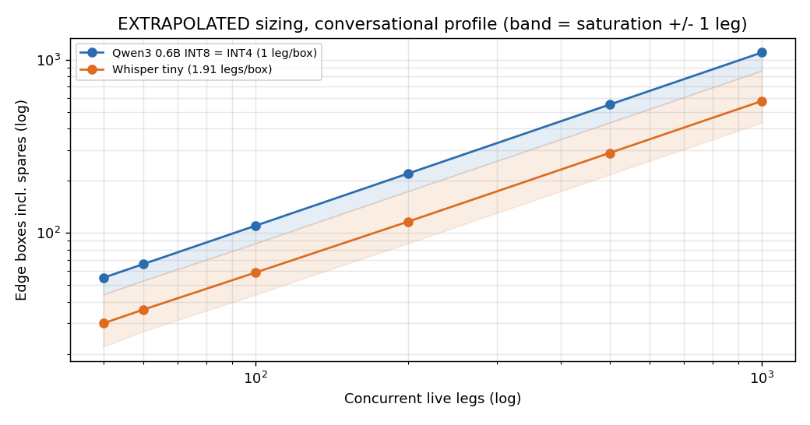

**Conversational profile (planning case).** Edge boxes identical to the test machine, including spares; ±1-leg range in parentheses.

| Concurrent legs | Qwen3 0.6B INT4 (1 leg/box, 6 GB) | Qwen3 0.6B INT8 (1 leg/box, 7 GB) | Whisper tiny (1.91 legs/box, 4 GB) | Confidence |
|---|---|---|---|---|
| 50 | 55 (44–55) | 55 (44–55) | 30 (22–44) | Qwen Low · Whisper Low-Medium |
| 60 | 66 (53–66) | 66 (53–66) | 36 (27–53) | Qwen Low · Whisper Low-Medium |
| 100 | 110 (87–110) | 110 (87–110) | 59 (44–87) | Qwen Low · Whisper Low-Medium |
| 200 | 220 (174–220) | 220 (174–220) | 116 (87–174) | Low |
| 500 | 550 (433–550) | 550 (433–550) | 289 (217–433) | Qwen Very low · Whisper Low |
| 1,000 | 1,100 (865–1,100) | 1,100 (865–1,100) | 577 (433–865) | Very low |

**Dense profile (upper bound):** at 100 legs, Qwen 110 boxes and Whisper tiny 87 (59–110); at 1,000 legs, 1,100 and 865.

**Operating targets per box (MEASURED at the operating point):** Qwen INT4 pass RTF ≤ 0.35 and P95 staleness ≤ 0.9 s; Qwen INT8 ≤ 0.40 and ≤ 1.0 s;
Whisper tiny ≤ 0.40 and ≤ 1.1 s (conversational) or ≤ 0.35 and ≤ 1.6 s (dense).

**Sensitivity.** Qwen is already at the 1-leg-per-box floor, so headroom (60–80%) and overhead (x1.00–x1.25) do not change its count;
only spares do. Whisper at 100 conversational legs moves from 51 boxes (80% headroom) to 69 (60%), and from 44 to 87 across the
±1-leg measurement uncertainty. The planning numbers are best used for orders of magnitude: about one Qwen box per live leg on this CPU class.

---

## 11. Production architecture recommendation

The full design is in [`../deployment.md`](../deployment.md). Summary:

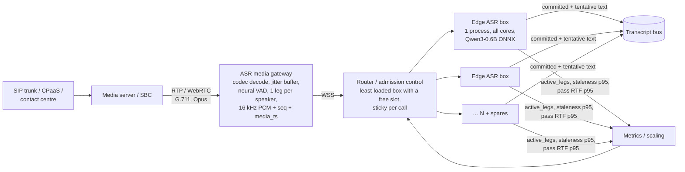

| Area | Recommendation |
|---|---|
| Model | Qwen3-ASR-0.6B ONNX. INT4 if RAM matters (force the language per leg from call metadata); INT8 otherwise. Re-check accuracy on real 8 kHz call audio before committing |
| Box layout | One ASR process per box using all cores (weights once); ORT threads = pinned CPUs; nothing else heavy on the box |
| Leg definition | One leg = one direction of one call; the gateway splits stereo/dual-stream calls into two mono legs |
| Ingest | The gateway does codec decode (G.711/Opus), a polyphase resampler, a 40–80 ms jitter buffer and gap fill from RTP timestamps; frames of 100–500 ms carrying `seq` and `media_ts` |
| VAD | A neural VAD (e.g. Silero/WebRTC) with hangover and pre-roll in the gateway replaces the fixed RMS 0.02 gate; `speech_started`/`speech_ended` events drive barge-in, not transcript text |
| Admission control | Hard cap per box = measured saturation (Qwen: 1 on this CPU class); site occupancy ≤ ~65–70%; N+1 (≥ 10%) spares |
| Health signals | Staleness P95 and pass RTF P95 over 30 s, queue depth, `active_legs / max_legs`. **Not CPU %** |
| Overload policy | Stop admitting, then stretch draft passes (1 s → 2 s), then drop drafts and keep finals, then skip ahead, then shed newest legs to post-call batch transcription |
| Code fixes before production | Duration-based (not message-count) trigger, Qwen skip-ahead, bounded per-leg queue, dedicated executor, Whisper hop counting on normalised samples, auth/TLS, health metrics (`docs/deployment.md` §3.5) |
| Rollout gates | Telephony accuracy test, load test on the target edge CPU, 1–2 h soak, chaos tests (jitter, loss, stall, box kill), P95 staleness ≤ SLO at 65–70% occupancy |

---

## 12. Alternative models/designs

None of the options below was measured in this project. They are ranked by how directly they address the bottleneck in section 9.

### 12.1 Design changes (same models)

| Option | What it changes | Expected effect | Risk / cost |
|---|---|---|---|
| **Lower draft-pass rate** (Qwen every 4th chunk, Whisper `hop_s` 2 s) | Fewer re-transcriptions per audio second | Close to halving the draft cost; finals unchanged | Partials arrive ~1 s later |
| **Finals-only mode** | Transcribe only committed utterances | Cost approaches the batch RTF (~0.15–0.19), i.e. the 2.3–3.7x multiplier largely disappears | No live partials; text appears at each pause |
| **Cross-leg batching** of encoder and decoder steps | One ORT call serves several legs | Better core use during the sequential decode loop; the largest structural lever | Scheduler complexity; padding waste |
| **Prefix reuse between passes** | Keep encoder output / KV cache of audio already seen | Removes repeated encode and prefill of the stable prefix | Needs encoder chunking support in the export |
| **Qwen skip-ahead + bounded queue** | Process the newest audio; drop stale drafts | Graceful degradation like Whisper; no unbounded lag | Some drafts lost under load |
| **Several smaller processes per box** (e.g. 4 x 4 threads) | Less contention per session | Untested at whole-box scale; an earlier 2-process run doubled RAM without a gain | Weights duplicated per process |
| **Hardware with AVX-512 VNNI / AMX** | Faster INT8 matrix work | Higher per-core throughput than this AVX2-only CPU | Must be re-measured; sizing does not transfer |

### 12.2 Alternative models and runtimes

Language coverage (EN + ZH + ID) must be checked for each before adopting it.

| Candidate | Why consider it | Concern |
|---|---|---|
| **Streaming-native transducers** (e.g. sherpa-onnx streaming Zipformer / Paraformer) | Incremental encoder, no window re-encoding, very low CPU per leg | Few models cover Indonesian; accuracy vs Qwen unknown |
| **faster-whisper (CTranslate2 INT8) / whisper.cpp** | More optimised Whisper runtimes than the ONNX path used here | Same 30 s padding and Mandarin weakness of small Whisper models |
| **Whisper large-v3-turbo** | Much better multilingual accuracy than tiny/base | Expected to be too slow for live CPU use on this class of machine (Whisper small is already RTF 1.7 here) |
| **SenseVoice-Small** | Non-autoregressive, very fast, strong on Mandarin | Language list does not include Indonesian |
| **Qwen3-ASR 1.7B INT4** (already integrated) | Best ONNX accuracy | ~1.6x the cost of 0.6B per audio second; expected ≤ 1 live leg per box here |
| **Speculative / shorter decoding** | Decode is 57–81% of Qwen pass time | Needs a draft model or export changes |

---

## 13. Limitations, risks, and next experiments

### 13.1 Limitations

| Area | Limitation |
|---|---|
| Hardware | One laptop CPU (AVX2, 8C/16T), shared and thermally limited. Another edge CPU will saturate at a different point |
| Accuracy data | 7 files, ~84 s. EN = 54 words (1 word ≈ 2 WER points). ZH/ID references are unreviewed Qwen drafts, biased toward Qwen |
| Audio type | Clean read speech at 16 kHz (ZH originally 8 kHz). No telephony codecs, noise, accents, overlap or code-switching |
| Load test | English only (the most token-dense language here, so slightly pessimistic for ZH/ID), 30 s calls, whole-leg resolution (1–3 legs), one confirm run, no network path, single box |
| Sizing | Every 50+ leg row is extrapolated; scale-out, serving overhead and headroom are assumed |
| Benchmark details | Whisper benchmark used beam 5 while streaming uses greedy; load times after the first configs are warm, not cold |
| Telemetry | `ttft_ms` in the live UI is the time of the whole first pass; on the commit path `rtf` is computed on the leftover buffer |

### 13.2 Risks

| Risk | Impact | Mitigation |
|---|---|---|
| Telephony accuracy is much worse than measured | Wrong model choice | Accuracy run on real 8 kHz calls before any decision |
| INT4 empty output on auto-detect | Silent missing text on some utterances | Force the language from call metadata, or retry with the language when 0 tokens are generated; flag `tokens_generated == 0` in the benchmark |
| Hallucination on noise (silence produces fluent sentences) | Fabricated text in transcripts | Neural VAD in the gateway; keep the minimum-utterance rule |
| Qwen overload produces unbounded lag | Every leg on the box degrades | Admission control at the measured cap, skip-ahead, bounded queues |
| ±1-leg measurement noise at 1–3 legs/box | Fleet size off by up to 2x for Whisper | Repeat runs on the target CPU and use the lower result |
| Hour-long calls not tested | Memory or latency drift | 1–2 h soak test |

### 13.3 Next experiments (in priority order)

1. **Accuracy on real telephony audio:** 8 kHz G.711, both channels, all three languages, human-verified references.
   Re-run `benchmark/run_benchmark.py` with a fixed language for INT4.
2. **Cost reduction of the streaming loop:** load-test the draft-rate options (every 2nd vs 4th chunk; `hop_s` 1 vs 2 s) and a
   finals-only mode with `loadtest/run_loadtest.py`. These change only the stream logic, and the expected gain is the largest.
3. **Qwen skip-ahead and bounded queue**, then repeat the dense ramp to confirm graceful degradation.
4. **Target-hardware load test:** run the same pipeline on the candidate edge CPU (ideally with AVX-512 VNNI/AMX), with the production
   VAD and real speech density; replace the extrapolated rows.
5. **Cross-leg batching prototype** for the encoder and the decoder step, measured as legs per box.
6. **Streaming-native model trial** (transducer family) for EN/ZH, compared on accuracy and legs per box against Qwen3-0.6B.
7. **Soak and chaos tests:** 1–2 h calls; jitter, loss, stall + burst, box kill; overload beyond `max_legs`.
8. **SLO sensitivity:** re-run the ramp at 3 s. Only the two dense Qwen 2-leg runs would have passed at 3 s in this data (worst
   leg 2.25–2.39 s staleness), so the gain is likely small but cheap to confirm.

---

### Appendix: reproduce

```bash
uv run python benchmark/run_benchmark.py                 # benchmark (writes benchmark/results/<UTC>_*)
uv run python loadtest/run_loadtest.py                   # load test (keep the machine idle)
uv run python loadtest/run_sizing.py --input loadtest/results/<UTC>_loadtest_raw.json
python3 docs/report/make_figures.py                      # figures for this report (matplotlib only)
```

Related documents: [`../arch/architecture.md`](../arch/architecture.md) (POC internals), [`../how-streaming-works.md`](../how-streaming-works.md),
[`../benchmark/benchmarking.md`](../benchmark/benchmarking.md), [`../loadtest/loadtest.md`](../loadtest/loadtest.md),
[`../deployment.md`](../deployment.md) (production design).
